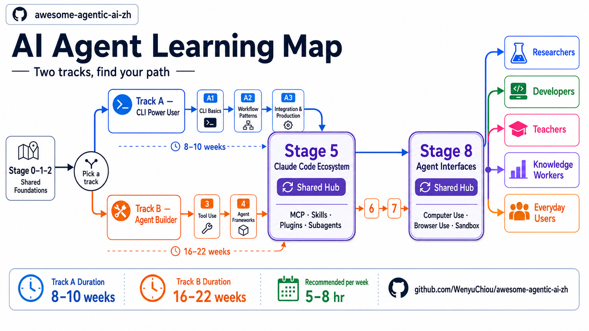

<div align="right">
  <a href="./README.md">繁體中文</a> | <a href="./README.zh-Hans.md">简体中文</a> | <strong>English</strong>
</div>

<div align="center" markdown="1">



# awesome-agentic-ai-zh

**🤖 One map from “what is an AI agent?” to “I can build a reliable system.”**

**Pick a route, then walk it one step at a time. Concepts, exercises, and resources are already in order.**

[](LICENSE)
[](README.md)
[](README.zh-Hans.md)
[](README.en.md)

[](https://wenyuchiou.github.io/awesome-agentic-ai-zh/)

</div>

> 📱 On a phone, read the [docs site](https://wenyuchiou.github.io/awesome-agentic-ai-zh/).

## 🎯 What does this map help you do?

An **AI Agent** is an AI system that can decide what to do next and take action toward a person's goal. It reads the situation, chooses the next step, and uses tools when needed; based on the result, it continues, corrects course, stops, or hands control back. It can do work automatically, but only within a person's rules and permissions. A one-shot chatbot or fixed script is not necessarily an Agent. The map covers three things in order:

1. **Get the basics**: what an LLM, a prompt, an API, and a token are.
2. **Then build something**: let a model call tools, run an agent loop, read documents, remember things.
3. **Then make it reliable**: add permissions, Eval, human approval, observability, and failure recovery.

This repo is **a learning roadmap + curated resources + small runnable examples**. For chapter-length depth we point to the official docs, [Datawhale Hello-Agents](https://github.com/datawhalechina/hello-agents), or a cookbook rather than rewriting an encyclopedia. When a model connection is needed, each exercise explains the cloud or local path.

Each important term is explained in plain language the first time it appears. Forgot one? See the [glossary](resources/glossary.en.md).

## 🚀 Start now

1. **Never written code**: start at [Stage 0: Foundations](stages/00-foundations.en.md). If APIs or CLI Agents are new, use the [zero-to-setup guide](resources/setup-guide.en.md) beside it.
2. **Already know Python, Git, and APIs**: start at [Stage 1: LLM fundamentals](stages/01-llm-basics.en.md).
3. **Not sure which route fits**: read the Track A / Track B table below.

Before Track A or Track B, check Stage 0–2. If you only want everyday AI use, go straight to the role guide.

| What do you want to do? | Route | Route entrance |
|---|---|---|
| Get work done with a CLI agent — Claude Code, Codex, OpenCode | **Track A — CLI Power User** | [A1: Pick a CLI agent](tracks/cli/A1-cli-intro.en.md) |
| Write your own agent, tool loop, workflow, and service | **Track B — Agent Builder** | [Stage 3: First agent loop](stages/03-tool-use-and-hello-agent.en.md) |
| Use AI safely in daily life, no coding for now | **Everyday user route** | [Everyday user guide](branches/for-everyday-users.en.md) |

<details markdown="1">
<summary>💻 Expand: clone it to your machine</summary>

```powershell
git clone https://github.com/WenyuChiou/awesome-agentic-ai-zh.git
cd awesome-agentic-ai-zh
```

Then open `stages/00-foundations.en.md`, or jump to your first stop above.

</details>

## Stage 0 through Stage 8, plus the Stage 7.5 reading stop



The map has **8 topic stages + the Stage 0 readiness check + the Stage 7.5 advanced reading stop**: **10 learning stops** in total. Track A / B readers first check the **shared Stage 0–2 foundations**; skip Stage 0 if you already know Python, Git, and APIs. Everyday users can go straight to the role guide.

### Shared foundations: Stages 0–2

| Stage | What it settles | What you can do after |
|---|---|---|
| **0** · [Foundations](stages/00-foundations.en.md) | Machine and tools ready? | Call a public API in Python, read JSON, save with Git |
| **1** · [LLM fundamentals](stages/01-llm-basics.en.md) | What are LLM, token, context; how do models differ? | Call an LLM and pick a cloud or local model |
| **2** · [Prompt design](stages/02-prompt-engineering.en.md) | How to state goal, data, rules, output clearly? | Compare Zero-Shot, One-Shot, Few-Shot, and the boundary of CoT |

### Track A: get work done with a CLI agent

The intended order is `A1 → A2 → Stage 5 → A3 → Stage 8`.

| Order | What it settles | What you can do after |
|---|---|---|
| **A1** · [Pick a CLI agent](tracks/cli/A1-cli-intro.en.md) | What are OpenRouter, OpenCode, Pi, Ollama? | Pick a tool and finish one small task |
| **A2** · [Build a repeatable process](tracks/cli/A2-cli-workflow.en.md) | How to keep rules and steps for next time? | Write project instructions, a Skill, a reusable workflow |
| **5** · [Claude Code ecosystem](stages/05-claude-code-ecosystem.en.md) | How do MCP, Skills, Plugins, Hooks, Subagents differ? | Read core 5.1–5.4; choose 5.5–5.8 only when your work needs them |
| **A3** · [Plug into real work](tracks/cli/A3-cli-production.en.md) | How to safely connect tools, CI, and team process? | Integrate with least privilege, human checks, a record |
| **8** · [Agent interfaces](stages/08-agent-interfaces.en.md) | How does an agent drive a browser, screen, sandbox? | Decide if a task needs CLI, browser, Computer Use, or API |

### Track B: build an agent from scratch

| Order | What it settles | What you can do after |
|---|---|---|
| **3** · [Tool Use & Your First Agent Loop](stages/03-tool-use-and-hello-agent.en.md) | How does a model call tools safely and continue? | Build an agent loop with a turn limit and validated arguments |
| **4** · [Workflow Graphs & Agent Frameworks](stages/04-agent-frameworks.en.md) | How to draw several steps as one map? | Choose between workflow, agent, graph, framework |
| **5** · [Claude Code ecosystem](stages/05-claude-code-ecosystem.en.md) | How do MCP, Skills, Plugins, Hooks, Subagents work together? | Combine tools, rules, reusable capabilities |
| **6** · [Memory · RAG](stages/06-memory-rag.en.md) | How does an agent search, save, and get back what matters? | Build a minimal RAG, long-term memory, and contextual retrieval flow |
| **7** · [Agent Production Engineering: Testable, Observable, Stoppable, and Recoverable](stages/07-multi-agent-production.en.md) | How does an agent stay stable in production? | Add Eval, observability, budget, Human-in-the-loop approval, recovery |
| **7.5** · [Advanced agentic concept map](stages/07.5-advanced-agentic-concepts.en.md) | Which advanced patterns are worth knowing? | Pick what you need from 12 concepts such as PAR loop and agent-as-judge |
| **8** · [Agent interfaces](stages/08-agent-interfaces.en.md) | How does an agent work beyond the API? | Choose Computer Use, Browser Use, or a code sandbox |

Stage 4 first explains the **Workflow Graph**, then uses a framework to build it. Stage 7 adds Eval, observability, approval, and recovery so the same work map can run reliably.

> 🔭 **Learning order**: Stage 2 Prompt → Stage 3 **Agent Loop** → Stage 4 **Workflow Graph** / framework → Stage 5 tools and rules → Stage 6 **Context Engineering** → Stage 7 production. Prompt, Context, Harness, Loop, and Graph work together; they are not five layers or product generations that replace one another.

After A3 or Stage 7, start the [Capstone project](CAPSTONE.en.md); track your progress in [PROGRESS.en.md](PROGRESS.en.md).

<details markdown="1">
<summary>⏱️ View time estimates (planning aid, not a deadline)</summary>

- **Track A**: about 8–10 weeks, using an existing CLI agent to get work done.
- **Track B**: main path about 16–22 weeks; at 5–8 hours a week, usually 5–7 months.
- **Stage 5** is the tools-and-rules hub: Track A uses them, Track B combines them.
- **Stage 8** is the interface hub: Track A delegates, Track B builds them in.

The timeline is a planning aid. Finish the step in front of you; no need to read the whole map at once.

</details>

### Keep going by who you are



[Static image](resources/diagrams/branch-decision-tree.en.png)

| Route | Who it fits | What you will handle |
|---|---|---|
| 🔬 [Researcher](branches/for-researcher.en.md) | Grad students, postdocs, PIs | Literature evidence, reproducible pipelines, multi-agent review |
| 💻 [Developer](branches/for-developer.en.md) | Software engineers | CLI delegation, code review, tests and rollback |
| 🎓 [Teacher](branches/for-teacher.en.md) | Teachers, instructors | Lesson prep, feedback, privacy, teaching prompts |
| 📊 [Knowledge worker](branches/for-knowledge-worker.en.md) | Consultants, PMs, analysts | Email, meeting, reporting workflows |
| 👥 [Everyday user](branches/for-everyday-users.en.md) | AI users who may not code | Writing, learning, privacy, safe use |

## 💡 How do you learn without getting stuck?

1. **One Stage at a time**: answer that chapter's core question first.
2. **Read the core terms and required reading first**: the exercises use them directly.
3. **Copy the first command as-is**: run the offline test first, don't retype a blank file.
4. **Change one thing at a time**: rerun the test right after, so you know what caused the result.
5. **Meet the completion check before moving on**: understanding is not the same as doing.

Every `starter.py` is a runnable reference. Read the task and success condition, change one place, rerun the test. Full method: [how to use this material](docs/HOW_TO_USE.md).

## 📚 Learning entrances to bookmark

Only the most-used entrances are here; the full list is in [RESOURCES.en.md](RESOURCES.en.md). Stars mean **learning priority**, not a ranking.

<table>
  <thead><tr><th>Purpose</th><th>Entrance</th><th>When to use it</th><th>Priority</th></tr></thead>
  <tbody>
    <tr><th scope="rowgroup" rowspan="3">Start</th><td><a href="resources/setup-guide.en.md">Zero-to-setup guide</a></td><td>First install and first run</td><td>⭐⭐⭐⭐⭐</td></tr>
    <tr><td><a href="docs/HOW_TO_USE.md">How to use this material</a></td><td>Before your first hands-on exercise</td><td>⭐⭐⭐⭐⭐</td></tr>
    <tr><td><a href="PROGRESS.en.md">Progress tracker</a></td><td>Want the next step, or to log what you finished</td><td>⭐⭐⭐⭐</td></tr>
  </tbody>
  <tbody>
    <tr><th scope="rowgroup" rowspan="3">Learn</th><td><a href="resources/glossary.en.md">Core glossary</a></td><td>You hit an unfamiliar word: token, RAG, MCP</td><td>⭐⭐⭐⭐⭐</td></tr>
    <tr><td><a href="examples/README.en.md">Runnable examples</a></td><td>Want to run offline tests and small cases</td><td>⭐⭐⭐⭐⭐</td></tr>
    <tr><td><a href="resources/cookbook.en.md">Hands-on cookbook</a></td><td>Building a Skill, MCP, Office, Zotero, or local LLM</td><td>⭐⭐⭐⭐</td></tr>
  </tbody>
  <tbody>
    <tr><th scope="rowgroup" rowspan="4">Look it up</th><td><a href="resources/README.en.md">Resource toolbox</a></td><td>Not sure if you need a guide, catalog, or cookbook</td><td>⭐⭐⭐⭐⭐</td></tr>
    <tr><td><a href="RESOURCES.en.md">Full resource list</a></td><td>Official docs, courses, communities, further reading</td><td>⭐⭐⭐⭐</td></tr>
    <tr><td><a href="resources/cli-agents-guide.en.md">CLI agent selection guide</a></td><td>Starting Track A, or comparing CLI tools</td><td>⭐⭐⭐⭐</td></tr>
    <tr><td><a href="resources/courses.en.md">Course and certification map</a></td><td>Separates completion certificates, skill badges, and certification exams</td><td>⭐⭐⭐⭐</td></tr>
  </tbody>
</table>

## 🤝 Help improve this map

- Wrong content, broken links, or stale information: open an [Issue](https://github.com/WenyuChiou/awesome-agentic-ai-zh/issues).
- Adding a project or learning resource: say which Stage it teaches, and what.
- Sending a PR: read [CONTRIBUTING.en.md](CONTRIBUTING.en.md) and the [style guide](resources/style-guide.en.md) first.
- Recent changes: see [CHANGELOG.md](CHANGELOG.md).

<details markdown="1">
<summary>🧰 Expand: all the ways to contribute, and the automated checks</summary>

You can fix wording, fill in a missing trilingual mirror, report a missing topic, or maintain a Stage or role route long term. For a new GitHub project link, the automated check shows archive status, license, and last update; inclusion stays a maintainer call based on learning value.

Full roles and rules are in [CONTRIBUTORS.md](CONTRIBUTORS.md).

</details>

## 🙏 Key inspirations and related projects

- [**Datawhale Hello-Agents**](https://github.com/datawhalechina/hello-agents) — for readers who want full chapters and deep hands-on work.
- [**Datawhale community**](https://github.com/datawhalechina) — a Chinese-language machine learning study community with many reliable entrances.
- [**liyupi/ai-guide**](https://github.com/liyupi/ai-guide) — a breadth-first resource hub; this repo handles the learning order instead.

<details markdown="1">
<summary>📖 Expand: contributors and citation format</summary>

[](https://github.com/WenyuChiou/awesome-agentic-ai-zh/graphs/contributors)

```bibtex
@misc{awesome_agentic_ai_zh_2026,
  title = {awesome-agentic-ai-zh: A Structured Learning Roadmap for Agentic AI},
  author = {Chiou, Wenyu},
  year = {2026},
  url = {https://github.com/WenyuChiou/awesome-agentic-ai-zh}
}
```

</details>

## ☕ Support and contact

This learning map is MIT-licensed and stays free and public. Use an Issue for questions; for private contact, email [wenyuchiou12@gmail.com](mailto:wenyuchiou12@gmail.com).

If this map helped you, a ⭐ Star is welcome, or [buy the author a coffee](https://www.buymeacoffee.com/wenyuchiou).

## License

MIT. Maintained by [@WenyuChiou](https://github.com/WenyuChiou).
