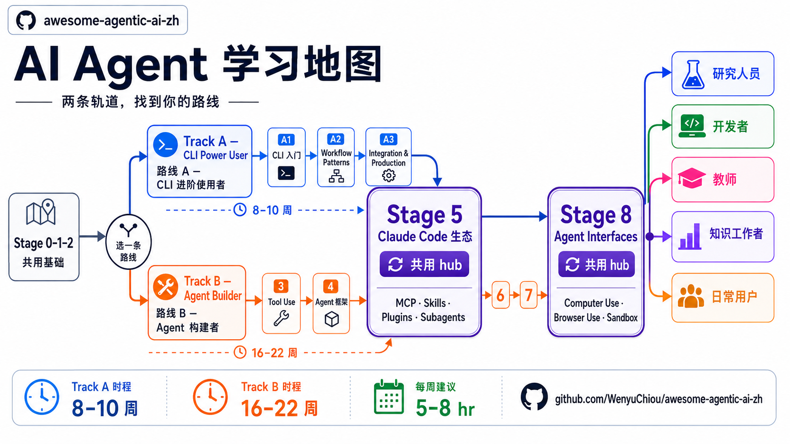

<div align="right">
  <a href="./README.md">繁體中文</a> | <strong>简体中文</strong> | <a href="./README.en.md">English</a>
</div>

<div align="center" markdown="1">



# awesome-agentic-ai-zh

**🤖 一张从“AI Agent 是什么”走到“能做出可靠系统”的学习地图**

**先选一条路，再一步一步走。重要概念、动手练习与精选资源都帮你排好顺序。**

[](LICENSE)
[](README.md)
[](README.zh-Hans.md)
[](README.en.md)

[](https://wenyuchiou.github.io/awesome-agentic-ai-zh/)

</div>

> 📱 手机阅读请使用[在线文档站](https://wenyuchiou.github.io/awesome-agentic-ai-zh/)。

## 🎯 这份地图帮你做什么？

**AI Agent**（AI 智能体）是“能为了人的目标，自己判断下一步并采取行动的 AI 系统”。人给它目标后，它会读取当前情况、选择下一步，需要时使用工具，再根据结果继续、修正、停止，或把控制权交还给人。它可以自动替人完成工作，但只能在人给的规则和权限内行动。只回答一次的聊天机器人，或每一步都预先固定好的脚本，不一定是 Agent。这个 repo 不要求你一开始就懂所有名词，而是带你依序完成三件事：

1. **先懂基础**：LLM、Prompt、API 与 Token 是什么。
2. **再做出东西**：让模型调用工具、跑 Agent Loop、读文件与记住事情。
3. **最后做得可靠**：加入权限、Eval、人工批准、观测与失败恢复。

这里的角色是**学习路线图 + 精选资源 + 可直接运行的小练习**。需要完整章节时，我们会带你去官方文档、[Datawhale Hello-Agents](https://github.com/datawhalechina/hello-agents) 或对应的 Cookbook，不重写另一套百科全书。需要连接模型时，每个练习会再说明云端或本机路径。

重要技术词第一次出现时会先用白话说明，再保留正式英文。忘记某个词时，直接查[名词表](resources/glossary.zh-Hans.md)。

## 🚀 现在就开始

1. **完全没写过程序**：从 [Stage 0：基础准备](stages/00-foundations.zh-Hans.md)开始；API 或 CLI Agent 不熟时，搭配[零基础设置指南](resources/setup-guide.zh-Hans.md)。
2. **已经会 Python、Git 与 API**：从 [Stage 1：LLM 基础](stages/01-llm-basics.zh-Hans.md)开始。
3. **还不确定要走哪条路**：先看下面的 Track A／Track B 选择表。

走 Track A 或 Track B 前，先确认 Stage 0–2；只走日常用户路线的人可以直接打开角色指南。

| 你现在想做什么？ | 建议路线 | 路线入口 |
|---|---|---|
| 用 Claude Code、Codex、OpenCode 等 CLI Agent 完成工作 | **Track A — CLI Power User** | [A1：选一个 CLI Agent](tracks/cli/A1-cli-intro.zh-Hans.md) |
| 自己写 Agent、工具循环、Workflow 与服务 | **Track B — Agent Builder** | [Stage 3：第一个 Agent Loop](stages/03-tool-use-and-hello-agent.zh-Hans.md) |
| 只想在日常生活安全使用 AI，暂时不写程序 | **日常用户路线** | [日常用户指南](branches/for-everyday-users.zh-Hans.md) |

<details markdown="1">
<summary>💻 展开：下载到本机</summary>

```powershell
git clone https://github.com/WenyuChiou/awesome-agentic-ai-zh.git
cd awesome-agentic-ai-zh
```

下载后先打开 `stages/00-foundations.zh-Hans.md`，或依上表直接前往适合你的第一站。

</details>

## 从 Stage 0 到 Stage 8，另有 Stage 7.5 阅读站



这张地图共有 **8 个主题 Stage + Stage 0 准备关 + Stage 7.5 进阶阅读站**，也就是 **10 个学习站**。Track A／B 读者先确认 **Stage 0–2 共用基础**；已经会 Python、Git 与 API 的人可以跳过 Stage 0。日常用户可以直接走角色指南。

### 共用基础：Stage 0–2

| Stage | 这一步解决什么？ | 完成后你能做什么？ |
|---|---|---|
| **0** · [基础准备](stages/00-foundations.zh-Hans.md) | 电脑与基本工具准备好了吗？ | 用 Python 调用公开 API、读 JSON，并用 Git 保存成果 |
| **1** · [LLM 基础](stages/01-llm-basics.zh-Hans.md) | LLM、Token、Context 与模型差在哪里？ | 调用一个 LLM，并依需求选云端或本机模型 |
| **2** · [Prompt 设计](stages/02-prompt-engineering.zh-Hans.md) | 怎么把目标、数据、规则与输出说清楚？ | 用固定案例比较 Zero-Shot、One-Shot、Few-Shot 与 CoT 的边界 |

### Track A：使用 CLI Agent 把工作做完

正式顺序是 `A1 → A2 → Stage 5 → A3 → Stage 8`。

| 顺序 | 这一步解决什么？ | 完成后你能做什么？ |
|---|---|---|
| **A1** · [选一个 CLI Agent](tracks/cli/A1-cli-intro.zh-Hans.md) | OpenRouter、OpenCode、Pi、Ollama 分别是什么？ | 选对工具并完成第一个小任务 |
| **A2** · [建立可重复流程](tracks/cli/A2-cli-workflow.zh-Hans.md) | 怎么把规则与步骤留给下一次使用？ | 写 Project Instructions、Skill 与可重用工作流程 |
| **5** · [Claude Code 生态](stages/05-claude-code-ecosystem.zh-Hans.md) | MCP、Skills、Plugins、Hooks 与 Subagents 怎么分？ | 先读核心 5.1–5.4；5.5–5.8 依工作需要选读 |
| **A3** · [接进真实工作](tracks/cli/A3-cli-production.zh-Hans.md) | 怎么安全连接外部工具、CI 与团队流程？ | 用最小权限、人工检查与记录完成集成 |
| **8** · [Agent 操作界面](stages/08-agent-interfaces.zh-Hans.md) | Agent 怎么操作浏览器、画面与 Sandbox？ | 判断任务该用 CLI、Browser、Computer Use 还是 API |

### Track B：从零打造 Agent

| 顺序 | 这一步解决什么？ | 完成后你能做什么？ |
|---|---|---|
| **3** · [工具使用与第一个 Agent Loop](stages/03-tool-use-and-hello-agent.zh-Hans.md) | 模型怎么安全调用工具并重复下一步？ | 做出有最大轮数、会验证参数的 Agent Loop |
| **4** · [Workflow Graph 与 Agent 框架](stages/04-agent-frameworks.zh-Hans.md) | 怎么把多个步骤画成工作地图？ | 选择 Workflow、Agent、Graph 与 Framework |
| **5** · [Claude Code 生态](stages/05-claude-code-ecosystem.zh-Hans.md) | MCP、Skills、Plugins、Hooks 与 Subagents 怎么合作？ | 组合工具、规则与可重用能力 |
| **6** · [Memory · RAG](stages/06-memory-rag.zh-Hans.md) | Agent 怎么查文件、保存与取回重要信息？ | 建立最小 RAG、long-term memory 与 contextual retrieval 流程 |
| **7** · [Agent 上线工程：可测、可看、可停、可恢复](stages/07-multi-agent-production.zh-Hans.md) | Agent 怎么在真实环境稳定运作？ | 加入 Eval、观测、预算、Human-in-the-loop（HITL，人工批准）与恢复 |
| **7.5** · [进阶 Agentic 概念地图](stages/07.5-advanced-agentic-concepts.zh-Hans.md) | 还有哪些进阶 Pattern 值得认得？ | 从 12 个概念选读 PAR loop、agent-as-judge 等需要的主题 |
| **8** · [Agent 操作界面](stages/08-agent-interfaces.zh-Hans.md) | Agent 怎么操作 API 以外的真实环境？ | 选择 Computer Use、Browser Use 或 Code Sandbox |

Stage 4 先看懂 **Workflow Graph**，再用 framework 把它做出来；Stage 7 再加入 Eval、观测、批准与恢复，让同一张工作图可以稳定运行。

> 🔭 **学习顺序**：Stage 2 Prompt → Stage 3 **Agent Loop** → Stage 4 **Workflow Graph**／Framework → Stage 5 工具与规则 → Stage 6 **Context Engineering** → Stage 7 production。Prompt、Context、Harness、Loop、Graph 会一起工作；它们不是五层，也不是互相取代的产品世代。

完成 A3 或 Stage 7 后，可以开始 [Capstone 项目](CAPSTONE.zh-Hans.md)；想记录进度可使用 [PROGRESS.zh-Hans.md](PROGRESS.zh-Hans.md)。

<details markdown="1">
<summary>⏱️ 查看时间估算（安排参考，不是截止日期）</summary>

- **Track A**：约 8–10 周。重点是使用现成 CLI Agent 完成工作。
- **Track B**：主干约 16–22 周；每周投入 5–8 小时时，通常需要 5–7 个月。
- **Stage 5** 是工具与规则 Hub：Track A 看怎么用，Track B 看怎么组合。
- **Stage 8** 是操作界面 Hub：Track A 看怎么委派，Track B 看怎么接进自己的 Agent。

时程只是安排参考。先完成眼前的一步，不需要一次读完整张地图。

</details>

### 依你的身份继续走



[静态图](resources/diagrams/branch-decision-tree.zh-Hans.png)

| 路线 | 适合谁 | 你会处理什么？ |
|---|---|---|
| 🔬 [研究人员](branches/for-researcher.zh-Hans.md) | 研究生、博后、PI | 文献证据、可重现流程、Multi-Agent Review |
| 💻 [开发者](branches/for-developer.zh-Hans.md) | 软件工程师 | CLI Delegation、Code Review、测试与回滚 |
| 🎓 [教师](branches/for-teacher.zh-Hans.md) | 老师、讲师 | 备课、反馈、隐私与教学 Prompt |
| 📊 [知识工作者](branches/for-knowledge-worker.zh-Hans.md) | 顾问、PM、分析师 | Email、会议与报告工作流程 |
| 👥 [日常用户](branches/for-everyday-users.zh-Hans.md) | 不一定写程序的 AI 用户 | 写作、学习、隐私与安全使用 |

## 💡 怎么学才不容易卡住？

1. **一次只走一个 Stage**：先回答这一章的核心问题。
2. **核心词与必读先看**：它们会直接用在后面的练习。
3. **直接复制第一个命令**：先跑不连网的测试，不必抄一份空白文件。
4. **一次只改一件事**：改完立刻再跑测试，才知道是哪个改动造成结果。
5. **做到完成条件再往下走**：看懂不等于做得到。

每个 `starter.py` 都是可执行参考。先看题目与成功条件，再修改一个地方并重跑测试。完整方法见[如何使用这份教材](docs/HOW_TO_USE.md)。

## 📚 先收藏的学习入口

这里只放最常用入口；完整清单在 [RESOURCES.zh-Hans.md](RESOURCES.zh-Hans.md)。星号表示**学习优先顺序**，不是项目排行榜。

<table>
  <thead><tr><th>用途</th><th>入口</th><th>什么时候用？</th><th>重要性</th></tr></thead>
  <tbody>
    <tr><th scope="rowgroup" rowspan="3">开始</th><td><a href="resources/setup-guide.zh-Hans.md">零基础设置指南</a></td><td>第一次安装与执行</td><td>⭐⭐⭐⭐⭐</td></tr>
    <tr><td><a href="docs/HOW_TO_USE.md">如何使用这份教材</a></td><td>开始第一个动手练习前</td><td>⭐⭐⭐⭐⭐</td></tr>
    <tr><td><a href="PROGRESS.zh-Hans.md">学习进度表</a></td><td>想知道下一步或记录完成项目</td><td>⭐⭐⭐⭐</td></tr>
  </tbody>
  <tbody>
    <tr><th scope="rowgroup" rowspan="3">学习</th><td><a href="resources/glossary.zh-Hans.md">核心名词表</a></td><td>遇到 Token、RAG、MCP 等陌生词</td><td>⭐⭐⭐⭐⭐</td></tr>
    <tr><td><a href="examples/README.zh-Hans.md">可执行范例入口</a></td><td>想直接跑离线测试与小型案例</td><td>⭐⭐⭐⭐⭐</td></tr>
    <tr><td><a href="resources/cookbook.zh-Hans.md">实作 Cookbook</a></td><td>想做 Skill、MCP、Office、Zotero 或本机 LLM</td><td>⭐⭐⭐⭐</td></tr>
  </tbody>
  <tbody>
    <tr><th scope="rowgroup" rowspan="4">查资料</th><td><a href="resources/README.zh-Hans.md">资源工具柜</a></td><td>不知道该查 Guide、Catalog 还是 Cookbook</td><td>⭐⭐⭐⭐⭐</td></tr>
    <tr><td><a href="RESOURCES.zh-Hans.md">完整资源清单</a></td><td>想找官方文档、课程、社群与延伸阅读</td><td>⭐⭐⭐⭐</td></tr>
    <tr><td><a href="resources/cli-agents-guide.zh-Hans.md">CLI Agent 选择指南</a></td><td>准备走 Track A 或比较 CLI 工具</td><td>⭐⭐⭐⭐</td></tr>
    <tr><td><a href="resources/courses.zh-Hans.md">课程与认证地图</a></td><td>分清完成证书、技能徽章和认证考试</td><td>⭐⭐⭐⭐</td></tr>
  </tbody>
</table>

## 🤝 一起改进这张地图

- 内容错误、失效链接或过时信息：请开 [Issue](https://github.com/WenyuChiou/awesome-agentic-ai-zh/issues)。
- 想补一个项目或学习资源：请附上“它教哪个 Stage 的什么”。
- 准备送 PR：先看 [CONTRIBUTING.zh-Hans.md](CONTRIBUTING.zh-Hans.md) 与[写作规范](resources/style-guide.zh-Hans.md)。
- 最近更新内容：查看 [CHANGELOG.md](CHANGELOG.md)。

<details markdown="1">
<summary>🧰 展开：完整贡献方式与自动检查</summary>

你可以修正文字、补三语镜像、回报缺少的主题，或长期维护一个 Stage／角色路线。新增 GitHub 项目链接时，自动检查会协助查看归档状态、License 与最近更新；是否收录仍由 maintainer 依学习价值判断。

完整角色与规则见 [CONTRIBUTORS.md](CONTRIBUTORS.md)。

</details>

## 🙏 重要启发与相关项目

- [**Datawhale Hello-Agents**](https://github.com/datawhalechina/hello-agents) — 适合需要完整章节与深度实作的读者。
- [**Datawhale 社群**](https://github.com/datawhalechina) — 中文机器学习共学社群，提供许多可靠的学习入口。
- [**liyupi/ai-guide**](https://github.com/liyupi/ai-guide) — 偏向广度资源库；本 repo 则负责安排学习顺序。

<details markdown="1">
<summary>📖 展开：贡献者与引用格式</summary>

[](https://github.com/WenyuChiou/awesome-agentic-ai-zh/graphs/contributors)

```bibtex
@misc{awesome_agentic_ai_zh_2026,
  title = {awesome-agentic-ai-zh: A Structured Learning Roadmap for Agentic AI},
  author = {Chiou, Wenyu},
  year = {2026},
  url = {https://github.com/WenyuChiou/awesome-agentic-ai-zh}
}
```

</details>

## ☕ 支持与联络

这份学习地图采 MIT 授权，会继续免费公开。一般问题与建议请使用 Issue；需要私下联络时可寄信至 [wenyuchiou12@gmail.com](mailto:wenyuchiou12@gmail.com)。

如果这份地图帮到你，欢迎给一个 ⭐ Star，或[请作者喝杯咖啡](https://www.buymeacoffee.com/wenyuchiou)。

## License

MIT。Maintained by [@WenyuChiou](https://github.com/WenyuChiou)。
