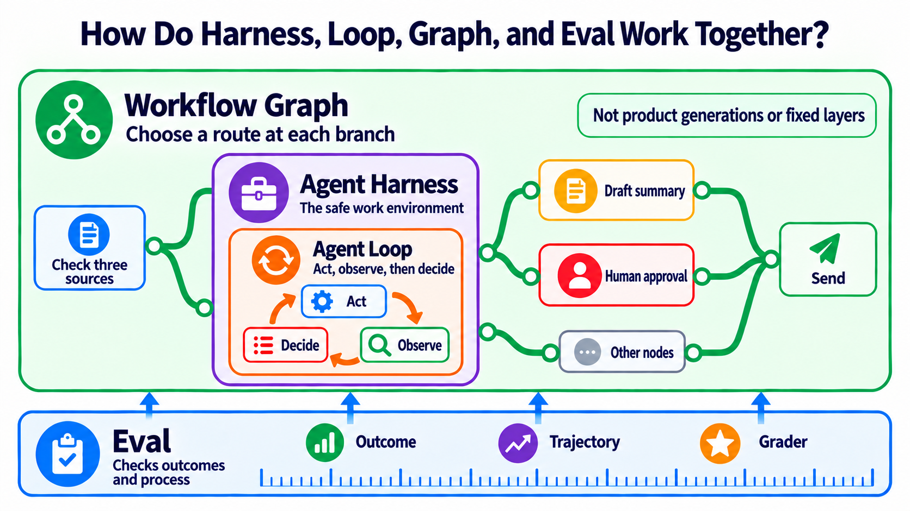
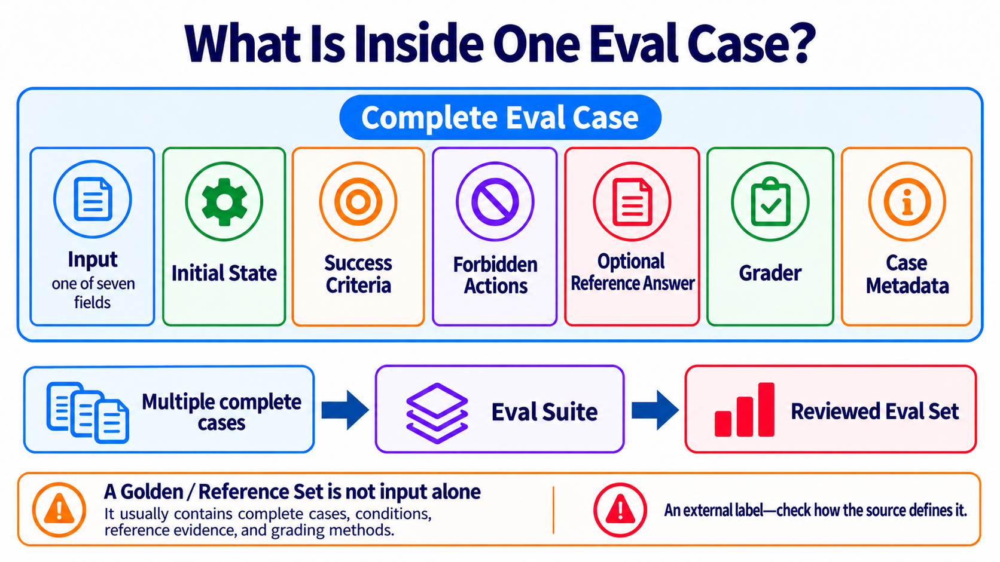

# Stage 7 — Agent Production Engineering: Testable, Observable, Stoppable, and Recoverable

> [繁體中文](./07-multi-agent-production.md) | [简体中文](./07-multi-agent-production.zh-Hans.md) | **English**

<!-- freshness: canonical=stages/07-multi-agent-production.md; verified_on=2026-09-13; scope=evals,observability,human-approval,persistence,recovery,orchestration,resources; max_age_days=90 -->

This stage teaches you to hand an AI helper to someone else. It must do more than work once in front of you. You also need to check it, see what it did, stop it before risky actions, and continue safely after a failure.

## 🎯 What This Stage Does (Start Here)

This learning map calls the work of making an AI helper safe enough for other people to use **Agent Production Engineering**. Think of taking a toy car onto a real road: first add steering, brakes, and a dashboard. In this chapter, the term means making an Agent testable, observable, stoppable, and recoverable. It does not mean the Agent must serve millions of people.

The whole chapter uses one story. An AI research helper checks three sources, writes a summary, and asks a person before sending it. You will add a workspace, a repeat-and-check rhythm, branching routes, a way to test quality, and a safety brake.

Remember this order:

> **Say what success looks like → keep a record of the work → ask a person before risky actions → prove it can continue after a fall → only then give it to other people.**

| Where you are stuck | Do this first | Evidence to produce |
|---|---|---|
| You do not know whether the summary is good | Write fixed examples and success rules | A check you can run again |
| You do not know which step failed | Record every step, error, time, and cost | One complete work record |
| It can send mail, pay, delete, or write data | Stop before the action, ask a person, and save progress | Who approved it and where to continue |
| The first three checks can rerun and pass | Give it to other people | Health, stop, continue-after-failure, and rollback instructions |

Make one AI helper reliable first. Add more helpers only when the work can truly be separated or different roles must check one another.

<details markdown="1">
<summary>⏱ Expand: time, environment, cost, and safety notes</summary>

- Split this stage into several short practice sessions. You do not need to finish it at once.
- You need Python and Git. The deployment exercise also uses Docker.
- Run the tests that need no API key first. Set a small budget before calling a paid model.
- A work record may contain prompts, tool inputs, and model answers. Do not send passwords, personal data, or customer data directly to a tracing service.
- Another Agent usually adds another model call, more latency, and more debugging. Do not assume Multi-Agent is automatically faster or more accurate.

</details>

## 📌 Learning Goals

After this stage, you can:

1. Tell apart the AI helper's workspace, its repeat-and-check rhythm, and its branching route.
2. Turn real failures into checks you can run again instead of trusting one pretty answer.
3. Find every step, error, time, and cost from one task.
4. Stop before risky actions and continue from the right saved point.
5. Use the same evidence to decide whether the system is ready for other people.

<a id="-meet-the-core-terms-first"></a>
## 🧩 Meet Nineteen Core Terms First

Use “plain-language meaning” to get oriented, then read “how this chapter uses it / technical boundary” to see what the term means here. Related terms share one group, so you do not need to read the same definition twice.

<table>
<thead><tr><th scope="col">What to solve first</th><th scope="col">Core term</th><th scope="col">Plain-language meaning</th><th scope="col">How this chapter uses it / technical boundary</th></tr></thead>
<tbody>
<tr><th scope="rowgroup" rowspan="6">Make the task run</th><td><strong>Agent Harness</strong></td><td>The room where the AI helper works</td><td>The execution environment that holds the model, tools, permissions, state, error handling, and records; this chapter uses it to check sources and prepare a summary safely</td></tr>
<tr><td><strong>Agent Loop</strong></td><td>Do one step, see the result, then choose the next step</td><td>The model repeatedly chooses an action and reads the tool result until it finishes, reaches a limit, or must ask a person</td></tr>
<tr><td><strong>Workflow Graph</strong></td><td>A route map with forks</td><td>Steps, connections, conditions, and state that say which route to take; this chapter uses it for research, checking, and approval before sending</td></tr>
<tr><td><strong>Orchestration</strong></td><td>Arrange who goes first and who goes next</td><td>Control steps, data flow, roles, retries, and stop conditions</td></tr>
<tr><td><strong>Multi-Agent</strong></td><td>Several AI helpers share the work</td><td>Multiple Agents complete a task with clear roles; it is an option, not a requirement</td></tr>
<tr><td><strong>Handoff</strong></td><td>Pass the baton and the notes together</td><td>One Agent passes control, needed data, and result evidence to another Agent</td></tr>
</tbody>
<tbody>
<tr><th scope="rowgroup" rowspan="7">Prove it did the right thing</th><td><strong>Evaluation / Eval</strong></td><td>Use the same checklist each time</td><td>Measure an Agent's result and process with fixed cases, environments, grading methods, and thresholds</td></tr>
<tr><td><strong>Outcome</strong></td><td>What really happened at the end</td><td>The externally verifiable state when the task ends; this chapter checks that the summary truly uses three valid sources</td></tr>
<tr><td><strong>Trajectory</strong></td><td>The footprints left along the way</td><td>What happened during one run, including tool calls, intermediate results, errors, and output</td></tr>
<tr><td><strong>Grader</strong></td><td>Mark one answer using stated rules</td><td>A method, program, or model that scores one Eval Case against success criteria; this chapter keeps the rules and human spot checks visible</td></tr>
<tr><td><strong>Evaluation Harness</strong></td><td>The exam room that gives the same test and keeps the score</td><td>A test system that loads cases, reruns the Agent, calls graders, and saves results; it has a different responsibility from the Agent Harness used for daily work</td></tr>
<tr><td><strong>Trace</strong></td><td>A notebook that collects the footprints</td><td>Steps, tool calls, errors, and results arranged by time for one task; this chapter uses it to find the failing step</td></tr>
<tr><td><strong>Observability</strong></td><td>Put a clear window on the system</td><td>Use traces, logs, and metrics to see internal state; this chapter uses it to find where a source went missing</td></tr>
</tbody>
<tbody>
<tr><th scope="rowgroup" rowspan="6">Let it stop and continue safely</th><td><strong>Guardrail</strong></td><td>Block what must not happen</td><td>Rules that limit inputs, outputs, tool permissions, or risky actions</td></tr>
<tr><td><strong>Human Approval</strong></td><td>Ask a person before a risky action</td><td>Pause before a sensitive tool call so a person can approve, edit, or reject it</td></tr>
<tr><td><strong>Checkpoint</strong></td><td>Save before moving on</td><td>Save recoverable workflow state and version information</td></tr>
<tr><td><strong>Resume</strong></td><td>Continue from the saved point</td><td>Load a checkpoint with the same task or thread ID and continue execution</td></tr>
<tr><td><strong>Recovery</strong></td><td>Come back safely after falling</td><td>A strategy to stop, retry, compensate, or hand a failure to a person</td></tr>
<tr><td><strong>Idempotency</strong></td><td>Press twice, do it once</td><td>Retries with the same idempotency key do not duplicate external side effects</td></tr>
</tbody>
</table>

A **Prompt** is the instruction and material you give the model. **Context** is the information needed for this step. They still matter; this chapter adds execution, checking, and recovery around them.

## 🚪 Entry Conditions

You should have completed at least:

- [Stage 4](04-agent-frameworks.en.md): know what Agents, Tools, and Workflows are.
- [Stage 5](05-claude-code-ecosystem.en.md): have seen tool permissions, Subagents, and development workflows.
- [Stage 6](06-memory-rag.en.md): know that Context, RAG, and Memory are different.

You can start even if Docker is new to you. Do the four core exercises first and learn Docker for Core Exercise 4.

## 📚 Required Reading

Read these six in production order:

1. [Anthropic — Demystifying evals for AI agents](https://www.anthropic.com/engineering/demystifying-evals-for-ai-agents): distinguish **Outcome** from the complete **Trajectory**; an Agent saying “done” does not prove the outside result is done.
2. [OpenAI Agents SDK — Tracing](https://openai.github.io/openai-agents-python/tracing/): see how trace, span, tool, handoff, and guardrail events connect one run.
3. [OpenAI Agents SDK — Human-in-the-loop](https://openai.github.io/openai-agents-python/human_in_the_loop/): pause before a sensitive tool, save `RunState`, approve or reject, and resume.
4. [LangGraph — Persistence](https://docs.langchain.com/oss/python/langgraph/persistence): distinguish checkpoints from cross-thread stores; interruption, recovery, and long-term memory are not the same thing.
5. [LangGraph — Interrupts](https://docs.langchain.com/oss/python/langgraph/interrupts): see how human approval pauses and resumes, and why side effects before an interrupt must be idempotent.
6. [Anthropic — Building Effective Agents](https://www.anthropic.com/engineering/building-effective-agents): start with simple compositions and add autonomy or Multi-Agent only when real division of labor needs it.

<details markdown="1">
<summary>📖 Expand: further reading and purpose</summary>

1. [Anthropic — Develop tests and evaluations](https://platform.claude.com/docs/en/test-and-evaluate/develop-tests): define measurable success criteria before choosing a grader.
2. [OpenAI Agents SDK — Testing utilities](https://openai.github.io/openai-agents-python/testing/): test with repeatable fake models instead of paying for every run.
3. [OpenAI Agents SDK — Running agents](https://openai.github.io/openai-agents-python/running_agents/): see an Agent Loop repeat, and stop it with `max_turns`.
4. [OpenAI Agents SDK — Multi-agent orchestration](https://openai.github.io/openai-agents-python/multi_agent/): compare manager and **Handoff** patterns; this is an advanced option, not the first production step.
5. [LangGraph — Workflows and agents](https://docs.langchain.com/oss/python/langgraph/workflows-agents): distinguish fixed Workflows from Agents that choose their next step.
6. [Microsoft Agent Framework — Workflow concepts](https://learn.microsoft.com/en-us/agent-framework/concepts/workflows/): see how executors, edges, events, and state form a Workflow Graph.
7. [OpenAI — Harness engineering](https://openai.com/index/harness-engineering/): see how environments, feedback loops, and mechanical rules help Agents work reliably.
8. [OpenTelemetry — GenAI semantic conventions](https://github.com/open-telemetry/semantic-conventions-genai): learn portable tracing fields; the conventions are evolving, so do not assume every platform supports all of them.

</details>

<a id="the-five-layer-engineering-split-prompt--context--harness--loop--graph"></a>
## 🧭 Harness, Loop, Graph, and Eval: How They Work Together

They are not four product generations, and you do not choose only one. Think about the same research helper from four angles:

| Responsibility | Plain-language question | Research-helper example |
|---|---|---|
| **Agent Harness** | Where can it work safely? | It may read sources, but it must stop before sending |
| **Agent Loop** | Why should it take another round? | If one source is missing, search again; stop at the limit |
| **Workflow Graph** | Which route should it take now? | Go back to research when sources are weak; otherwise ask for approval |
| **Eval** | How do I know the result and process are acceptable? | Check three valid sources, correct citations, and no skipped approval |

Eval checks the **Outcome** and **Trajectory**, then uses a **Grader** to decide whether the run meets the stated rules. Eval can make the Loop retry, make the Graph choose another route, or make the Harness stop. Putting a Harness and Eval together still does not create the Loop's rules for repeating and stopping.



The learning order is [Stage 3 Agent Loop](03-tool-use-and-hello-agent.en.md) → [Stage 4 Workflow Graph / Agent Framework](04-agent-frameworks.en.md) → safe production integration in this chapter. **Loop Engineering** is an emerging label used by IBM. **Graph Engineering** is even less settled. Learn the responsibilities first, then treat these labels as search terms used by the community. Sources: [IBM — Loop Engineering](https://www.ibm.com/think/topics/loop-engineering), [Anthropic — Agent harness and eval](https://www.anthropic.com/engineering/demystifying-evals-for-ai-agents), and [Microsoft Agent Framework — graph-based workflows](https://learn.microsoft.com/en-us/agent-framework/concepts/workflows/builder-and-execution).

## 🏗 Agent Harness: Prepare the Safe Workspace

**Harness Engineering** means designing the runtime that lets a model act as an Agent. The model produces decisions; the Harness processes input, tools, state, permissions, failures, and results, and it often runs the agent loop directly. An outer scheduler may call the Harness many times, so a Harness is not limited to “one short run.” Sources: [OpenAI — Harness engineering](https://openai.com/index/harness-engineering/), [Anthropic — agent harness definition](https://www.anthropic.com/engineering/demystifying-evals-for-ai-agents), and [Anthropic — Managed agents](https://www.anthropic.com/engineering/managed-agents).

### The 8 Core Components of a Harness

These eight items are this project’s production checklist, not the world’s only official taxonomy.

| Component | Plain-language meaning | Question before release |
|---|---|---|
| **1. Orchestration / Run loop** | Decide what happens next | Who starts, who stops, and what if a handoff fails? |
| **2. Tool / Permission boundary** | Give it only the keys it needs | Which tools may read, write, or delete? |
| **3. Context / State / Checkpoint** | Save where it is now | Can it resume from the correct point? |
| **4. Retry / Recovery / Idempotency** | Try again without charging twice | Could a retry repeat an email, payment, or database write? |
| **5. Guardrail / Human approval** | Ask an adult before a risky action | Which actions always require approval? |
| **6. Telemetry / Observability** | Put a clear window on the system | Can we see traces, errors, latency, and tokens? |
| **7. Eval harness** | Retake the test after every change | Are cases, scoring rules, and failure thresholds fixed? |
| **8. Cost / Latency budget** | Decide the money and time limit first | Above budget, should it stop, downgrade, or queue? |

<details markdown="1">
<summary>🔧 Expand: feedback, recovery, and cost details</summary>

- Write tool errors as feedback an Agent can understand, not only a long stack trace.
- Keep the grader separate from the worker when possible. Do not ask only, “How good was your own work?”
- Design **idempotency** for every external side effect so a retry does not repeat a payment, email, or data write.
- Prompt caching, batching, model routing, and smaller models may reduce cost, but results depend on the workload. Measure a baseline, change one thing, and measure again.
- Anthropic prompt caching can be automatic or use explicit `cache_control`. Cache duration and read/write pricing depend on the option; use the [official documentation](https://platform.claude.com/docs/en/build-with-claude/prompt-caching).
- Traces may capture sensitive inputs and outputs. Configure redaction, retention, and access before release.

</details>

## 🔁 Agent Loop: Act, Observe, Then Decide

First separate three kinds of Loop that sound similar but cover different scopes:

| Name | What repeats | Example |
|---|---|---|
| **Program loop** | The same code block | `for item in items`; this is syntax, not the topic of this section |
| **Agent Loop** | Model → tool → tool result → model | Keep calling tools inside one run until completion or `max_turns` |
| **Loop Engineering** | Goal → action → observation → adjustment | Repeat work in one long run or across sessions／schedules, with verification, memory, budgets, and stop conditions on every round |

IBM explains Loop Engineering as `Goal → Action → Observation → Adjustment`. The point is not to let an Agent run forever. Every round must answer: **Is the goal still valid? Is the evidence enough? Should we continue, stop, or hand control to a person?**

Therefore, Loop Engineering **is not the next Harness product generation and does not automatically replace a Harness**. In Anthropic's terminology, the Harness itself includes the loop that calls the model and routes tools. IBM's broader Loop Engineering practice includes goals, checking, tools, hooks, context, subagents, and persistent state. Sources draw the boundary differently, so remember the responsibilities instead of memorizing one universal layer diagram. Sources: [IBM — Loop Engineering](https://www.ibm.com/think/topics/loop-engineering) and [Anthropic — Managed Agents](https://www.anthropic.com/engineering/managed-agents).

When models improve, a particular patch may be removable. For example, Anthropic removed context resets used by an earlier harness for newer models. That only means **the same Evals showed one workaround was no longer needed**. It does not mean permissions, safety, logs, evals, or recovery automatically became obsolete. Source: [Anthropic — Harness design for long-running applications](https://www.anthropic.com/engineering/harness-design-long-running-apps). Stage 7.5 explains how to keep, simplify, or remove each part under [Model–Harness Fit](07.5-advanced-agentic-concepts.en.md).

<a id="-graph-engineering--arrange-steps-loops-and-approvals-into-a-complete-route"></a>
## 🗺 Workflow Graph: Know Where to Go at a Branch

The Agent Loop answers, “Should I do this again?” The Workflow Graph answers, “Where should I go next?” It is like a school map with forks. The map arranges the route, but it does not do the work at each stop.

Outside writing sometimes calls this engineering work **Graph Engineering**. The label is emerging. Official documents often call each stop a **node**, each connection an **edge**, and each choice a **branch**. Learn nodes, edges, branches, cycles, state, checkpoints, and human approval instead of memorizing a label that is not yet standardized.

> **A node can contain an Agent Loop; the Workflow Graph arranges the order between nodes.**

<details markdown="1">
<summary>🧠 Expand: choosing a Loop, Graph, or Multi-Agent design</summary>

- Use a Loop when there is one path that may need many retries.
- Use a Graph / Workflow when there are branches, parallel steps, human approvals, or a need to resume in the middle.
- Add Multi-Agent only when parts can truly work independently or distinct roles must check one another.
- A Graph node can be an Agent, a tool, fixed code, or “wait for human approval.” Not every box needs an Agent.

</details>

## 🧪 Eval: State What Good Means, Then Decide How to Grade

Eval is not one score or a report added after the system is done. First say what success means. Then use the same method to compare versions.

Start with the **Outcome**. The research helper's Outcome is not “the Agent says the summary is done.” It is “the summary really uses three valid sources, every citation opens, and human approval has not been skipped.”

Next, create a complete **Eval Case**. It is like an exam question that also includes its rules. Input is only one part.

| Part of an Eval Case | Research-helper example | Why keep it |
|---|---|---|
| **Input** | `Summarize these three topics` | Tells the system what to do |
| **Initial State** | Three candidate sources; not yet approved | Fixes the starting environment |
| **Success Criteria** | All three sources open; the summary has checkable citations | Says what success means |
| **Forbidden Actions** | Do not invent a source; do not send by itself | Blocks bad behavior even when the answer looks good |
| **Optional Reference Answer** | A summary checked by a person | Gives comparison guidance when useful; not every case needs one |
| **Grader** | Code checks links and counts; a person checks faithfulness | Says who grades with which rule |
| **Case Metadata** | Case ID, version, split, source, and labels | Makes the same case rerunnable and traceable |



Several complete cases form an **Eval Suite**. Version the Suite so you know whether this run and the last run used the same exam.

This project calls a human-reviewed, reusable collection of complete cases a **Reviewed Eval Set**. Other sources may say **Golden Set** or **Reference Set**, but these labels do not have one shared definition across vendors. Check whether a source means questions, answers, criteria, or the whole collection.

> **A Golden / Reference Set is not input alone, and it is not the same as training data or few-shot examples.** It usually contains complete cases, conditions, reference evidence, and grading methods. Its exact fields still come from the current project's definition.

Add these measurement terms last:

| Term | Plain-language meaning | How this chapter uses it |
|---|---|---|
| **Trial** | One actual attempt at one case | Run a case more than once when model output can vary |
| **Baseline** | Measure before changing anything | Gives old and new versions the same starting point |
| **Regression** | The new version becomes worse past a preset limit | Check quality, cost, safety, and reliability together |
| **Development Set** | Practice questions you may look at | Rerun after changes and use failures to improve the system |
| **Holdout Set** | The final exam you do not peek at | Open only for a release candidate or final validation |

Anthropic's [Agent Eval guide](https://www.anthropic.com/engineering/demystifying-evals-for-ai-agents) separates task, trial, grader, trajectory, and outcome. OpenAI's [Graders API](https://platform.openai.com/docs/api-reference/graders?api-mode=chat) lists several grader types. Tools may differ, but each report should keep dataset version, split, case ID, trial count, grader, Outcome, Trajectory, and baseline.

The system that loads cases, reruns an Agent, calls a grader, and saves results is the Evaluation Harness defined earlier. It can call an Agent Harness, but their jobs are different: one runs work safely, and one makes tests repeatable and comparable.

## 🔎 Observability: See Which Step Failed

Observability is like looking through the clear wall of a transparent box. It does not mean showing everything to everyone. It means keeping useful traces, logs, and metrics while hiding passwords, personal data, and customer data.

For the research helper, one Trace should answer: Which sources were checked? Which tool failed? How many retries happened? How long did it take? Why did it stop before approval? A Trace helps explain the Trajectory, but “we recorded a lot” does not mean the result is correct. Eval still checks the Outcome.

## 🛑 Approval, Checkpoint, Resume, and Recovery: Stop, Then Continue Safely

When the research helper is ready to send, it enters Human Approval. The person does not start from zero. They receive the summary, sources, and risks together.

Save a Checkpoint before approval. After a restart, Resume uses the same task ID to return to that point. If something failed, Recovery decides whether to retry, compensate, restore an older state, or hand the task to a person. Any action that sends mail, pays, or writes data needs an Idempotency key so the same retry produces the outside effect only once.

<a id="-four-release-steps-eval--observability--approval--recovery--deploy"></a>
## 🛡 Complete Production Route: Eval → Observability → Approval / Recovery → Deploy

**Deploy** means giving a checked system to other people. It is like opening a shop. Opening the door is not proof of success; the tests, records, brakes, and recovery plan come first.

These four steps are not maturity badges; they are the check route for the same change:

| Order | Question to answer | Minimum evidence to leave | What to do if it fails |
|---:|---|---|---|
| 1. **Eval** | Is the final result really correct? Did it take a dangerous shortcut? | Anthropic suggests starting with 20–50 cases representing real work as a practical range, not a universal minimum. Also record Outcome, Trajectory, grader, cost, and a failure threshold | Add cases or fix behavior; do not deploy |
| 2. **Observability** | Can you find the failed step? | Task ID, trace/span, tool call, error type, latency, tokens, and sensitive-data redaction | Make failures visible before changing the Prompt or model |
| 3. **Approval / Recovery** | Can a risky action stop first? Can it resume safely after interruption? | Human approval point, versioned checkpoint, resume test, idempotency key, and reject/timeout/compensation route | Fail closed, stop automation, and hand it to a person |
| 4. **Deploy** | Can the first three steps rerun on the new version? | Health/readiness, rate limit, rollback, stop switch, version, and release record | Keep the old version or roll back; “the service started” is not success |

An **Outcome Eval** checks the outside-world result. For example, an Agent saying “the email was sent” is only text; the test environment having exactly one email sent to the right recipient is an Outcome pass. A **Trajectory Eval** checks which tools it used, how many attempts it made, whether it bypassed approval, and how many tokens it spent. Use both so a polished final sentence cannot pass by itself.

Build cases from real failures first: for each error, keep a de-identified input, expected Outcome, forbidden actions, and reproduction steps. Do not copy production data into a public repo; use structurally equivalent fake data when needed.

## 🧭 What Is the Difference Between OpenRouter, Pi, OpenCode, Orca, and QM?

They are not five versions of the same product. Put each one at the right layer:

| Name | What it is | One-line memory aid |
|---|---|---|
| [OpenRouter](https://openrouter.ai/docs/quickstart) | Model API gateway / router | Connects software to different models; it is not a coding Agent |
| [Pi](https://github.com/earendil-works/pi) | Agent toolkit and coding-agent CLI | Calls models and tools to finish a task |
| [OpenCode](https://github.com/anomalyco/opencode) | Open-source coding Agent | Reads, edits, and tests inside a code project |
| [Orca](https://github.com/stablyai/orca) | Multi-Agent development environment | Runs coding Agents in isolated worktrees for comparison |
| [QM](https://github.com/yc-software/qm) | Team Multi-Agent harness | Manages people, workspaces, permissions, schedules, and collaboration |

> **Model gateway → Agent runtime → Multi-Agent collaboration platform.** The three layers can work together, but they do not replace one another.

## 🛠 Hands-on Exercises

Start with the four core exercises. Do not rename files or copy everything into a blank file first. Run the test directly, then change one small thing.

### Core Exercise 1: Eval

**Result:** fixed cases and rules reveal which behavior regressed.

```bash
cd examples/stage-7/02-eval
python test.py
```

### Core Exercise 2: Observability

**Result:** see the steps, latency, tokens, and errors in one run.

```bash
cd examples/stage-7/03-observability
python test.py
```

### Core Exercise 3: Approval, Checkpoint, and Recovery

**Result:** a sensitive action stops at human approval; after a restart it resumes from a checkpoint, and the same idempotency key does not repeat the action.

```bash
cd examples/stage-7/06-safe-execution
python test.py
```

### Core Exercise 4: Deploy

**Result:** wrap an Agent in an API with `/health` and `/chat`, then test its error states.

```bash
cd examples/stage-7/05-deploy
python test.py
```

<details markdown="1">
<summary>🛠 Expand: exercise order, paid paths, and what to observe</summary>

1. Run `python test.py` first in every folder. It uses mocks and needs no API key.
2. Only after Eval, Observability, and Deploy tests pass, choose the local Ollama or Anthropic path in that folder’s README; Safe Execution uses fake actions throughout and needs no model.
3. Change only one thing: a grading rule, trace field, approval result, corrupted-checkpoint case, or API error response.
4. Run the test again. Record what changed, which result moved, and whether it stayed within budget.
5. Docker in Core Exercise 4 is optional at first. Verify behavior with FastAPI tests before starting a service.

</details>

## 🧭 Advanced Options (Keep the Entrances Visible)

### Option A: Multi-Agent Debate

**Result:** two Agents make independent cases and a third Agent judges them with a rule. Do this only after a single-Agent baseline has an Eval and the roles truly need to be separate.

[Open the Multi-Agent example](../examples/stage-7/01-multi-agent-debate/README.en.md)

### Option B: Streaming and Prompt caching

**Result:** compare streaming and prompt caching; measure the cost effect yourself. Cache is not a safety or recovery mechanism.

[Open the advanced SDK example](../examples/stage-7/04-sdk-advanced/README.en.md)

<details markdown="1">
<summary>🧪 Expand: direct test commands for both options</summary>

```bash
cd examples/stage-7/01-multi-agent-debate
python test.py

cd ../04-sdk-advanced
python test.py
```

</details>

## 🧪 Recommended Mini-Project: A Research Assistant with a Receipt

Start with a single-Agent version:

1. Find three sources and keep their URLs and retrieval times.
2. Write a short summary using only the sources; say clearly when you do not know.
3. Stop before “publishing the summary” so a person can approve, edit, or reject it.
4. Save a checkpoint and simulate a restart followed by resume.
5. Use an idempotency key to prove that rerunning one publication writes only once.

Finally, produce an **execution receipt**: task ID, Outcome, Trajectory, tools, sources, elapsed time, tokens, errors, checkpoint version, and human approval records. Start with five development cases for the baseline, then add real failures to a versioned suite. If results look worse, rerun enough trials, check the predefined threshold, and review the failed cases before deciding whether to block deployment; one random failure is not enough by itself.

Only after the single-Agent version is stable should you split “find sources” and “review” into separate Agents, then compare quality, cost, and latency to see whether the split is actually better.

## 📊 Agent Benchmark Landscape: How to read it, not just the leaderboard + ⚠ Reward-Hacking Warning

A **Benchmark** is like a shared exam. It helps comparison, but it cannot promise that your real work will perform the same way.

Ask five questions before trusting a score:

| Check | Plain-language question |
|---|---|
| Task | Does the exam resemble my real work? |
| Environment | Which tools, data, and permissions did the model receive? |
| Grader | Who scored it, and can the rule be exploited? |
| Trajectory | Did it really solve the task, or only stumble into a score? |
| Hold-out | Did it pass my own tests that were not used for tuning? |

**Reward hacking** means “getting the score without achieving the real goal.” It is like a child learning that pressing a bell earns candy, then pressing the bell repeatedly instead of doing the assigned task.

<details markdown="1">
<summary>📊 Expand: useful Benchmarks and production evaluation</summary>

- [SWE-bench](https://www.swebench.com/): real software issues.
- [Terminal-Bench](https://github.com/harbor-framework/terminal-bench-1): terminal tasks.
- [OSWorld](https://github.com/xlang-ai/OSWorld): desktop-environment tasks.
- [τ²-bench](https://github.com/sierra-research/tau2-bench): tasks with tools and multi-turn interaction.
- [GAIA](https://huggingface.co/gaia-benchmark): general-assistant tasks.

Do not copy one SOTA score into the page as a permanent fact. Release decisions should use your own cases, rubric, complete trajectories, cost, and latency. Whenever you change the model, Prompt, Tool, or Harness, rerun the development/reference cases first; do not tune repeatedly on the frozen holdout. Open the holdout only for a release candidate or final validation.

</details>

## 🎯 Featured Projects (Templates / SDKs / Tool Collections)

Choose one by purpose; do not install everything at once. Ratings show teaching usefulness in this project, not GitHub stars.

The 21 entries below are directly visible because readers may return here as a tool-selection map.

<table>
  <thead>
    <tr><th scope="col">Category</th><th scope="col">Project / document</th><th scope="col">Teaching fit</th><th scope="col">Best for</th><th scope="col">Know this first</th></tr>
  </thead>
  <tbody>
    <tr><th scope="rowgroup" rowspan="4">Orchestration / Workflow</th><td><a href="https://www.anthropic.com/engineering/building-effective-agents">Anthropic — Building Effective Agents</a></td><td>⭐⭐⭐⭐⭐</td><td>Learn simple workflows before Agents</td><td>A design guide, not a deployable framework</td></tr>
    <tr><td><a href="https://openai.github.io/openai-agents-python/multi_agent/">OpenAI Agents SDK orchestration</a></td><td>⭐⭐⭐⭐⭐</td><td>Compare manager and handoff patterns</td><td>Examples center on OpenAI Agents SDK</td></tr>
    <tr><td><a href="https://learn.microsoft.com/en-us/agent-framework/workflows/orchestrations/">Microsoft Agent Framework orchestrations</a></td><td>⭐⭐⭐⭐</td><td>Sequence, concurrency, handoff, group chat, and approval</td><td>Confirm current package version and preview status</td></tr>
    <tr><td><a href="https://github.com/langchain-ai/langgraph">LangGraph</a></td><td>⭐⭐⭐⭐⭐</td><td>State, checkpointing, and human-in-the-loop</td><td>More abstraction than a first Agent needs</td></tr>
  </tbody>
  <tbody>
    <tr><th scope="rowgroup" rowspan="6">Eval / Observability</th><td><a href="https://platform.claude.com/docs/en/test-and-evaluate/develop-tests">Anthropic — Develop tests and evaluations</a></td><td>⭐⭐⭐⭐⭐</td><td>Define success criteria and graders</td><td>You must supply cases that represent real work</td></tr>
    <tr><td><a href="https://github.com/promptfoo/promptfoo">promptfoo</a></td><td>⭐⭐⭐⭐⭐</td><td>Put Evals in CI</td><td>A config file cannot replace a good rubric</td></tr>
    <tr><td><a href="https://github.com/open-telemetry/semantic-conventions-genai">OpenTelemetry GenAI conventions</a></td><td>⭐⭐⭐⭐</td><td>Learn portable trace fields</td><td>The conventions evolve and support varies</td></tr>
    <tr><td><a href="https://github.com/langfuse/langfuse">Langfuse</a></td><td>⭐⭐⭐⭐⭐</td><td>Tracing, Eval, and prompt management</td><td>Self-hosting still needs operations and data governance</td></tr>
    <tr><td><a href="https://github.com/Arize-ai/phoenix">Arize Phoenix</a></td><td>⭐⭐⭐⭐</td><td>OpenTelemetry and local analysis</td><td>Design sensitive-data redaction first</td></tr>
     <tr><td><a href="https://www.anthropic.com/engineering/demystifying-evals-for-ai-agents">Anthropic — Demystifying evals for AI agents</a></td><td>⭐⭐⭐⭐⭐</td><td>Check Outcome, Trajectory, and graders together</td><td>Build cases from your own real work and failures</td></tr>
  </tbody>
  <tbody>
    <tr><th scope="rowgroup" rowspan="6">Harness / Sandbox / Deploy</th><td><a href="https://github.com/anthropics/claude-agent-sdk-python">Claude Agent SDK Python</a></td><td>⭐⭐⭐⭐⭐</td><td>Read tool loops, permissions, and subagent code</td><td>Centers on the Claude runtime</td></tr>
    <tr><td><a href="https://github.com/deepseek-ai/deepseek-harness">DeepSeek Harness</a></td><td>⭐⭐⭐</td><td>Read a plugin-based harness architecture</td><td>Developer preview; breaking changes are possible</td></tr>
     <tr><td><a href="https://openai.github.io/openai-agents-python/human_in_the_loop/">OpenAI Agents SDK — Human-in-the-loop</a></td><td>⭐⭐⭐⭐⭐</td><td>Pause sensitive tools, save RunState, and resume</td><td>Saved state may contain context and runtime metadata; manage it as sensitive data</td></tr>
     <tr><td><a href="https://docs.langchain.com/oss/python/langgraph/interrupts">LangGraph — Interrupts</a></td><td>⭐⭐⭐⭐⭐</td><td>Approval, checkpoints, resume, and idempotent side effects</td><td>Production needs a durable checkpointer, not only memory</td></tr>
    <tr><td><a href="https://github.com/sandbaseai/sandbase-harness">SandBase Harness</a></td><td>⭐⭐⭐⭐</td><td>See how a self-hosted runtime saves work, connects MCP, waits for approval, and keeps audit / replay records</td><td>Still v0.x; isolation depends on the local, Docker, Kubernetes, or Worker backend and its deployment, not a fixed microVM guarantee</td></tr>
    <tr><td><a href="https://github.com/bentoml/BentoML">BentoML</a></td><td>⭐⭐⭐⭐</td><td>Package an application as a service and container</td><td>A deployment framework does not add Evals or Guardrails for you</td></tr>
  </tbody>
  <tbody>
    <tr><th scope="rowgroup" rowspan="5">Multi-Agent Cases</th><td><a href="https://github.com/crewAIInc/crewAI">crewAI</a></td><td>⭐⭐⭐⭐</td><td>Understand role-based task division</td><td>More roles do not guarantee a better answer</td></tr>
    <tr><td><a href="https://github.com/stablyai/orca">Orca</a></td><td>⭐⭐⭐⭐</td><td>Run coding Agents in isolated worktrees</td><td>A person must still review and select parallel results</td></tr>
    <tr><td><a href="https://github.com/yc-software/qm">QM</a></td><td>⭐⭐⭐⭐</td><td>Study team workspaces, permissions, and schedules</td><td>Organization-wide deployment is more complex than a personal CLI</td></tr>
    <tr><td><a href="https://github.com/AMAP-ML/LongHorizon-Harness">LongHorizon-Harness</a></td><td>⭐⭐⭐</td><td>See Manager / Executor / Auditor roles</td><td>Very new, with limited long-term maintenance history</td></tr>
    <tr><td><a href="https://github.com/cft0808/edict">Edict</a></td><td>⭐⭐⭐</td><td>Learn planning, review, and execution roles from a Chinese-language case</td><td>Its special role names are a case design, not an industry standard</td></tr>
  </tbody>
</table>

<small>Verified: 2026-09-13 UTC</small>

## ✅ Self-Check After Stage 7

- [ ] I can distinguish Outcome and Trajectory and use both to check the same case.
- [ ] I have fixed Eval cases built from real failures instead of one attractive output.
- [ ] I can find the trace, error, latency, and token count for one run.
- [ ] Risky tools have least privilege and human approval; without approval they fail closed.
- [ ] I can resume from a checkpoint and prove the same idempotency key does not duplicate a side effect.
- [ ] I can show an execution receipt and explain when to stop, recover, or roll back.
- [ ] I can distinguish OpenRouter, an Agent runtime, and a Multi-Agent platform in one sentence, and I know a single Agent is the default.

Next, go to [Stage 7.5 — Advanced Agentic Concept Map](07.5-advanced-agentic-concepts.en.md), then [Stage 8 — Agent Interfaces](08-agent-interfaces.en.md). If one item is still unclear, return to its exercise, change one thing, and test again.
