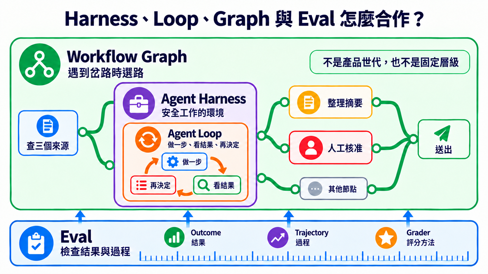
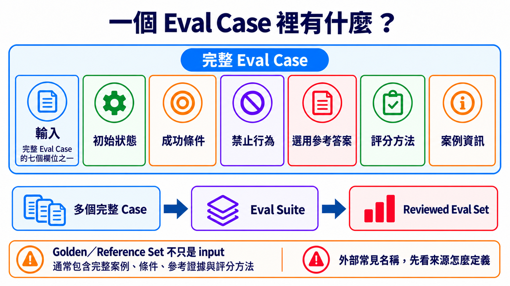

# Stage 7 — Agent 上線工程：可測、可看、可停、可恢復

> **繁體中文** | [简体中文](./07-multi-agent-production.zh-Hans.md) | [English](./07-multi-agent-production.en.md)

<!-- freshness: canonical=stages/07-multi-agent-production.md; verified_on=2026-09-13; scope=evals,observability,human-approval,persistence,recovery,orchestration,resources; max_age_days=90 -->

這一關教你把 AI 幫手交給別人使用。它不能只在你面前偶爾成功；你還要能檢查它、看見它做過什麼、在危險動作前停下，並在出錯後安全繼續。

## 🎯 這一關在做什麼（先定位）

本學習地圖把「讓 AI 幫手可以安心交給別人使用」的工作合稱為 **Agent Production Engineering（Agent 上線工程）**。它像把一台玩具車放到真正的馬路前，先補上方向盤、煞車和儀表板。本章用這個詞代表「讓 Agent 可測、可看、可停、可恢復」，不代表一定要服務很多人。

全章只用一個故事：AI 幫手查三個來源、整理摘要，送出前先請人確認。你會逐步替它補上工作環境、重複節奏、分支路線、檢查方法和安全煞車。

先記住上線順序：

> **先說清楚怎樣算成功 → 留下做事紀錄 → 危險動作先問人 → 確認跌倒後能繼續 → 最後才交給別人使用。**

| 你現在卡在哪裡 | 先做什麼 | 你要拿出的證據 |
|---|---|---|
| 不知道摘要算不算成功 | 先寫固定案例與成功條件 | 可重跑的檢查結果 |
| 出錯時不知道壞在哪一步 | 記錄每一步、錯誤、時間與成本 | 一次完整做事紀錄 |
| 會寄信、付款、刪除或寫入資料 | 在動作前停下來問人，並先保存進度 | 誰同意了，以及要從哪裡繼續 |
| 前三項都能重跑並通過 | 才交給別人使用 | 系統是否正常、怎麼停止、怎麼回到舊版 |

先把一個 AI 幫手做穩。只有工作真的能分開，或需要不同角色互相檢查時，才增加更多幫手。

<details markdown="1">
<summary>⏱ 展開：時間、環境、費用與安全提醒</summary>

- 建議分成數次短練習，不必一次做完。
- 需要 Python、Git；部署練習另需 Docker。
- 每個練習都先跑不需 API 金鑰的測試。要呼叫付費模型時，先設小額預算。
- 做事紀錄可能包含提示、工具輸入與模型回答。不要把密碼、個資或客戶資料直接送進追蹤平台。
- 多一個 Agent 通常就多一份模型呼叫、延遲與除錯工作。不要假設多 Agent 一定比較快或比較準。

</details>

## 📌 學習目標

完成本章後，你能：

1. 分清 AI 幫手工作的地方、反覆做事的節奏和帶岔路的完整路線。
2. 把真實失敗寫成可重跑的測試，不只看一次漂亮回答。
3. 找到一次任務裡的每一步、錯誤、時間與成本。
4. 讓高風險動作先停下問人，並能從正確位置繼續。
5. 用同一組證據判斷系統能不能交給別人使用。

<a id="-先認識核心詞"></a>
## 🧩 先認識十九個核心詞

先看「像什麼」抓住方向，再看「本章用途／技術界線」了解這一關怎麼使用它。同類詞已合併在同一組，不需要讀兩次。

<table>
<thead><tr><th scope="col">先解決什麼</th><th scope="col">核心詞</th><th scope="col">五歲也能懂的說法</th><th scope="col">本章用途／技術界線</th></tr></thead>
<tbody>
<tr><th scope="rowgroup" rowspan="6">先讓任務跑得動</th><td><strong>Agent Harness（Agent 執行架構）</strong></td><td>AI 幫手工作的房間</td><td>放入模型、工具、權限、狀態、錯誤處理與紀錄的執行環境；本章用它安全地查資料與準備摘要</td></tr>
<tr><td><strong>Agent Loop（Agent 迴圈）</strong></td><td>做一步、看結果，再決定下一步</td><td>模型在一次任務裡反覆選動作、讀取工具結果，直到完成、超出限制或需要問人</td></tr>
<tr><td><strong>Workflow Graph（工作流程圖）</strong></td><td>有岔路的路線圖</td><td>用步驟、連線、條件與狀態排出不同情況該走的路；本章用它安排查資料、檢查與送出前核准</td></tr>
<tr><td><strong>Orchestration（編排）</strong></td><td>安排誰先做、誰後做</td><td>控制步驟、資料流、角色、重試與停止條件</td></tr>
<tr><td><strong>Multi-Agent（多 Agent）</strong></td><td>幾個 AI 幫手分工</td><td>多個 Agent 以清楚角色共同完成任務；它是選擇，不是每套系統都需要</td></tr>
<tr><td><strong>Handoff（交接）</strong></td><td>把接力棒和筆記一起交出去</td><td>一個 Agent 把控制權、必要資料與成果證據交給另一個 Agent</td></tr>
</tbody>
<tbody>
<tr><th scope="rowgroup" rowspan="7">再證明有做對</th><td><strong>Evaluation／Eval（評測）</strong></td><td>用同一張檢查表反覆檢查</td><td>用固定案例、環境、評分方法與門檻量測 Agent 的結果和過程</td></tr>
<tr><td><strong>Outcome（結果）</strong></td><td>最後真的發生什麼</td><td>任務結束時外部可驗證的狀態；本章要確認摘要真的包含三個合格來源，而不是只相信 Agent 說「完成了」</td></tr>
<tr><td><strong>Trajectory（軌跡）</strong></td><td>一路留下的腳印</td><td>一次執行中做過的事，包括工具呼叫、中間結果、錯誤與輸出</td></tr>
<tr><td><strong>Grader（評分器）</strong></td><td>照規則批改一份答案</td><td>依成功條件替一個 Eval Case 評分的方法、程式或模型；本章要求保留規則與人工抽查</td></tr>
<tr><td><strong>Evaluation Harness（評測執行架構）</strong></td><td>固定出題、收卷和計分的考場</td><td>載入案例、重跑 Agent、呼叫 grader 並保存結果的測試系統；它和負責日常執行的 Agent Harness 不是同一個責任</td></tr>
<tr><td><strong>Trace（追蹤紀錄）</strong></td><td>把一路的腳印收進一本紀錄簿</td><td>一次任務中依時間排列的步驟、工具呼叫、錯誤與結果；本章用它找出哪一步出錯</td></tr>
<tr><td><strong>Observability（可觀測性）</strong></td><td>替系統裝透明窗</td><td>用追蹤紀錄、系統紀錄與數值指標看見內部狀態；本章用它找出摘要在哪一步漏掉來源</td></tr>
</tbody>
<tbody>
<tr><th scope="rowgroup" rowspan="6">最後讓它能停、能接著做</th><td><strong>Guardrail（護欄）</strong></td><td>先擋住不能做的事</td><td>限制輸入、輸出、工具權限或高風險操作的規則</td></tr>
<tr><td><strong>Human Approval（人工核准）</strong></td><td>危險動作先問人</td><td>執行敏感 tool call 前暫停，由人批准、修改或拒絕</td></tr>
<tr><td><strong>Checkpoint（檢查點）</strong></td><td>先存檔再往下走</td><td>保存目前做到哪裡和版本資訊，讓任務可以恢復</td></tr>
<tr><td><strong>Resume（續跑）</strong></td><td>回到存檔點繼續</td><td>用同一個任務編號載入檢查點並繼續執行</td></tr>
<tr><td><strong>Recovery（復原）</strong></td><td>跌倒後安全回來</td><td>失敗後停止、重試、補償或人工接手的策略</td></tr>
<tr><td><strong>Idempotency（冪等）</strong></td><td>按兩次也只做一次</td><td>使用相同重試識別碼時，不會重複寄信、付款或寫入資料</td></tr>
</tbody>
</table>

**Prompt（提示）**是你交給模型的指令與材料。**Context（上下文）**是這一步需要看的資料。它們仍然重要；本章是在外面補上執行、檢查和復原的系統。

## 🚪 進入條件

你至少應該完成：

- [Stage 4](04-agent-frameworks.md)：知道 Agent、Tool 與 Workflow 是什麼。
- [Stage 5](05-claude-code-ecosystem.md)：看過工具權限、Subagent 與開發流程。
- [Stage 6](06-memory-rag.md)：知道 Context、RAG 與 Memory 不一樣。

Docker 還不熟也可以開始；先做四個核心練習，再為核心練習 4 補 Docker。

## 📚 必修閱讀

先按 production 順序讀這六份：

1. [Anthropic — Demystifying evals for AI agents](https://www.anthropic.com/engineering/demystifying-evals-for-ai-agents)：先分清 **Outcome** 與完整 **Trajectory**；Agent 說「完成」不等於外部結果真的完成。
2. [OpenAI Agents SDK — Tracing](https://openai.github.io/openai-agents-python/tracing/)：看 trace、span、tool、handoff 與 guardrail 事件如何串起一次 run。
3. [OpenAI Agents SDK — Human-in-the-loop](https://openai.github.io/openai-agents-python/human_in_the_loop/)：敏感工具先暫停，再保存 `RunState`、核准或拒絕並 resume。
4. [LangGraph — Persistence](https://docs.langchain.com/oss/python/langgraph/persistence)：分清 checkpoint 與跨 thread store，知道中斷、復原與長期記憶不是同一件事。
5. [LangGraph — Interrupts](https://docs.langchain.com/oss/python/langgraph/interrupts)：看人工核准如何暫停與續跑，以及為什麼 interrupt 前的副作用必須冪等。
6. [Anthropic — Building Effective Agents](https://www.anthropic.com/engineering/building-effective-agents)：先用簡單組合，只有真的需要分工時才增加自主性或 Multi-Agent。

<details markdown="1">
<summary>📖 展開：延伸閱讀與用途</summary>

1. [Anthropic — Develop tests and evaluations](https://platform.claude.com/docs/en/test-and-evaluate/develop-tests)：先寫可量測的成功標準，再選評分方式。
2. [OpenAI Agents SDK — Testing utilities](https://openai.github.io/openai-agents-python/testing/)：用可重複的假模型測試，不必每次花 API 費用。
3. [OpenAI Agents SDK — Running agents](https://openai.github.io/openai-agents-python/running_agents/)：看一次 Agent Loop 如何反覆執行，並用 `max_turns` 停下來。
4. [OpenAI Agents SDK — Multi-agent orchestration](https://openai.github.io/openai-agents-python/multi_agent/)：比較 manager 與 **Handoff**；這是選修，不是第一個 production 步驟。
5. [LangGraph — Workflows and agents](https://docs.langchain.com/oss/python/langgraph/workflows-agents)：分清固定 Workflow 與會自己決定下一步的 Agent。
6. [Microsoft Agent Framework — Workflow concepts](https://learn.microsoft.com/en-us/agent-framework/concepts/workflows/)：看 executor、edge、event 與 state 怎麼組成 Workflow Graph。
7. [OpenAI — Harness engineering](https://openai.com/index/harness-engineering/)：看環境、回饋迴路與機器規則如何幫 Agent 穩定工作。
8. [OpenTelemetry — GenAI semantic conventions](https://github.com/open-telemetry/semantic-conventions-genai)：認識可攜的追蹤欄位；規格仍在演進，不要假設所有平台都完整支援。

</details>

<a id="五層工程分工prompt--context--harness--loop--graph"></a>
<a id="-harnessloopgraph-各自管什麼"></a>
## 🧭 Harness、Loop、Graph 與 Eval 怎麼合作？

它們不是四代產品，也不是只能選一個。請把同一個研究助理想成四個角度：

| 責任 | 白話問題 | 研究助理例子 |
|---|---|---|
| **Agent Harness** | 它在哪裡安全做事？ | 只允許讀資料；準備送出時必須停下 |
| **Agent Loop** | 它為什麼再做一輪？ | 少一個來源就再查一次；達到上限就停止 |
| **Workflow Graph** | 遇到不同情況要往哪走？ | 來源不足就回去查；足夠就進入人工核准 |
| **Eval** | 我怎麼知道結果和過程合格？ | 檢查三個來源、引用正確、沒有跳過核准 |

Eval 會檢查 **Outcome**、**Trajectory**，再由 **Grader** 依規則判斷是否合格。Eval 可以讓 Loop 重試、讓 Graph 換路，或要求 Harness 停止；但把 Harness 和 Eval 放在一起，仍不會自動產生「何時重複、何時停止」的 Loop。



學習順序是 [Stage 3 的 Agent Loop](03-tool-use-and-hello-agent.md) → [Stage 4 的 Workflow Graph／Agent Framework](04-agent-frameworks.md) → 本章的安全上線整合。**Loop Engineering** 是 IBM 使用的新興說法；**Graph Engineering** 的用法更鬆散。讀者要先學清楚責任，再把這些名稱當成社群搜尋詞。來源：[IBM — Loop Engineering](https://www.ibm.com/think/topics/loop-engineering)、[Anthropic — Agent harness 與 eval](https://www.anthropic.com/engineering/demystifying-evals-for-ai-agents)、[Microsoft Agent Framework — graph-based workflows](https://learn.microsoft.com/en-us/agent-framework/concepts/workflows/builder-and-execution)。

<a id="-harness-engineering--production-agent-runtime-的工程設計--本-stage-核心概念"></a>
## 🏗 Agent Harness：先把安全工作間準備好

模型像會想辦法的大腦，但它不能自己讀檔、寄信或保存進度。Agent Harness 把工具和規則接在模型旁邊，也常負責執行 Agent Loop。外層排程器可以多次呼叫同一個 Harness，所以 Harness 不只代表一次很短的執行。正式設計這個環境的工作常叫 **Harness Engineering**。來源：[OpenAI — Harness engineering](https://openai.com/index/harness-engineering/)、[Anthropic — Agent harness 定義](https://www.anthropic.com/engineering/demystifying-evals-for-ai-agents)、[Anthropic — Managed agents](https://www.anthropic.com/engineering/managed-agents)。

### Harness 的 8 個核心元件

這八項是本專案的 production 檢查表，不是全世界唯一的官方分類。

| 元件 | 五歲也能懂的說法 | 上線前要問 |
|---|---|---|
| **1. Orchestration／Run loop** | 決定下一步做什麼 | 誰開始、誰停止、交接失敗怎麼辦？ |
| **2. Tool／Permission boundary** | 只給它需要的鑰匙 | 哪些工具能讀、能寫、能刪？ |
| **3. Context／State／Checkpoint** | 保存它現在做到哪裡 | 中斷後能不能從正確位置繼續？ |
| **4. Retry／Recovery／Idempotency** | 跌倒能重來，又不會重複扣款 | 重試會不會重複寄信、付款或寫資料？ |
| **5. Guardrail／Human approval** | 危險動作先問大人 | 哪些操作一定要人按核准？ |
| **6. Telemetry／Observability** | 裝上透明窗 | 能不能看到 trace、錯誤、延遲與 token？ |
| **7. Eval harness** | 每次改動都重新考試 | 有固定案例、評分規則和失敗門檻嗎？ |
| **8. Cost／Latency budget** | 先說可以花多少錢和時間 | 超過預算時要停止、降級還是排隊？ |

<details markdown="1">
<summary>🔧 展開：回饋、復原與成本的實作重點</summary>

- 工具錯誤要寫成 Agent 看得懂的回饋，不只丟一大串 stack trace。
- 評分者最好和執行者分開；不要只問 Agent「你自己做得好不好」。
- 每個有外部副作用的動作都要設計 **idempotency（冪等）**，避免重試時重複付款、寄信或新增資料。
- Prompt caching、batching、model routing 與較小模型都可能省成本，但效果依工作而異。先量 baseline，再改一項，再重測。
- Anthropic prompt caching 可用自動方式或明確的 `cache_control`；快取期限與讀寫價格依方案不同，請以[官方文件](https://platform.claude.com/docs/en/build-with-claude/prompt-caching)為準。
- Trace 可能收進敏感輸入與輸出。上線前設定遮罩、保留期限與存取權限。

</details>

<a id="-loop-engineering--讓-agent-做看改而且知道何時停"></a>
## 🔁 Agent Loop：做一步、看結果，再決定

先分清三種很像、但範圍不同的 Loop：

| 名稱 | 它重複什麼 | 例子 |
|---|---|---|
| **程式迴圈** | 同一段程式碼 | `for item in items`；這是語法，不是本節主題 |
| **Agent Loop** | 模型 → 工具 → 工具結果 → 模型 | 一次 run 裡持續呼叫工具，直到完成或碰到 `max_turns` |
| **Loop Engineering** | 目標 → 動作 → 觀察 → 調整 | 一次長 run 或跨 session／排程反覆工作，每輪都有驗證、記憶、預算與停止條件 |

IBM 用 `Goal → Action → Observation → Adjustment` 說明較外層的 **Loop Engineering**。重點不是讓 Agent 永遠自己跑，而是每一輪都能回答：**目標還成立嗎？證據夠了嗎？要繼續、停止，還是交給人？**

因此，Loop Engineering **不是 Harness 的下一代產品，也不會自動淘汰 Harness**。在 Anthropic 的用語裡，Harness 本身就包含呼叫模型與路由工具的 loop；IBM 的 Loop Engineering 則把目標、檢查、工具、hooks、context、subagent 與持久狀態放進更大的反覆工作設計。不同文件切邊界的方法不同，所以請記責任，不要硬背一張唯一的層級圖。來源：[IBM — Loop Engineering](https://www.ibm.com/think/topics/loop-engineering)、[Anthropic — Managed Agents](https://www.anthropic.com/engineering/managed-agents)。

模型變強時，某個補丁可能可以刪掉。例如 Anthropic 在較新模型上移除了先前 harness 使用的 context reset。但這只表示**一個 workaround 經同一組 Eval 證明不再需要**，不表示權限、安全、log、eval 或 recovery 自動過時。來源：[Anthropic — Harness design for long-running applications](https://www.anthropic.com/engineering/harness-design-long-running-apps)。如何逐項保留、簡化或移除，放在 [Stage 7.5 的 Model–Harness Fit](07.5-advanced-agentic-concepts.md)。

<a id="-graph-engineering--把步驟loop-與核准排成完整路線"></a>
## 🗺 Workflow Graph：遇到岔路時知道往哪走

Agent Loop 負責「要不要再做一次」。Workflow Graph 負責「接下來要去哪裡」。它像一張有岔路的校園地圖；地圖能排路線，但不會替每一站完成工作。

外面的文章有時把這份工程工作稱為 **Graph Engineering**。這是新興稱呼；真正需要學會的是 node、edge、branch、cycle、state、checkpoint 與 human approval，不是先背一個尚未統一的標籤。

> **一個節點裡可以有 Agent Loop；節點之間由 Workflow Graph 安排順序。**

<details markdown="1">
<summary>🧠 展開：什麼時候選 Loop、Graph 或 Multi-Agent</summary>

- 任務只有一條路，但可能要重試很多次：先用 Loop。
- 任務有分支、平行步驟、人工核准或需要從中間恢復：用 Graph／Workflow。
- 不同部分真的能獨立工作，或必須由不同角色互查：才加入 Multi-Agent。
- 一個 Graph 節點可以是 Agent、工具、固定程式或「等人核准」；不是每個格子都要放一個 Agent。

</details>

<a id="-九個-eval-基礎積木先學會怎麼出考卷"></a>
## 🧪 Eval：先說要什麼，再決定怎麼評

Eval 不是一個分數，也不是等系統做完才補的報表。它先寫清楚「怎樣才算成功」，再用同一套方法檢查不同版本。

先從 **Outcome（結果）**開始。研究助理的 Outcome 不是「Agent 說摘要完成了」，而是「摘要真的使用三個合格來源、引用可以打開，而且尚未跳過人工核准」。

接著建立完整的 **Eval Case（評測案例）**。它像一張連規則都寫好的考題；input 只是其中一格。

| Eval Case 的部分 | 研究助理例子 | 為什麼要留 |
|---|---|---|
| **Input（輸入）** | `整理這三個主題` | 告訴系統要做什麼 |
| **Initial State（初始狀態）** | 三個候選來源、尚未核准 | 固定開始時的環境 |
| **Success Criteria（成功條件）** | 三個來源都能開啟；摘要包含可核對引用 | 說清楚怎樣算成功 |
| **Forbidden Actions（禁止行為）** | 不得捏造來源；不得自行送出 | 即使答案漂亮也不能做的事 |
| **Optional Reference Answer（選用參考答案）** | 一份人工核對過的摘要 | 有需要時提供比較方向；不是每題都必須有 |
| **Grader（評分方法）** | 程式檢查連結與數量，人檢查摘要是否忠於來源 | 決定誰照什麼規則評分 |
| **Case Metadata（案例資訊）** | case ID、版本、split、來源與標籤 | 讓同一題可以重跑和追蹤 |



把多個完整案例放在一起，叫做 **Eval Suite（評測組）**。替 Suite 留下版本，才能知道這次和上次是不是在考同一份題目。

經人檢查、可重複使用的完整案例集合，本專案稱為 **Reviewed Eval Set（已審查評測集）**。外部資料有時寫 **Golden Set** 或 **Reference Set**，但這些名稱沒有跨供應商一致定義。看到它們時，要回到來源確認它是在說題目、答案、標準，還是整套資料。

> **Golden／Reference Set 不只是 input，也不等於訓練資料或 Few-shot 範例。**它通常包含完整案例、條件、參考證據與評分方法；實際欄位仍要看當前專案的定義。

最後再加入這些測量詞：

| 名詞 | 白話意思 | 本章怎麼用 |
|---|---|---|
| **Trial（試跑）** | 同一題實際做一次 | 模型結果會變動時，同一個 case 要跑多次 |
| **Baseline（基線）** | 改之前先量一次 | 提供新舊版本的比較起點 |
| **Regression（退步）** | 新版本超過預先門檻地變差 | 同時檢查品質、成本、安全與可靠性 |
| **Development Set（開發集）** | 平常可以看的練習題 | 每次修改後重跑並用失敗改善系統 |
| **Holdout Set（保留集）** | 平常不偷看的最後考卷 | 只在 release candidate 或最後驗證時打開 |

Anthropic 的 [Agent Eval 指南](https://www.anthropic.com/engineering/demystifying-evals-for-ai-agents)把 task、trial、grader、trajectory 與 outcome 分開；OpenAI 的 [Graders API](https://platform.openai.com/docs/api-reference/graders?api-mode=chat)列出多種 grader。工具可以不同，但每份報告都應留下 dataset version、split、case ID、trial 次數、grader、Outcome、Trajectory 與 baseline。

負責載入 cases、重跑 Agent、呼叫 grader 並保存結果的系統，是前面定義過的 Evaluation Harness。它可以呼叫 Agent Harness，但兩者的責任不同：一個讓工作安全執行，一個讓測試可以重複比較。

## 🔎 Observability：出錯時看得見是哪一步

Observability 像在透明積木盒外面看每一格。它不是把所有內容公開，而是留下能除錯的 trace、log 與 metrics，並遮住密碼、個資和客戶資料。

在研究助理案例裡，一次 **Trace（追蹤紀錄）**要能回答：查了哪些來源、哪個工具失敗、重試幾次、花了多少時間，以及為什麼停在人工核准前。Trace 能解釋 Trajectory，但「記錄很多」不等於「結果正確」；Outcome 仍要交給 Eval 檢查。

## 🛑 Approval、Checkpoint、Resume 與 Recovery：先停，再安全繼續

研究助理準備送出摘要時，先進入 Human Approval。這不是請人從頭重做，而是把摘要、來源與風險一起交給人核對。

核准前先保存 Checkpoint。重新啟動後用 Resume 回到同一個 task；如果中間失敗，Recovery 決定要重試、補償、回到舊狀態，或交給人。任何會寄信、付款或寫資料的動作都要帶 Idempotency key，確保相同重試只產生一次外部效果。

<a id="-上線四步eval--observability--approvalrecovery--deploy"></a>
## 🛡 完整上線路線：Eval → Observability → Approval／Recovery → Deploy

**Deploy（部署）**是把通過檢查的系統交給別人使用。它像開店前正式開門；開門不是成功證明，前面的測試、紀錄、煞車和復原方式才是。

這四步不是成熟度徽章，而是同一次修改要走完的檢查路線：

| 順序 | 先回答的問題 | 最少要留下的證據 | 沒通過時怎麼做 |
|---:|---|---|---|
| 1. **Eval** | 最後結果真的對嗎？中間有沒有走危險捷徑？ | Anthropic 建議先從 20–50 個代表真實工作的 cases 起步；這是實務起點，不是所有專案的硬性最低數。另記 Outcome、Trajectory、grader、成本與失敗門檻 | 先補案例或修行為，不進部署 |
| 2. **Observability** | 壞掉時找得到哪一步嗎？ | task ID、trace／span、tool call、錯誤類型、延遲、token 與敏感資料遮罩 | 先讓失敗看得見，再改 Prompt 或模型 |
| 3. **Approval／Recovery** | 高風險動作能先停下嗎？中斷後能安全續跑嗎？ | 人工核准點、版本化 checkpoint、resume 測試、idempotency key、拒絕／timeout／補償路線 | fail closed，停止自動執行並交給人 |
| 4. **Deploy** | 前三項能在新版本重跑嗎？ | 服務是否活著與準備好、用量限制、回到舊版的方法、停止開關與版本紀錄 | 保留舊版或回到舊版，不把「服務有啟動」當成功 |

**Outcome Eval** 要檢查外部世界的結果。例如 Agent 說「信已寄出」只是文字；測試環境真的只有一封信、收件者正確，才是 Outcome 通過。**Trajectory Eval** 則檢查它用了哪些工具、嘗試幾次、是否繞過核准、花多少 token。兩種一起看，才不會只因最後一句很漂亮就放行。

案例先從真實失敗建立：每遇到一次錯誤，就留下去識別化的輸入、預期 Outcome、禁止動作與重現步驟。正式資料不能直接複製進公開 repo；必要時改成結構相同的假資料。

## 🧭 OpenRouter、Pi、OpenCode、Orca、QM 到底差在哪？

它們不是五個同類產品。把它們放到正確層，就不會混在一起：

| 名稱 | 它是什麼 | 一句話記法 |
|---|---|---|
| [OpenRouter](https://openrouter.ai/docs/quickstart) | 模型 API 入口／Router | 幫程式連到不同模型，本身不是幫你改程式的 Agent |
| [Pi](https://github.com/earendil-works/pi) | Agent toolkit 與 coding-agent CLI | 會呼叫模型和工具，把任務做完 |
| [OpenCode](https://github.com/anomalyco/opencode) | 開源 coding agent | 在程式碼專案裡讀、改、測 |
| [Orca](https://github.com/stablyai/orca) | 多 Agent 開發環境 | 讓多個 coding agent 在隔離 worktree 平行工作與比較 |
| [QM](https://github.com/yc-software/qm) | 團隊用的多 Agent harness | 管理多人、workspace、權限、排程與協作 |

> **模型入口 → Agent runtime → 多 Agent 協作平台**。這三層可以互相搭配，但不能互相代替。

## 🛠 動手練習

先走四個核心練習。不要先把檔案改名或重抄一份；直接跑測試，再只改一個小地方。

### 核心練習 1：Eval

**成果：**用固定案例與規則檢查 Agent，看到哪一題退步。

```bash
cd examples/stage-7/02-eval
python test.py
```

### 核心練習 2：Observability

**成果：**看到一次執行的步驟、延遲、token 與錯誤。

```bash
cd examples/stage-7/03-observability
python test.py
```

### 核心練習 3：Approval、Checkpoint 與 Recovery

**成果：**敏感動作先停在人工核准點；重新啟動後從 checkpoint resume，相同 idempotency key 不會重複執行。

```bash
cd examples/stage-7/06-safe-execution
python test.py
```

### 核心練習 4：Deploy

**成果：**把 Agent 包成有 `/health` 與 `/chat` 的 API，再用測試確認錯誤狀態。

```bash
cd examples/stage-7/05-deploy
python test.py
```

<details markdown="1">
<summary>🛠 展開：練習順序、付費路徑與觀察重點</summary>

1. 每題先跑 `python test.py`；這條路使用 mock，不需 API 金鑰。
2. Eval、Observability 與 Deploy 測試通過後，才依 README 選本機 Ollama 或 Anthropic 路徑；Safe Execution 全程使用假動作，不需要模型。
3. 只改一件事：評分規則、trace 欄位、核准結果、checkpoint 損壞情境或 API 錯誤處理。
4. 再跑測試，寫下「改了什麼、哪個結果變了、是否超過預算」。
5. 核心練習 4 的 Docker 是加分項；先用 FastAPI 測試確認行為，再啟動服務。

</details>

## 🧭 進階選修（入口保持可見）

### 選修 A：Multi-Agent 辯論

**成果：**兩個 Agent 分別提出正反意見，第三個 Agent 依規則裁決。只有單一 Agent baseline 已有 Eval，且角色真的需要分開時再做。

[打開 Multi-Agent 範例](../examples/stage-7/01-multi-agent-debate/README.md)

### 選修 B：Streaming 與 Prompt caching

**成果：**比較 streaming 與 prompt caching 的行為；成本效果必須自己量，不把 cache 當成安全或復原機制。

[打開 SDK 進階範例](../examples/stage-7/04-sdk-advanced/README.md)

<details markdown="1">
<summary>🧪 展開：兩個選修的直接測試命令</summary>

```bash
cd examples/stage-7/01-multi-agent-debate
python test.py

cd ../04-sdk-advanced
python test.py
```

</details>

## 🧪 推薦小專案：有收據的研究助理

先做一個單一 Agent 版本：

1. 找三個來源，保留 URL 與擷取時間。
2. 只根據來源寫短摘要；找不到就明寫不知道。
3. 在「發布摘要」前停下來，讓人核准、修改或拒絕。
4. 保存 checkpoint；模擬程式中斷後 resume。
5. 用 idempotency key 證明同一次發布重跑也只寫入一次。

最後輸出一張 **execution receipt（執行收據）**：task ID、Outcome、Trajectory、工具、來源、耗時、token、錯誤、checkpoint 版本與人工核准紀錄。先用 5 個 development cases 做 baseline，再把真實失敗逐步加進版本化 suite。若結果看起來退步，先重跑足夠 trials，確認是否超過預先寫好的門檻，再檢查失敗案例；不能因一次隨機失敗就直接判定整版不可部署。

單一 Agent 版本穩定後，才把「找資料」與「審查」拆成不同 Agent，比較品質、成本與延遲是否真的更好。

## 📊 Agent Benchmark Landscape：怎麼看，不要只看排行榜 + ⚠ Reward-Hacking 警告

**Benchmark（基準測試）**像統一考卷。它能幫你比較，但不能保證你的真實工作也會一樣好。

看任何分數前，先問五件事：

| 要看什麼 | 白話問題 |
|---|---|
| Task | 考題跟我的工作像嗎？ |
| Environment | 模型拿到哪些工具、資料與權限？ |
| Grader | 誰評分？規則有沒有漏洞？ |
| Trajectory | 它真的完成任務，還是只碰巧拿到分數？ |
| Hold-out | 它有沒有通過我自己沒拿來調整的測試？ |

**Reward hacking（獎勵鑽漏洞）**就是「拿到高分，卻沒有真的完成目的」。像小孩發現只要按一下鐘就有糖，於是一直按鐘，卻沒做原本的任務。

<details markdown="1">
<summary>📊 展開：可參考的 Benchmark 與 production 評測方法</summary>

- [SWE-bench](https://www.swebench.com/)：真實軟體問題。
- [Terminal-Bench](https://github.com/harbor-framework/terminal-bench-1)：終端機任務。
- [OSWorld](https://github.com/xlang-ai/OSWorld)：桌面環境操作。
- [τ²-bench](https://github.com/sierra-research/tau2-bench)：需要工具與多輪互動的任務。
- [GAIA](https://huggingface.co/gaia-benchmark)：一般助理任務。

不要把頁面上的某個 SOTA 分數抄成永久事實。上線判斷應以自己的案例、rubric、完整 trajectory、成本與延遲為主。每次換模型、Prompt、Tool 或 Harness，先重跑 development／reference cases；frozen holdout 不拿來逐次調整，只在 release candidate 或最後驗證時打開。

</details>

## 🎯 精選 Projects（範本 / SDK / 工具 collection）

先按用途選一個，不要一次安裝全部。評分是本專案的教學適合度，不是 GitHub stars。

以下 21 筆直接放在這裡，因為它們是讀者選工具時會回來看的路標。

<table>
  <thead>
    <tr><th scope="col">分類</th><th scope="col">Project／文件</th><th scope="col">教學適合度</th><th scope="col">適合做什麼</th><th scope="col">先知道的限制</th></tr>
  </thead>
  <tbody>
    <tr><th scope="rowgroup" rowspan="4">Orchestration／Workflow</th><td><a href="https://www.anthropic.com/engineering/building-effective-agents">Anthropic — Building Effective Agents</a></td><td>⭐⭐⭐⭐⭐</td><td>先學簡單 workflow，再理解 Agent</td><td>是設計指南，不是可直接部署的框架</td></tr>
    <tr><td><a href="https://openai.github.io/openai-agents-python/multi_agent/">OpenAI Agents SDK orchestration</a></td><td>⭐⭐⭐⭐⭐</td><td>比較 manager 與 handoff</td><td>範例以 OpenAI Agents SDK 為主</td></tr>
    <tr><td><a href="https://learn.microsoft.com/en-us/agent-framework/workflows/orchestrations/">Microsoft Agent Framework orchestrations</a></td><td>⭐⭐⭐⭐</td><td>順序、平行、handoff、群聊與人工核准</td><td>先確認套件版本與目前預覽狀態</td></tr>
    <tr><td><a href="https://github.com/langchain-ai/langgraph">LangGraph</a></td><td>⭐⭐⭐⭐⭐</td><td>需要 state、checkpoint 與 human-in-the-loop</td><td>抽象較多，第一個 Agent 不必從這裡開始</td></tr>
  </tbody>
  <tbody>
    <tr><th scope="rowgroup" rowspan="6">Eval／Observability</th><td><a href="https://platform.claude.com/docs/en/test-and-evaluate/develop-tests">Anthropic — Develop tests and evaluations</a></td><td>⭐⭐⭐⭐⭐</td><td>建立成功標準與 grader</td><td>需自行準備代表真實工作的案例</td></tr>
    <tr><td><a href="https://github.com/promptfoo/promptfoo">promptfoo</a></td><td>⭐⭐⭐⭐⭐</td><td>把 Eval 放進 CI</td><td>設定檔不能代替好的 rubric</td></tr>
    <tr><td><a href="https://github.com/open-telemetry/semantic-conventions-genai">OpenTelemetry GenAI conventions</a></td><td>⭐⭐⭐⭐</td><td>學可攜的 trace 欄位</td><td>規格仍演進，各平台支援度不同</td></tr>
    <tr><td><a href="https://github.com/langfuse/langfuse">Langfuse</a></td><td>⭐⭐⭐⭐⭐</td><td>trace、Eval 與 prompt 管理</td><td>自架仍需維運與資料治理</td></tr>
    <tr><td><a href="https://github.com/Arize-ai/phoenix">Arize Phoenix</a></td><td>⭐⭐⭐⭐</td><td>OpenTelemetry 與本機分析</td><td>先設計敏感資料遮罩</td></tr>
    <tr><td><a href="https://www.anthropic.com/engineering/demystifying-evals-for-ai-agents">Anthropic — Demystifying evals for AI agents</a></td><td>⭐⭐⭐⭐⭐</td><td>一起檢查 Outcome、Trajectory 與 grader</td><td>案例仍要從自己的真實工作與失敗建立</td></tr>
  </tbody>
  <tbody>
    <tr><th scope="rowgroup" rowspan="6">Harness／Sandbox／Deploy</th><td><a href="https://github.com/anthropics/claude-agent-sdk-python">Claude Agent SDK Python</a></td><td>⭐⭐⭐⭐⭐</td><td>閱讀工具迴圈、權限與 subagent 實作</td><td>以 Claude runtime 為中心</td></tr>
    <tr><td><a href="https://github.com/deepseek-ai/deepseek-harness">DeepSeek Harness</a></td><td>⭐⭐⭐</td><td>閱讀 plugin-based harness 架構</td><td>Developer preview；可能有破壞性變更</td></tr>
    <tr><td><a href="https://openai.github.io/openai-agents-python/human_in_the_loop/">OpenAI Agents SDK — Human-in-the-loop</a></td><td>⭐⭐⭐⭐⭐</td><td>暫停敏感工具、保存 RunState 並 resume</td><td>保存的 state 也可能含 context 與 runtime metadata，要按敏感資料管理</td></tr>
    <tr><td><a href="https://docs.langchain.com/oss/python/langgraph/interrupts">LangGraph — Interrupts</a></td><td>⭐⭐⭐⭐⭐</td><td>核准、checkpoint、resume 與冪等副作用</td><td>production 要使用 durable checkpointer，不能只靠記憶體</td></tr>
    <tr><td><a href="https://github.com/sandbaseai/sandbase-harness">SandBase Harness</a></td><td>⭐⭐⭐⭐</td><td>看 self-hosted runtime 怎麼保存工作、接 MCP、停下來等人批准，並留下 audit／replay 紀錄</td><td>仍是 v0.x；隔離強度取決於 local／Docker／Kubernetes／Worker backend 與部署設定，不是固定的 microVM 保證</td></tr>
    <tr><td><a href="https://github.com/bentoml/BentoML">BentoML</a></td><td>⭐⭐⭐⭐</td><td>把應用包成服務與容器</td><td>部署框架不會自動補齊 Eval 和 Guardrail</td></tr>
  </tbody>
  <tbody>
    <tr><th scope="rowgroup" rowspan="5">Multi-Agent 案例</th><td><a href="https://github.com/crewAIInc/crewAI">crewAI</a></td><td>⭐⭐⭐⭐</td><td>理解角色式任務分工</td><td>角色多不等於答案一定更好</td></tr>
    <tr><td><a href="https://github.com/stablyai/orca">Orca</a></td><td>⭐⭐⭐⭐</td><td>在隔離 worktree 平行跑 coding agents</td><td>平行結果仍需要人審查與選擇</td></tr>
    <tr><td><a href="https://github.com/yc-software/qm">QM</a></td><td>⭐⭐⭐⭐</td><td>觀察團隊 workspace、權限與排程</td><td>組織級部署比個人 CLI 複雜</td></tr>
    <tr><td><a href="https://github.com/AMAP-ML/LongHorizon-Harness">LongHorizon-Harness</a></td><td>⭐⭐⭐</td><td>看 Manager／Executor／Auditor 分工</td><td>專案很新，長期維護紀錄仍有限</td></tr>
    <tr><td><a href="https://github.com/cft0808/edict">Edict</a></td><td>⭐⭐⭐</td><td>用中文案例理解規劃、審查與執行角色</td><td>特殊角色命名是案例設計，不是業界標準</td></tr>
  </tbody>
</table>

<small>資料查核：2026-09-13 UTC</small>

## ✅ Stage 7 之後的自我檢查

- [ ] 我能分清 Outcome 與 Trajectory，並用兩者檢查同一個 case。
- [ ] 我有從真實失敗建立的固定 Eval cases，不只看一次漂亮輸出。
- [ ] 我能找到一次執行的 trace、錯誤、延遲與 token。
- [ ] 高風險工具有最小權限與人工核准；沒有核准時會 fail closed。
- [ ] 我能從 checkpoint resume，並證明相同 idempotency key 不會重複副作用。
- [ ] 我能展示 execution receipt，並說明何時停止、復原或 rollback。
- [ ] 我能用一句話分清 OpenRouter、Agent runtime 與多 Agent 平台，也知道單一 Agent 是預設選擇。

完成後，進入 [Stage 7.5 — 進階 Agentic 概念地圖](07.5-advanced-agentic-concepts.md)，再到 [Stage 8 — Agent Interfaces](08-agent-interfaces.md)。如果其中一項還說不清楚，回到對應練習，只改一件事再測一次。
