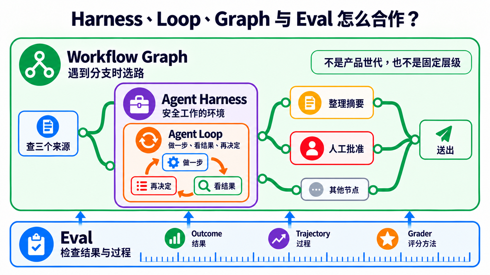
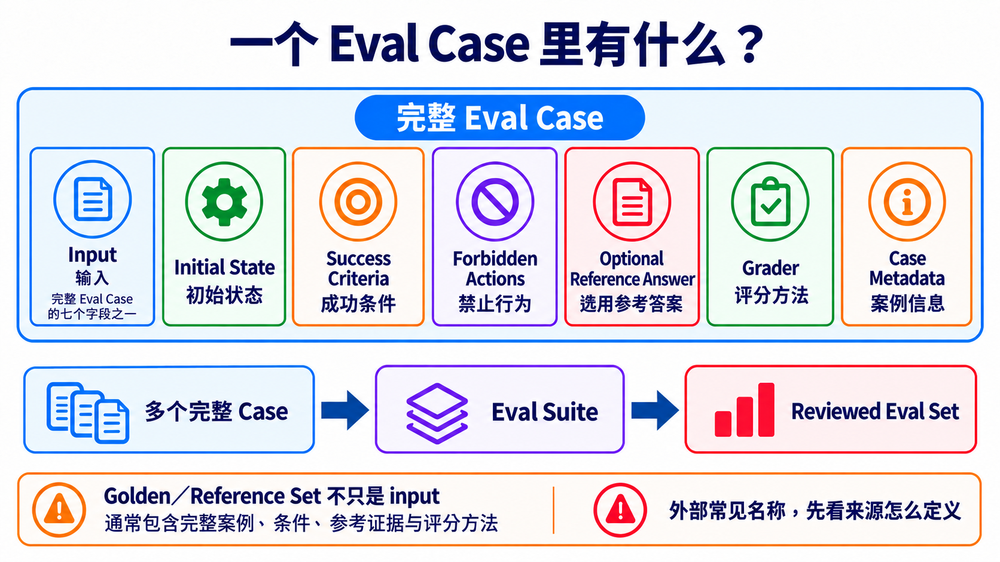

# Stage 7 — Agent 上线工程：可测、可看、可停、可恢复

> [繁體中文](./07-multi-agent-production.md) | **简体中文** | [English](./07-multi-agent-production.en.md)

<!-- freshness: canonical=stages/07-multi-agent-production.md; verified_on=2026-09-13; scope=evals,observability,human-approval,persistence,recovery,orchestration,resources; max_age_days=90 -->

这一关教你把 AI 帮手交给别人使用。它不能只在你面前偶尔成功；你还要能检查它、看见它做过什么、在危险动作前停下，并在出错后安全继续。

## 🎯 这一关在做什么（先定位）

本学习地图把“让 AI 帮手可以安心交给别人使用”的工作合称为 **Agent Production Engineering（Agent 上线工程）**。它像把一台玩具车放到真正的马路前，先补上方向盘、煞车和仪表板。本章用这个词代表“让 Agent 可测、可看、可停、可恢复”，不代表一定要服务很多人。

全章只用一个故事：AI 帮手查三个来源、整理摘要，送出前先请人确认。你会逐步替它补上工作环境、重复节奏、分支路线、检查方法和安全煞车。

先记住上线顺序：

> **先说清楚怎样算成功 → 留下做事纪录 → 危险动作先问人 → 确认跌倒后能继续 → 最后才交给别人使用。**

| 你现在卡在哪里 | 先做什么 | 你要拿出的证据 |
|---|---|---|
| 不知道摘要算不算成功 | 先写固定案例与成功条件 | 可重跑的检查结果 |
| 出错时不知道坏在哪一步 | 记录每一步、错误、时间与成本 | 一次完整做事纪录 |
| 会寄信、付款、删除或写入数据 | 在动作前停下来问人，并先保存进度 | 谁同意了，以及要从哪里继续 |
| 前三项都能重跑并通过 | 才交给别人使用 | 系统是否正常、怎么停止、怎么回到旧版 |

先把一个 AI 帮手做稳。只有工作真的能分开，或需要不同角色互相检查时，才增加更多帮手。

<details markdown="1">
<summary>⏱ 展开：时间、环境、费用与安全提醒</summary>

- 建议分成数次短练习，不必一次做完。
- 需要 Python、Git；部署练习另需 Docker。
- 每个练习都先跑不需 API 密钥的测试。要调用付费模型时，先设小额预算。
- 做事纪录可能包含提示、工具输入与模型回答。不要把密码、个资或客户数据直接送进追踪平台。
- 多一个 Agent 通常就多一份模型调用、延迟与调试工作。不要假设多 Agent 一定比较快或比较准。

</details>

## 📌 学习目标

完成本章后，你能：

1. 分清 AI 帮手工作的地方、反复做事的节奏和带岔路的完整路线。
2. 把真实失败写成可重跑的测试，不只看一次漂亮回答。
3. 找到一次任务里的每一步、错误、时间与成本。
4. 让高风险动作先停下问人，并能从正确位置继续。
5. 用同一组证据判断系统能不能交给别人使用。

<a id="-先认识核心词"></a>
## 🧩 先认识十九个核心词

先看“五岁也能懂的说法”抓住方向，再看“本章用途／技术边界”了解这一关怎么使用它。同类词已经合并在同一组，不需要读两次。

<table>
<thead><tr><th scope="col">先解决什么</th><th scope="col">核心词</th><th scope="col">五岁也能懂的说法</th><th scope="col">本章用途／技术边界</th></tr></thead>
<tbody>
<tr><th scope="rowgroup" rowspan="6">先让任务跑得动</th><td><strong>Agent Harness（Agent 执行架构）</strong></td><td>AI 帮手工作的房间</td><td>放入模型、工具、权限、状态、错误处理与纪录的执行环境；本章用它安全地查资料与准备摘要</td></tr>
<tr><td><strong>Agent Loop（Agent 循环）</strong></td><td>做一步、看结果，再决定下一步</td><td>模型在一次任务里反复选动作、读取工具结果，直到完成、超出限制或需要问人</td></tr>
<tr><td><strong>Workflow Graph（工作流程图）</strong></td><td>有岔路的路线图</td><td>用步骤、连接、条件与状态排出不同情况该走的路；本章用它安排查数据、检查与送出前批准</td></tr>
<tr><td><strong>Orchestration（编排）</strong></td><td>安排谁先做、谁后做</td><td>控制步骤、数据流、角色、重试与停止条件</td></tr>
<tr><td><strong>Multi-Agent（多 Agent）</strong></td><td>几个 AI 帮手分工</td><td>多个 Agent 以清楚角色共同完成任务；它是选择，不是每套系统都需要</td></tr>
<tr><td><strong>Handoff（交接）</strong></td><td>把接力棒和笔记一起交出去</td><td>一个 Agent 把控制权、必要数据与成果证据交给另一个 Agent</td></tr>
</tbody>
<tbody>
<tr><th scope="rowgroup" rowspan="7">再证明有做对</th><td><strong>Evaluation／Eval（评测）</strong></td><td>用同一张检查表反复检查</td><td>用固定案例、环境、评分方法与门槛量测 Agent 的结果和过程</td></tr>
<tr><td><strong>Outcome（结果）</strong></td><td>最后真的发生什么</td><td>任务结束时外部可验证的状态；本章要确认摘要真的包含三个合格来源，而不是只相信 Agent 说“完成了”</td></tr>
<tr><td><strong>Trajectory（轨迹）</strong></td><td>一路留下的脚印</td><td>一次运行中做过的事，包括工具调用、中间结果、错误与输出</td></tr>
<tr><td><strong>Grader（评分器）</strong></td><td>照规则批改一份答案</td><td>依成功条件为一个 Eval Case 评分的方法、程序或模型；本章要求保留规则与人工抽查</td></tr>
<tr><td><strong>Evaluation Harness（评测执行架构）</strong></td><td>固定出题、收卷和计分的考场</td><td>加载案例、重跑 Agent、调用 grader 并保存结果的测试系统；它和负责日常执行的 Agent Harness 不是同一个责任</td></tr>
<tr><td><strong>Trace（追踪纪录）</strong></td><td>把一路的脚印收进一本纪录簿</td><td>一次任务中依时间排列的步骤、工具调用、错误与结果；本章用它找出哪一步出错</td></tr>
<tr><td><strong>Observability（可观测性）</strong></td><td>替系统装透明窗</td><td>用追踪纪录、系统纪录与数值指标看见内部状态；本章用它找出摘要在哪一步漏掉来源</td></tr>
</tbody>
<tbody>
<tr><th scope="rowgroup" rowspan="6">最后让它能停、能接着做</th><td><strong>Guardrail（护栏）</strong></td><td>先挡住不能做的事</td><td>限制输入、输出、工具权限或高风险操作的规则</td></tr>
<tr><td><strong>Human Approval（人工批准）</strong></td><td>危险动作先问人</td><td>运行敏感 tool call 前暂停，由人批准、修改或拒绝</td></tr>
<tr><td><strong>Checkpoint（检查点）</strong></td><td>先存盘再往下走</td><td>保存目前做到哪里和版本信息，让任务可以恢复</td></tr>
<tr><td><strong>Resume（续跑）</strong></td><td>回到存盘点继续</td><td>用同一个任务编号加载检查点并继续运行</td></tr>
<tr><td><strong>Recovery（恢复）</strong></td><td>跌倒后安全回来</td><td>失败后停止、重试、补偿或人工接手的策略</td></tr>
<tr><td><strong>Idempotency（幂等）</strong></td><td>按两次也只做一次</td><td>使用相同重试识别码时，不会重复寄信、付款或写入数据</td></tr>
</tbody>
</table>

**Prompt（提示）**是你交给模型的指令与材料。**Context（上下文）**是这一步需要看的数据。它们仍然重要；本章是在外面补上运行、检查和恢复的系统。

## 🚪 进入条件

你至少应该完成：

- [Stage 4](04-agent-frameworks.zh-Hans.md)：知道 Agent、Tool 与 Workflow 是什么。
- [Stage 5](05-claude-code-ecosystem.zh-Hans.md)：看过工具权限、Subagent 与开发流程。
- [Stage 6](06-memory-rag.zh-Hans.md)：知道 Context、RAG 与 Memory 不一样。

Docker 还不熟也可以开始；先做四个核心练习，再为核心练习 4 补 Docker。

## 📚 必修阅读

先按 production 顺序读这六份：

1. [Anthropic — Demystifying evals for AI agents](https://www.anthropic.com/engineering/demystifying-evals-for-ai-agents)：先分清 **Outcome** 与完整 **Trajectory**；Agent 说“完成”不等于外部结果真的完成。
2. [OpenAI Agents SDK — Tracing](https://openai.github.io/openai-agents-python/tracing/)：看 trace、span、tool、handoff 与 guardrail 事件如何串起一次 run。
3. [OpenAI Agents SDK — Human-in-the-loop](https://openai.github.io/openai-agents-python/human_in_the_loop/)：敏感工具先暂停，再保存 `RunState`、批准或拒绝并 resume。
4. [LangGraph — Persistence](https://docs.langchain.com/oss/python/langgraph/persistence)：分清 checkpoint 与跨 thread store，知道中断、恢复与长期记忆不是同一件事。
5. [LangGraph — Interrupts](https://docs.langchain.com/oss/python/langgraph/interrupts)：看人工批准如何暂停与续跑，以及为什么 interrupt 前的副作用必须幂等。
6. [Anthropic — Building Effective Agents](https://www.anthropic.com/engineering/building-effective-agents)：先用简单组合，只有真的需要分工时才增加自主性或 Multi-Agent。

<details markdown="1">
<summary>📖 展开：延伸阅读与用途</summary>

1. [Anthropic — Develop tests and evaluations](https://platform.claude.com/docs/en/test-and-evaluate/develop-tests)：先写可量测的成功标准，再选评分方式。
2. [OpenAI Agents SDK — Testing utilities](https://openai.github.io/openai-agents-python/testing/)：用可重复的假模型测试，不必每次花 API 费用。
3. [OpenAI Agents SDK — Running agents](https://openai.github.io/openai-agents-python/running_agents/)：看一次 Agent Loop 如何反复运行，并用 `max_turns` 停下来。
4. [OpenAI Agents SDK — Multi-agent orchestration](https://openai.github.io/openai-agents-python/multi_agent/)：比较 manager 与 **Handoff**；这是选修，不是第一个 production 步骤。
5. [LangGraph — Workflows and agents](https://docs.langchain.com/oss/python/langgraph/workflows-agents)：分清固定 Workflow 与会自己决定下一步的 Agent。
6. [Microsoft Agent Framework — Workflow concepts](https://learn.microsoft.com/en-us/agent-framework/concepts/workflows/)：看 executor、edge、event 与 state 怎么组成 Workflow Graph。
7. [OpenAI — Harness engineering](https://openai.com/index/harness-engineering/)：看环境、回馈回路与机器规则如何帮 Agent 稳定工作。
8. [OpenTelemetry — GenAI semantic conventions](https://github.com/open-telemetry/semantic-conventions-genai)：认识可携的追踪字段；规格仍在演进，不要假设所有平台都完整支持。

</details>

<a id="五层工程分工prompt--context--harness--loop--graph"></a>
<a id="-harnessloopgraph-各自管什么"></a>
## 🧭 Harness、Loop、Graph 与 Eval 怎么合作？

它们不是四代产品，也不是只能选一个。请把同一个研究助理想成四个角度：

| 责任 | 白话问题 | 研究助理例子 |
|---|---|---|
| **Agent Harness** | 它在哪里安全做事？ | 只允许读数据；准备送出时必须停下 |
| **Agent Loop** | 它为什么再做一轮？ | 少一个来源就再查一次；达到上限就停止 |
| **Workflow Graph** | 遇到不同情况要往哪走？ | 来源不足就回去查；足够就进入人工批准 |
| **Eval** | 我怎么知道结果和过程合格？ | 检查三个来源、引用正确、没有跳过批准 |

Eval 会检查 **Outcome**、**Trajectory**，再由 **Grader** 依规则判断是否合格。Eval 可以让 Loop 重试、让 Graph 换路，或要求 Harness 停止；但把 Harness 和 Eval 放在一起，仍不会自动产生“何时重复、何时停止”的 Loop。



学习顺序是 [Stage 3 的 Agent Loop](03-tool-use-and-hello-agent.zh-Hans.md) → [Stage 4 的 Workflow Graph／Agent Framework](04-agent-frameworks.zh-Hans.md) → 本章的安全上线集成。**Loop Engineering** 是 IBM 使用的新兴说法；**Graph Engineering** 的用法更松散。读者要先学清楚责任，再把这些名称当成社群搜索词。来源：[IBM — Loop Engineering](https://www.ibm.com/think/topics/loop-engineering)、[Anthropic — Agent harness 与 eval](https://www.anthropic.com/engineering/demystifying-evals-for-ai-agents)、[Microsoft Agent Framework — graph-based workflows](https://learn.microsoft.com/en-us/agent-framework/concepts/workflows/builder-and-execution)。

<a id="-harness-engineering--production-agent-runtime-的工程设计--本-stage-核心概念"></a>
## 🏗 Agent Harness：先把安全工作间准备好

模型像会想办法的大脑，但它不能自己读档、寄信或保存进度。Agent Harness 把工具和规则接在模型旁边，也常负责运行 Agent Loop。外层调度器可以多次调用同一个 Harness，所以 Harness 不只代表一次很短的运行。正式设计这个环境的工作常叫 **Harness Engineering**。来源：[OpenAI — Harness engineering](https://openai.com/index/harness-engineering/)、[Anthropic — Agent harness 定义](https://www.anthropic.com/engineering/demystifying-evals-for-ai-agents)、[Anthropic — Managed agents](https://www.anthropic.com/engineering/managed-agents)。

### Harness 的 8 个核心组件

这八项是本项目的 production 检查表，不是全世界唯一的官方分类。

| 组件 | 五岁也能懂的说法 | 上线前要问 |
|---|---|---|
| **1. Orchestration／Run loop** | 决定下一步做什么 | 谁开始、谁停止、交接失败怎么办？ |
| **2. Tool／Permission boundary** | 只给它需要的钥匙 | 哪些工具能读、能写、能删？ |
| **3. Context／State／Checkpoint** | 保存它现在做到哪里 | 中断后能不能从正确位置继续？ |
| **4. Retry／Recovery／Idempotency** | 跌倒能重来，又不会重复扣款 | 重试会不会重复寄信、付款或写数据？ |
| **5. Guardrail／Human approval** | 危险动作先问大人 | 哪些操作一定要人按批准？ |
| **6. Telemetry／Observability** | 装上透明窗 | 能不能看到 trace、错误、延迟与 token？ |
| **7. Eval harness** | 每次改动都重新考试 | 有固定案例、评分规则和失败门槛吗？ |
| **8. Cost／Latency budget** | 先说可以花多少钱和时间 | 超过预算时要停止、降级还是排队？ |

<details markdown="1">
<summary>🔧 展开：回馈、恢复与成本的实作重点</summary>

- 工具错误要写成 Agent 看得懂的回馈，不只丢一大串 stack trace。
- 评分者最好和运行者分开；不要只问 Agent“你自己做得好不好”。
- 每个有外部副作用的动作都要设计 **idempotency（幂等）**，避免重试时重复付款、寄信或添加数据。
- Prompt caching、batching、model routing 与较小模型都可能省成本，但效果依工作而异。先量 baseline，再改一项，再重测。
- Anthropic prompt caching 可用自动方式或明确的 `cache_control`；缓存期限与读写价格依方案不同，请以[官方文档](https://platform.claude.com/docs/en/build-with-claude/prompt-caching)为准。
- Trace 可能收进敏感输入与输出。上线前设置遮罩、保留期限与访问权限。

</details>

<a id="-loop-engineering--让-agent-做看改而且知道何时停"></a>
## 🔁 Agent Loop：做一步、看结果，再决定

先分清三种很像、但范围不同的 Loop：

| 名称 | 它重复什么 | 例子 |
|---|---|---|
| **程序循环** | 同一段代码 | `for item in items`；这是语法，不是本节主题 |
| **Agent Loop** | 模型 → 工具 → 工具结果 → 模型 | 一次 run 里持续调用工具，直到完成或碰到 `max_turns` |
| **Loop Engineering** | 目标 → 动作 → 观察 → 调整 | 一次长 run 或跨 session／调度反复工作，每轮都有验证、记忆、预算与停止条件 |

IBM 用 `Goal → Action → Observation → Adjustment` 说明较外层的 **Loop Engineering**。重点不是让 Agent 永远自己跑，而是每一轮都能回答：**目标还成立吗？证据够了吗？要继续、停止，还是交给人？**

因此，Loop Engineering **不是 Harness 的下一代产品，也不会自动淘汰 Harness**。在 Anthropic 的用语里，Harness 本身就包含调用模型与路由工具的 loop；IBM 的 Loop Engineering 则把目标、检查、工具、hooks、context、subagent 与持久状态放进更大的反复工作设计。不同文档切边界的方法不同，所以请记责任，不要硬背一张唯一的层级图。来源：[IBM — Loop Engineering](https://www.ibm.com/think/topics/loop-engineering)、[Anthropic — Managed Agents](https://www.anthropic.com/engineering/managed-agents)。

模型变强时，某个补丁可能可以删掉。例如 Anthropic 在较新模型上移除了先前 harness 使用的 context reset。但这只表示**一个 workaround 经同一组 Eval 证明不再需要**，不表示权限、安全、log、eval 或 recovery 自动过时。来源：[Anthropic — Harness design for long-running applications](https://www.anthropic.com/engineering/harness-design-long-running-apps)。如何逐项保留、简化或移除，放在 [Stage 7.5 的 Model–Harness Fit](07.5-advanced-agentic-concepts.zh-Hans.md)。

<a id="-graph-engineering--把步骤loop-与批准排成完整路线"></a>
## 🗺 Workflow Graph：遇到岔路时知道往哪走

Agent Loop 负责“要不要再做一次”。Workflow Graph 负责“接下来要去哪里”。它像一张有岔路的校园地图；地图能排路线，但不会替每一站完成工作。

外面的文章有时把这份工程工作称为 **Graph Engineering**。这是新兴称呼；真正需要学会的是 node、edge、branch、cycle、state、checkpoint 与 human approval，不是先背一个尚未统一的标签。

> **一个节点里可以有 Agent Loop；节点之间由 Workflow Graph 安排顺序。**

<details markdown="1">
<summary>🧠 展开：什么时候选 Loop、Graph 或 Multi-Agent</summary>

- 任务只有一条路，但可能要重试很多次：先用 Loop。
- 任务有分支、平行步骤、人工批准或需要从中间恢复：用 Graph／Workflow。
- 不同部分真的能独立工作，或必须由不同角色互查：才加入 Multi-Agent。
- 一个 Graph 节点可以是 Agent、工具、固定程序或“等人批准”；不是每个格子都要放一个 Agent。

</details>

<a id="-九个-eval-基础积木先学会怎么出考卷"></a>
## 🧪 Eval：先说要什么，再决定怎么评

Eval 不是一个分数，也不是等系统做完才补的报表。它先写清楚“怎样才算成功”，再用同一套方法检查不同版本。

先从 **Outcome（结果）**开始。研究助理的 Outcome 不是“Agent 说摘要完成了”，而是“摘要真的使用三个合格来源、引用可以打开，而且尚未跳过人工批准”。

接着创建完整的 **Eval Case（评测案例）**。它像一张连规则都写好的考题；input 只是其中一格。

| Eval Case 的部分 | 研究助理例子 | 为什么要留 |
|---|---|---|
| **Input（输入）** | `整理这三个主题` | 告诉系统要做什么 |
| **Initial State（初始状态）** | 三个候选来源、尚未批准 | 固定开始时的环境 |
| **Success Criteria（成功条件）** | 三个来源都能打开；摘要包含可核对引用 | 说清楚怎样算成功 |
| **Forbidden Actions（禁止行为）** | 不得捏造来源；不得自行送出 | 即使答案漂亮也不能做的事 |
| **Optional Reference Answer（选用参考答案）** | 一份人工核对过的摘要 | 有需要时提供比较方向；不是每题都必须有 |
| **Grader（评分方法）** | 程序检查链接与数量，人检查摘要是否忠于来源 | 决定谁照什么规则评分 |
| **Case Metadata（案例信息）** | case ID、版本、split、来源与标签 | 让同一题可以重跑和追踪 |



把多个完整案例放在一起，叫做 **Eval Suite（评测组）**。替 Suite 留下版本，才能知道这次和上次是不是在考同一份题目。

经人检查、可重复使用的完整案例集合，本项目称为 **Reviewed Eval Set（已审查评测集）**。外部数据有时写 **Golden Set** 或 **Reference Set**，但这些名称没有跨供应商一致定义。看到它们时，要回到来源确认它是在说题目、答案、标准，还是整套数据。

> **Golden／Reference Set 不只是 input，也不等于训练数据或 Few-shot 范例。**它通常包含完整案例、条件、参考证据与评分方法；实际字段仍要看当前项目的定义。

最后再加入这些测量词：

| 名词 | 白话意思 | 本章怎么用 |
|---|---|---|
| **Trial（试跑）** | 同一题实际做一次 | 模型结果会变动时，同一个 case 要跑多次 |
| **Baseline（基线）** | 改之前先量一次 | 提供新旧版本的比较起点 |
| **Regression（退步）** | 新版本超过预先门槛地变差 | 同时检查质量、成本、安全与可靠性 |
| **Development Set（开发集）** | 平常可以看的练习题 | 每次修改后重跑并用失败改善系统 |
| **Holdout Set（保留集）** | 平常不偷看的最后考卷 | 只在 release candidate 或最后验证时打开 |

Anthropic 的 [Agent Eval 指南](https://www.anthropic.com/engineering/demystifying-evals-for-ai-agents)把 task、trial、grader、trajectory 与 outcome 分开；OpenAI 的 [Graders API](https://platform.openai.com/docs/api-reference/graders?api-mode=chat)列出多种 grader。工具可以不同，但每份报告都应留下 dataset version、split、case ID、trial 次数、grader、Outcome、Trajectory 与 baseline。

负责加载 cases、重跑 Agent、调用 grader 并保存结果的系统，是前面定义过的 Evaluation Harness。它可以调用 Agent Harness，但两者的责任不同：一个让工作安全运行，一个让测试可以重复比较。

## 🔎 Observability：出错时看得见是哪一步

Observability 像在透明积木盒外面看每一格。它不是把所有内容公开，而是留下能调试的 trace、log 与 metrics，并遮住密码、个资和客户数据。

在研究助理案例里，一次 **Trace（追踪纪录）**要能回答：查了哪些来源、哪个工具失败、重试几次、花了多少时间，以及为什么停在人工批准前。Trace 能解释 Trajectory，但“记录很多”不等于“结果正确”；Outcome 仍要交给 Eval 检查。

## 🛑 Approval、Checkpoint、Resume 与 Recovery：先停，再安全继续

研究助理准备送出摘要时，先进入 Human Approval。这不是请人从头重做，而是把摘要、来源与风险一起交给人核对。

批准前先保存 Checkpoint。重新启动后用 Resume 回到同一个 task；如果中间失败，Recovery 决定要重试、补偿、回到旧状态，或交给人。任何会寄信、付款或写数据的动作都要带 Idempotency key，确保相同重试只产生一次外部效果。

<a id="-上线四步eval--observability--approvalrecovery--deploy"></a>
## 🛡 完整上线路线：Eval → Observability → Approval／Recovery → Deploy

**Deploy（部署）**是把通过检查的系统交给别人使用。它像开店前正式开门；开门不是成功证明，前面的测试、纪录、煞车和恢复方式才是。

这四步不是成熟度徽章，而是同一次修改要走完的检查路线：

| 顺序 | 先回答的问题 | 最少要留下的证据 | 没通过时怎么做 |
|---:|---|---|---|
| 1. **Eval** | 最后结果真的对吗？中间有没有走危险捷径？ | Anthropic 建议先从 20–50 个代表真实工作的 cases 起步；这是实务起点，不是所有项目的硬性最低数。另记 Outcome、Trajectory、grader、成本与失败门槛 | 先补案例或修行为，不进部署 |
| 2. **Observability** | 坏掉时找得到哪一步吗？ | task ID、trace／span、tool call、错误类型、延迟、token 与敏感数据遮罩 | 先让失败看得见，再改 Prompt 或模型 |
| 3. **Approval／Recovery** | 高风险动作能先停下吗？中断后能安全续跑吗？ | 人工批准点、版本化 checkpoint、resume 测试、idempotency key、拒绝／timeout／补偿路线 | fail closed，停止自动运行并交给人 |
| 4. **Deploy** | 前三项能在新版本重跑吗？ | 服务是否活着与准备好、用量限制、回到旧版的方法、停止开关与版本纪录 | 保留旧版或回到旧版，不把“服务有启动”当成功 |

**Outcome Eval** 要检查外部世界的结果。例如 Agent 说“信已寄出”只是文本；测试环境真的只有一封信、收件者正确，才是 Outcome 通过。**Trajectory Eval** 则检查它用了哪些工具、尝试几次、是否绕过批准、花多少 token。两种一起看，才不会只因最后一句很漂亮就放行。

案例先从真实失败创建：每遇到一次错误，就留下去识别化的输入、预期 Outcome、禁止动作与重现步骤。正式数据不能直接拷贝进公开 repo；必要时改成结构相同的假数据。

## 🧭 OpenRouter、Pi、OpenCode、Orca、QM 到底有什么差别？

它们不是五个同类产品。把它们放到正确层，就不会混在一起：

| 名称 | 它是什么 | 一句话记法 |
|---|---|---|
| [OpenRouter](https://openrouter.ai/docs/quickstart) | 模型 API 入口／Router | 帮程序连接不同模型，本身不是帮你改程序的 Agent |
| [Pi](https://github.com/earendil-works/pi) | Agent toolkit 和 coding-agent CLI | 调用模型和工具，把任务做完 |
| [OpenCode](https://github.com/anomalyco/opencode) | 开源 coding agent | 在代码项目里读取、修改、测试 |
| [Orca](https://github.com/stablyai/orca) | 多 Agent 开发环境 | 让多个 coding agent 在隔离 worktree 中并行工作和比较 |
| [QM](https://github.com/yc-software/qm) | 团队用的多 Agent harness | 管理多人、workspace、权限、计划任务和协作 |

> **模型入口 → Agent runtime → 多 Agent 协作平台**。这三层可以互相搭配，但不能互相代替。

## 🛠 动手练习

先走四个核心练习。不要先把文件改名或重抄一份；直接跑测试，再只改一个小地方。

### 核心练习 1：Eval

**成果：**用固定案例和规则检查 Agent，看到哪一题退步。

```bash
cd examples/stage-7/02-eval
python test.py
```

### 核心练习 2：Observability

**成果：**看到一次运行的步骤、延迟、token 和错误。

```bash
cd examples/stage-7/03-observability
python test.py
```

### 核心练习 3：Approval、Checkpoint 与 Recovery

**成果：**敏感动作先停在人工批准点；重新启动后从 checkpoint resume，相同 idempotency key 不会重复执行。

```bash
cd examples/stage-7/06-safe-execution
python test.py
```

### 核心练习 4：Deploy

**成果：**把 Agent 包成有 `/health` 和 `/chat` 的 API，再用测试确认错误状态。

```bash
cd examples/stage-7/05-deploy
python test.py
```

<details markdown="1">
<summary>🛠 展开：练习顺序、付费路径与观察重点</summary>

1. 每题先跑 `python test.py`；这条路径使用 mock，不需要 API 密钥。
2. Eval、Observability 与 Deploy 测试通过后，才按 README 选择本地 Ollama 或 Anthropic 路径；Safe Execution 全程使用假动作，不需要模型。
3. 只改一件事：评分规则、trace 字段、批准结果、checkpoint 损坏情境或 API 错误处理。
4. 再跑测试，写下“改了什么、哪个结果变了、是否超过预算”。
5. 核心练习 4 的 Docker 是加分项；先用 FastAPI 测试确认行为，再启动服务。

</details>

## 🧭 进阶选修（入口保持可见）

### 选修 A：Multi-Agent 辩论

**成果：**两个 Agent 分别提出正反意见，第三个 Agent 按规则裁决。只有单一 Agent baseline 已有 Eval，且角色真的需要分开时再做。

[打开 Multi-Agent 示例](../examples/stage-7/01-multi-agent-debate/README.zh-Hans.md)

### 选修 B：Streaming 与 Prompt caching

**成果：**比较 streaming 与 prompt caching 的行为；成本效果必须自己测量，不把 cache 当成安全或恢复机制。

[打开 SDK 进阶示例](../examples/stage-7/04-sdk-advanced/README.zh-Hans.md)

<details markdown="1">
<summary>🧪 展开：两个选修的直接测试命令</summary>

```bash
cd examples/stage-7/01-multi-agent-debate
python test.py

cd ../04-sdk-advanced
python test.py
```

</details>

## 🧪 推荐小项目：有收据的研究助理

先做一个单一 Agent 版本：

1. 找三个来源，保留 URL 与抓取时间。
2. 只根据来源写短摘要；找不到就明写不知道。
3. 在“发布摘要”前停下，让人批准、修改或拒绝。
4. 保存 checkpoint；模拟程序中断后 resume。
5. 用 idempotency key 证明同一次发布重跑也只写入一次。

最后输出一张 **execution receipt（执行收据）**：task ID、Outcome、Trajectory、工具、来源、耗时、token、错误、checkpoint 版本与人工批准记录。先用 5 个 development cases 做 baseline，再把真实失败逐步加入版本化 suite。结果看起来退步时，先重跑足够的 trials，确认是否超过预先写好的阈值，再检查失败案例；不能只靠一次随机失败就阻挡整版部署。

单一 Agent 版本稳定后，才把“找资料”与“审查”拆成不同 Agent，比较质量、成本与延迟是否真的更好。

## 📊 Agent Benchmark Landscape：怎么看，不要只看排行榜 + ⚠ Reward-Hacking 警告

**Benchmark（基准测试）**像统一考卷。它能帮助比较，但不能保证你的真实工作也会一样好。

看任何分数前，先问五件事：

| 要看什么 | 大白话问题 |
|---|---|
| Task | 考题和我的工作像吗？ |
| Environment | 模型拿到哪些工具、数据和权限？ |
| Grader | 谁评分？规则有没有漏洞？ |
| Trajectory | 它真的完成任务，还是只碰巧拿到分数？ |
| Hold-out | 它有没有通过我自己没有拿来调整的测试？ |

**Reward hacking（奖励钻漏洞）**就是“拿到高分，却没有真的完成目的”。像小孩发现只要按一下铃就有糖，于是一直按铃，却没做原本的任务。

<details markdown="1">
<summary>📊 展开：可以参考的 Benchmark 与 production 评测方法</summary>

- [SWE-bench](https://www.swebench.com/)：真实软件问题。
- [Terminal-Bench](https://github.com/harbor-framework/terminal-bench-1)：终端任务。
- [OSWorld](https://github.com/xlang-ai/OSWorld)：桌面环境操作。
- [τ²-bench](https://github.com/sierra-research/tau2-bench)：需要工具和多轮互动的任务。
- [GAIA](https://huggingface.co/gaia-benchmark)：一般助理任务。

不要把页面上的某个 SOTA 分数抄成永久事实。上线判断应该以自己的案例、rubric、完整 trajectory、成本和延迟为主。每次更换模型、Prompt、Tool 或 Harness，先重新运行 development/reference cases；frozen holdout 不用于逐次调整，只在 release candidate 或最后验证时打开。

</details>

## 🎯 精选 Projects（范本 / SDK / 工具 collection）

先按用途选择一个，不要一次安装全部。评分是本项目的教学适合度，不是 GitHub stars。

以下 21 笔直接放在这里，因为它们是读者选择工具时会回来看的一张路标。

<table>
  <thead>
    <tr><th scope="col">分类</th><th scope="col">Project／文档</th><th scope="col">教学适合度</th><th scope="col">适合做什么</th><th scope="col">先知道的限制</th></tr>
  </thead>
  <tbody>
    <tr><th scope="rowgroup" rowspan="4">Orchestration／Workflow</th><td><a href="https://www.anthropic.com/engineering/building-effective-agents">Anthropic — Building Effective Agents</a></td><td>⭐⭐⭐⭐⭐</td><td>先学简单 workflow，再理解 Agent</td><td>是设计指南，不是可以直接部署的框架</td></tr>
    <tr><td><a href="https://openai.github.io/openai-agents-python/multi_agent/">OpenAI Agents SDK orchestration</a></td><td>⭐⭐⭐⭐⭐</td><td>比较 manager 和 handoff</td><td>示例以 OpenAI Agents SDK 为主</td></tr>
    <tr><td><a href="https://learn.microsoft.com/en-us/agent-framework/workflows/orchestrations/">Microsoft Agent Framework orchestrations</a></td><td>⭐⭐⭐⭐</td><td>顺序、并行、handoff、群聊和人工批准</td><td>先确认软件包版本和当前预览状态</td></tr>
    <tr><td><a href="https://github.com/langchain-ai/langgraph">LangGraph</a></td><td>⭐⭐⭐⭐⭐</td><td>需要 state、checkpoint 和 human-in-the-loop</td><td>抽象较多，第一个 Agent 不必从这里开始</td></tr>
  </tbody>
  <tbody>
    <tr><th scope="rowgroup" rowspan="6">Eval／Observability</th><td><a href="https://platform.claude.com/docs/en/test-and-evaluate/develop-tests">Anthropic — Develop tests and evaluations</a></td><td>⭐⭐⭐⭐⭐</td><td>建立成功标准和 grader</td><td>需要自己准备代表真实工作的案例</td></tr>
    <tr><td><a href="https://github.com/promptfoo/promptfoo">promptfoo</a></td><td>⭐⭐⭐⭐⭐</td><td>把 Eval 放进 CI</td><td>配置文件不能代替好的 rubric</td></tr>
    <tr><td><a href="https://github.com/open-telemetry/semantic-conventions-genai">OpenTelemetry GenAI conventions</a></td><td>⭐⭐⭐⭐</td><td>学习可移植的 trace 字段</td><td>规范仍在演进，各平台支持度不同</td></tr>
    <tr><td><a href="https://github.com/langfuse/langfuse">Langfuse</a></td><td>⭐⭐⭐⭐⭐</td><td>trace、Eval 和 prompt 管理</td><td>自行托管仍需要运维和数据治理</td></tr>
    <tr><td><a href="https://github.com/Arize-ai/phoenix">Arize Phoenix</a></td><td>⭐⭐⭐⭐</td><td>OpenTelemetry 和本地分析</td><td>先设计敏感数据遮盖</td></tr>
     <tr><td><a href="https://www.anthropic.com/engineering/demystifying-evals-for-ai-agents">Anthropic — Demystifying evals for AI agents</a></td><td>⭐⭐⭐⭐⭐</td><td>一起检查 Outcome、Trajectory 与 grader</td><td>案例仍要从自己的真实工作与失败建立</td></tr>
  </tbody>
  <tbody>
    <tr><th scope="rowgroup" rowspan="6">Harness／Sandbox／Deploy</th><td><a href="https://github.com/anthropics/claude-agent-sdk-python">Claude Agent SDK Python</a></td><td>⭐⭐⭐⭐⭐</td><td>阅读工具循环、权限和 subagent 实现</td><td>以 Claude runtime 为中心</td></tr>
    <tr><td><a href="https://github.com/deepseek-ai/deepseek-harness">DeepSeek Harness</a></td><td>⭐⭐⭐</td><td>阅读 plugin-based harness 架构</td><td>Developer preview；可能有破坏性变更</td></tr>
    <tr><td><a href="https://openai.github.io/openai-agents-python/human_in_the_loop/">OpenAI Agents SDK — Human-in-the-loop</a></td><td>⭐⭐⭐⭐⭐</td><td>暂停敏感工具、保存 RunState 并 resume</td><td>保存的 state 也可能含 context 与 runtime metadata，要按敏感资料管理</td></tr>
    <tr><td><a href="https://docs.langchain.com/oss/python/langgraph/interrupts">LangGraph — Interrupts</a></td><td>⭐⭐⭐⭐⭐</td><td>批准、checkpoint、resume 与幂等副作用</td><td>production 要使用 durable checkpointer，不能只靠记忆体</td></tr>
    <tr><td><a href="https://github.com/sandbaseai/sandbase-harness">SandBase Harness</a></td><td>⭐⭐⭐⭐</td><td>看 self-hosted runtime 怎样保存工作、接入 MCP、停下来等待人工批准，并留下 audit／replay 记录</td><td>仍是 v0.x；隔离强度取决于 local／Docker／Kubernetes／Worker backend 和部署设置，不是固定的 microVM 保证</td></tr>
    <tr><td><a href="https://github.com/bentoml/BentoML">BentoML</a></td><td>⭐⭐⭐⭐</td><td>把应用打包成服务和容器</td><td>部署框架不会自动补齐 Eval 和 Guardrail</td></tr>
  </tbody>
  <tbody>
    <tr><th scope="rowgroup" rowspan="5">Multi-Agent 案例</th><td><a href="https://github.com/crewAIInc/crewAI">crewAI</a></td><td>⭐⭐⭐⭐</td><td>理解角色式任务分工</td><td>角色多不等于答案一定更好</td></tr>
    <tr><td><a href="https://github.com/stablyai/orca">Orca</a></td><td>⭐⭐⭐⭐</td><td>在隔离 worktree 中并行运行 coding agents</td><td>并行结果仍然需要人审查和选择</td></tr>
    <tr><td><a href="https://github.com/yc-software/qm">QM</a></td><td>⭐⭐⭐⭐</td><td>观察团队 workspace、权限和计划任务</td><td>组织级部署比个人 CLI 复杂</td></tr>
    <tr><td><a href="https://github.com/AMAP-ML/LongHorizon-Harness">LongHorizon-Harness</a></td><td>⭐⭐⭐</td><td>看 Manager／Executor／Auditor 分工</td><td>项目很新，长期维护记录仍有限</td></tr>
    <tr><td><a href="https://github.com/cft0808/edict">Edict</a></td><td>⭐⭐⭐</td><td>用中文案例理解规划、审查和执行角色</td><td>特殊角色命名是案例设计，不是行业标准</td></tr>
  </tbody>
</table>

<small>数据核查：2026-09-13 UTC</small>

## ✅ Stage 7 之后的自我检查

- [ ] 我能分清 Outcome 与 Trajectory，并用两者检查同一个 case。
- [ ] 我有从真实失败建立的固定 Eval cases，不只看一次漂亮输出。
- [ ] 我能找到一次运行的 trace、错误、延迟和 token。
- [ ] 高风险工具有最小权限与人工批准；没有批准时会 fail closed。
- [ ] 我能从 checkpoint resume，并证明相同 idempotency key 不会重复副作用。
- [ ] 我能展示 execution receipt，并说明何时停止、恢复或 rollback。
- [ ] 我能用一句话分清 OpenRouter、Agent runtime 和多 Agent 平台，也知道单一 Agent 是默认选择。

完成后，进入 [Stage 7.5 — 进阶 Agentic 概念地图](07.5-advanced-agentic-concepts.zh-Hans.md)，再到 [Stage 8 — Agent Interfaces](08-agent-interfaces.zh-Hans.md)。如果其中一项还说不清楚，回到对应练习，只改一件事再测试一次。
