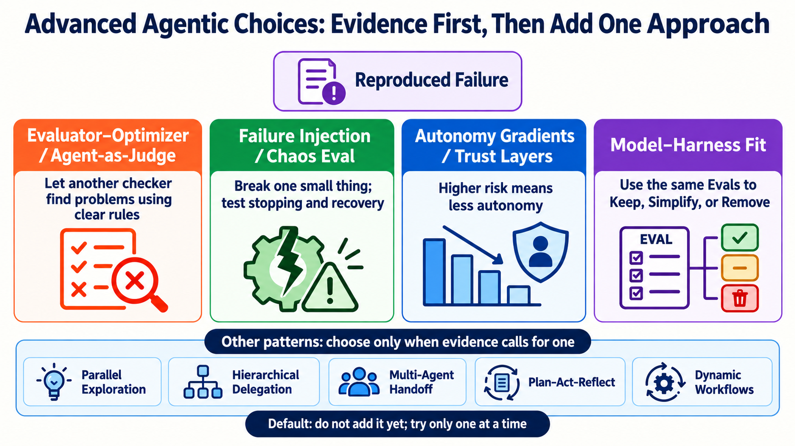
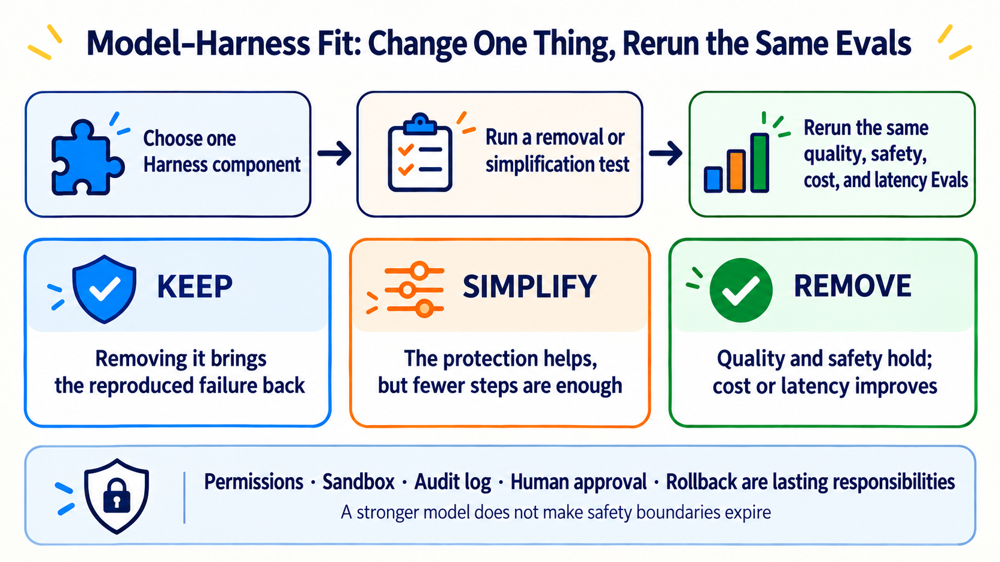

# Stage 7.5 — Advanced Agentic Choices: Add Complexity Only When Evidence Calls for It

> [繁體中文](./07.5-advanced-agentic-concepts.md) | [简体中文](./07.5-advanced-agentic-concepts.zh-Hans.md) | **English**

<!-- freshness: canonical=stages/07.5-advanced-agentic-concepts.md; verified_on=2026-09-13; scope=agent-patterns,harnesses,evals,dynamic-workflows,framework-status,research; max_age_days=90 -->

← **Return to [Stage 7 — Agent Production Engineering](07-multi-agent-production.en.md) first** if you cannot yet use Eval, Trace, Approval, and Recovery to show that your system is testable, observable, stoppable, and recoverable. Do not add the advanced choices in this chapter yet.

Stage 7.5 is not a cabinet for collecting more terms. It answers one question: **Which reproduced failure is worth one more checking step, failure test, autonomy level, or Harness component?**

> The default answer is “do not add it yet.” Measure a single-Agent baseline first. Keep a new approach only when it brings a repeatable improvement on the same Eval suite.

## 🎯 What you will be able to do

1. Explain four advanced concepts in plain language and name the failure each one handles.
2. Choose one candidate approach from a short table instead of installing every pattern at once.
3. Use a baseline, the same Eval suite, cost, and safety results to decide whether complexity should stay.
4. Make a Keep／Simplify／Remove decision for a Harness component and keep a way to restore it.

## 🚪 Minimum entry requirements

Finish [Stage 7](07-multi-agent-production.en.md), and have a rerunnable set of Eval cases, stop conditions, and a single-Agent baseline. This stage does not require coding, buying API access, or revealing a model’s private Chain-of-Thought.

<small>Information checked: 2026-09-13 UTC.</small>

## 📚 Required reading

Read these three first. Each one supports a decision in this chapter:

1. [Anthropic — Building Effective Agents](https://www.anthropic.com/engineering/building-effective-agents): start with the simplest workflow, and add more Agents only when you can show that the division of work helps.
2. [Anthropic — Demystifying Evals for AI Agents](https://www.anthropic.com/engineering/demystifying-evals-for-ai-agents): turn failures into rerunnable cases, then compare Outcome, Trajectory, cost, and stability.
3. [OpenAI — Harness Engineering](https://openai.com/index/harness-engineering/): see how clear boundaries, documentation, and mechanical gates help Agents work reliably in a real codebase. This is one case study, not the only valid system design.

<a id="-four-advanced-concepts-plain-language-first-formal-name-second"></a>
## 🔑 Meet Four Advanced Core Terms First

Start with the plain-language map so you know which problem calls for each term. The four short sections below add limits and sources instead of shrinking an advanced idea into one slogan.

<table>
<thead><tr><th scope="col">Problem to handle first</th><th scope="col">Core term</th><th scope="col">Plain-language picture</th><th scope="col">When to use it / technical boundary</th></tr></thead>
<tbody>
<tr><th scope="rowgroup" rowspan="2">Find the real failure first</th><td><strong>Evaluator–Optimizer／Agent-as-Judge</strong></td><td>One helper makes it; another checks it with a list</td><td>Use it when content quality needs judgment; a Judge can also be wrong and cannot decide truth alone</td></tr>
<tr><td><strong>Failure Injection／Chaos Eval</strong></td><td>Remove one small block on purpose and see whether the house stops safely</td><td>Create only small, controlled failures in an isolated environment; do not experiment carelessly on real data</td></tr>
</tbody>
<tbody>
<tr><th scope="rowgroup" rowspan="2">Control added complexity next</th><td><strong>Autonomy Gradients／Trust Layers</strong></td><td>The riskier the job, the shorter the path the AI may walk alone</td><td>Reduce permissions as risk rises; payment, deletion, publication, and external messages need a person first</td></tr>
<tr><td><strong>Model–Harness Fit</strong></td><td>After changing the engine, remove one part at a time and take the same test again</td><td>Use the same Evals to keep, simplify, or remove a component; a stronger model does not erase safety responsibilities</td></tr>
</tbody>
</table>

The sections below are not a second term list. They explain when each approach helps and the boundary that is easiest to miss.

### 1. Let another checker find problems using clear rules

**Evaluator–Optimizer／Agent-as-Judge**: one role creates an output. Another role follows an explicit rubric to find problems. The creator makes bounded revisions only when the checker provides new evidence.

Use it when an answer is not simply right or wrong and you must judge completeness, faithfulness, or writing quality. A Judge can also make mistakes, so it cannot decide truth by itself. Pair it with fixed cases, programmable checks, human sampling, and a revision limit.

> **Constitutional AI** is a principle-based training and critique method. It is not the same as every runtime LLM judge. Research entry point: [Constitutional AI paper](https://arxiv.org/abs/2212.08073).

### 2. Break one small thing on purpose and check that the system stops safely

**Failure Injection／Chaos Eval**: create a small, controlled, recoverable failure—such as a timeout, stale data, malformed output, or an unavailable tool—then check whether stopping, fallback, and recovery behave as expected.

“Failure Injection／Chaos Eval” is an **editorial and community umbrella used in this chapter, not a standard name shared by every vendor**. Start with the smallest failure in an isolated environment. Do not create accidents in real production data. For a starting method, see [Anthropic — Demystifying Evals](https://www.anthropic.com/engineering/demystifying-evals-for-ai-agents).

### 3. The higher the risk, the less the Agent may decide alone

**Autonomy Gradients／Trust Layers**: give the Agent different levels of autonomy based on task risk. A read-only lookup may run automatically. Payment, deletion, publication, or an external message should first become a proposal for a person to approve.

“Autonomy Gradients／Trust Layers” is also an **editorial and community umbrella in this chapter, not one official standard**. A common ladder is `suggest → propose → execute`, but the actual levels depend on risk, permissions, and the responsible owner. The model does not promote itself.

### 4. When the model improves, prove again that every extra step still earns its place

**Model–Harness Fit**: after changing a model or model version, remove one Harness component at a time. Use the same quality, safety, cost, and latency Evals to decide whether to keep, simplify, or remove it.

“Model–Harness Fit” is an **editorial shorthand in this chapter, not an established standard term**. It does not mean replacing permissions, a sandbox, an audit log, human approval, or rollback with a stronger model. Those are lasting responsibilities and cannot be deleted just because the model improved.

## 🧭 Other patterns: choose one only when you see this evidence

| Candidate pattern | Plain-language meaning | Evidence to see first | Official／original entry point |
|---|---|---|---|
| **Parallel Exploration** | Try several independent paths at the same time, then compare them | The problem really can be split, and added cost plus merging work is smaller than the quality or time gain | [Anthropic parallelization workflow](https://www.anthropic.com/engineering/building-effective-agents) |
| **Hierarchical Delegation** | Break a large job into smaller jobs across levels | One context cannot hold the work, or each child task has clear input, output, and an acceptor | [Anthropic orchestrator-workers](https://www.anthropic.com/engineering/building-effective-agents); new Microsoft projects can start with [Microsoft Agent Framework](https://github.com/microsoft/agent-framework), while AutoGen is in maintenance mode |
| **Multi-Agent Handoff** | Pass control, necessary context, and completion evidence together | Different roles truly must take over, and the handoff error rate is lower than the single-Agent baseline | [OpenAI Agents SDK orchestration](https://openai.github.io/openai-agents-python/multi_agent/) |
| **Plan–Act–Reflect** | Plan, act, read evidence, then make a limited revision | A test or grader can point to a fixable failure; the system is not merely trying the same prompt again | [Reflexion](https://arxiv.org/abs/2303.11366) |
| **Dynamic Workflows** | Let an Agent write a rerunnable script that coordinates workers | The task can run in parallel and be rerun, and a fixed workflow cannot express that job’s division of work | [Claude Code Dynamic Workflows](https://code.claude.com/docs/en/workflows) |



## 🧪 Minimum decision record: fill this in before adding anything

```text
Reproduced failure: Which case failed? What part of the Outcome or Trajectory was unacceptable?
Single-Agent baseline: What are the quality, cost, latency, and safety results?
One proposed addition: Which failure should it prevent?
Acceptance threshold: What must improve on the same Eval suite, and what must not get worse?
Stop／restore plan: If it does not help, costs more, or becomes less safe, how will you remove it?
```

If the first line has no evidence, add an Eval case first. If you cannot complete the fourth and fifth lines, do not add complexity yet.

## ⚖️ Model–Harness Fit: use Evals to keep, simplify, or remove

As models improve, a repeated reminder prompt, context reset, or extra planner／reviewer may no longer be necessary. Change only one component at a time. Keep the task, data, tools, environment, grader, and threshold unchanged, then compare multiple trials.



| Decision | Evidence you see | Next step |
|---|---|---|
| **Keep** | Removing it brings back the same reproduced failure or weakens a safety threshold | Restore it and record the case and version it protects |
| **Simplify** | The protection still helps, but fewer steps pass the same Eval suite | Remove one more step at a time and rerun the same trials |
| **Remove** | The deletion test passes, quality and safety do not regress, and cost or latency stays equal or improves | Remove it, keep monitoring, and preserve a tested restoration path |

| Classify it first | Examples | Decision boundary |
|---|---|---|
| **A component that may compensate for one model generation’s weakness** | context reset, repeated reminder prompt, extra planner／reviewer | Test its removal after a model change, but let only the same Eval suite decide |
| **A lasting safety responsibility** | least privilege, sandbox, audit log, human approval, rollback | The implementation may change; the responsibility does not disappear because the model improved |

<details markdown="1">
<summary>⏳ Expand: limits of the Bitter Lesson, human–Agent roles, and deletion tests</summary>

For every added layer, record three things: which reproduced failure needs it, which Eval shows that it works, and which deletion test could show that it is no longer needed.

This echoes Rich Sutton’s [The Bitter Lesson](http://www.incompleteideas.net/IncIdeas/BitterLesson.html), but the article did not present it as a law of Agent Harness design.

Anthropic’s analysis of Claude Code use from 2025-10 through 2026-04 observed that users made about 70% of planning decisions on average, while Claude made about 80% of execution decisions. This is an observation from one product and dataset, not a ratio every team should copy. The useful lesson is: **people own purpose, boundaries, and acceptance; Agents execute inside that boundary.** Source: [How Claude Code is used in practice](https://www.anthropic.com/research/claude-code-expertise).

</details>

<a id="-dynamic-workflowsopus-48--agent--workflow"></a>

### 🔀 Dynamic Workflows — when an Agent writes the division of work as a rerunnable script

This is a Claude Code Agent-orchestration feature. It is not a model and does not replace OpenRouter, Airflow, or n8n. Choose it only when the task can safely fan out, results can be compared, and rerunning the orchestration has value.

<details markdown="1">
<summary>Expand: current availability, mechanism, limits, and safety boundaries</summary>

- **Current availability**: the official documentation lists all paid plans, Anthropic API access, Amazon Bedrock, Google Cloud Agent Platform, and Microsoft Foundry. Pro users can enable it from `/config`.
- **How it works**: Claude writes a JavaScript orchestration script. A background runtime executes it. Intermediate results stay in script variables, and only the final result returns to the conversation context.
- **How to start it**: explicitly ask to `use a workflow` or `run a workflow`, or use `ultracode`. `/effort ultracode` requires Claude Code v2.1.203+ and a model that supports `xhigh` effort.
- **Current limits**: at most 16 concurrent agents and 1,000 agents in total per run. These are runaway-prevention limits, not targets to fill.
- **Safety boundary**: subagent tools remain subject to permission and sandbox rules. The workflow script itself has no arbitrary shell or filesystem access. Long runs use more tokens, so inspect scope and cost before starting.
- **Limitations**: normal user input cannot be inserted during a run. Work with heavily shared state—or work that needs only one Agent—should not fan out.

The 2026-05-28 launch announcement called the feature a research preview and announced it alongside Opus 4.8. That is history, not a rule that binds the current feature to Opus 4.8. Use the current [Dynamic Workflows documentation](https://code.claude.com/docs/en/workflows) as the source of truth.

</details>

## 🔬 Evidence and failure cases for deeper study

<details markdown="1">
<summary>🧯 Expand: what three cases teach—and how not to overread them</summary>

1. **The parts do not share one style**: Cognition’s Flappy Bird case warns that subagents without shared context can produce pieces that are hard to assemble. Source: [Don’t Build Multi-Agents](https://cognition.ai/blog/dont-build-multi-agents).
2. **A research Agent adds an unverified guess**: Anthropic’s Research system uses source quality, citations, and evaluators to reduce speculative leaps. Source: [How we built our multi-agent research system](https://www.anthropic.com/engineering/multi-agent-research-system).
3. **A written rule never became a mechanical guardrail**: the 2025-07 Replit production-database event is a third-party recorded case. It shows why permission gates matter, but it does not show that every product or version will behave the same way. Sources: [AI Incident Database #1152](https://incidentdatabase.ai/cite/1152/) and [The Register report](https://www.theregister.com/2025/07/21/replit_saastr_vibe_coding_incident/).

An incident does not automatically become a best practice. The system changes only when the lesson becomes a permission, test, review, or recovery gate.

</details>

<details markdown="1">
<summary>⚖️ Expand: how to read an Agent benchmark without being fooled by one score</summary>

An Agent benchmark measures a model, prompt, tools, harness, hardware, timeout, and grader together. At minimum, hold the task, scaffold, tools, data, and environment constant; run multiple trials; separate infrastructure errors from problem-solving failures; use held-out cases; and pair a Judge with deterministic checks and human sampling.

Anthropic’s 2026 research showed that infrastructure differences can be larger than the gap between models on a leaderboard. A small lead therefore does not prove a stable advantage. Sources: [Quantifying infrastructure noise in agentic coding evals](https://www.anthropic.com/engineering/infrastructure-noise) and [Demystifying Evals](https://www.anthropic.com/engineering/demystifying-evals-for-ai-agents).

</details>

## 🎯 Curated reading: choose one path first

1. [Anthropic — Building Effective Agents](https://www.anthropic.com/engineering/building-effective-agents) ⭐⭐⭐⭐⭐: start here when reading advanced Agent patterns for the first time.
2. [OpenAI — Harness Engineering](https://openai.com/index/harness-engineering/) ⭐⭐⭐⭐⭐: see how boundaries, documentation, and mechanical gates work in a real codebase.
3. [Anthropic — Demystifying Evals for AI Agents](https://www.anthropic.com/engineering/demystifying-evals-for-ai-agents) ⭐⭐⭐⭐⭐: start here to learn how to evaluate an Agent.
4. [Microsoft Agent Framework](https://github.com/microsoft/agent-framework) ⭐⭐⭐⭐⭐: use this as the current Microsoft multi-agent and workflow implementation entry point; do not start a new project with maintenance-mode AutoGen.
5. [datawhalechina/hello-agents](https://github.com/datawhalechina/hello-agents) ⭐⭐⭐⭐⭐: connect the concepts to a complete Chinese-language implementation guide.

## 📚 Complete learning resources and limits

<table>
  <thead>
    <tr><th scope="col">Category</th><th scope="col">Resource</th><th scope="col">Best for</th><th scope="col">Editorial rating</th><th scope="col">Limit／status</th></tr>
  </thead>
  <tbody>
    <tr><th scope="rowgroup" rowspan="5">Foundations and Context</th><td><a href="https://www.anthropic.com/engineering/building-effective-agents">Anthropic — Building Effective Agents</a></td><td>Workflows, Agents, and common patterns</td><td>⭐⭐⭐⭐⭐</td><td>A 2024 foundation, not a current product catalog</td></tr>
    <tr><td><a href="https://www.anthropic.com/engineering/effective-context-engineering-for-ai-agents">Effective Context Engineering</a></td><td>Choosing context without filling the window</td><td>⭐⭐⭐⭐⭐</td><td>Vendor article; principles can transfer across models</td></tr>
    <tr><td><a href="https://openai.com/index/harness-engineering/">OpenAI Harness Engineering</a></td><td>Readable codebase, source of record, invariants</td><td>⭐⭐⭐⭐⭐</td><td>One OpenAI codebase case study</td></tr>
    <tr><td><a href="https://www.anthropic.com/engineering/effective-harnesses-for-long-running-agents">Effective Harnesses for Long-running Agents</a></td><td>Cross-session artifacts and incremental progress</td><td>⭐⭐⭐⭐</td><td>A specific coding-harness experiment</td></tr>
    <tr><td><a href="https://www.anthropic.com/engineering/harness-design-long-running-apps">Harness Design for Long-running Apps</a></td><td>Planner／Generator／Evaluator</td><td>⭐⭐⭐⭐</td><td>A 2026 Labs case study, not the only architecture</td></tr>
  </tbody>
  <tbody>
    <tr><th scope="rowgroup" rowspan="5">Orchestration／Contracts</th><td><a href="https://www.anthropic.com/engineering/multi-agent-research-system">Anthropic Multi-Agent Research System</a></td><td>Production lessons from orchestrator–workers</td><td>⭐⭐⭐⭐⭐</td><td>Best suited to breadth-first research; high token use</td></tr>
    <tr><td><a href="https://github.com/langchain-ai/langgraph">LangGraph</a></td><td>Stateful graphs, checkpoints, and HITL</td><td>⭐⭐⭐⭐</td><td>Low-level framework; you design state and Evals</td></tr>
    <tr><td><a href="https://github.com/microsoft/agent-framework">Microsoft Agent Framework</a></td><td>Python／.NET Agents and workflows</td><td>⭐⭐⭐⭐⭐</td><td>Current successor entry point for AutoGen／Semantic Kernel</td></tr>
    <tr><td><a href="https://openai.github.io/openai-agents-python/sandbox/guide/">OpenAI Agents SDK Sandbox Agents</a></td><td>Workspace, session, snapshot, sandbox</td><td>⭐⭐⭐⭐</td><td><strong>Beta</strong>; interfaces may still change</td></tr>
    <tr><td><a href="https://code.claude.com/docs/en/workflows">Claude Code Dynamic Workflows</a></td><td>Agent-authored, rerunnable orchestration</td><td>⭐⭐⭐⭐</td><td>Claude Code feature; high token use, not a general workflow engine</td></tr>
  </tbody>
  <tbody>
    <tr><th scope="rowgroup" rowspan="5">Eval／Resilience</th><td><a href="https://www.anthropic.com/engineering/demystifying-evals-for-ai-agents">Demystifying Evals for AI Agents</a></td><td>Capability, regression, and transcript Evals</td><td>⭐⭐⭐⭐⭐</td><td>Start with a small, reproducible failure set</td></tr>
    <tr><td><a href="https://www.anthropic.com/engineering/infrastructure-noise">Infrastructure Noise in Agentic Evals</a></td><td>How hardware and environment distort scores</td><td>⭐⭐⭐⭐</td><td>Specific benchmark experiment; do not extrapolate an exact magnitude</td></tr>
    <tr><td><a href="https://arxiv.org/abs/2507.02825">Best Practices for Rigorous Agentic Benchmarks</a></td><td>Flaws in task, reward, and environment design</td><td>⭐⭐⭐⭐</td><td>Research paper; pair it with the benchmark’s current version</td></tr>
    <tr><td><a href="https://github.com/sierra-research/tau2-bench">tau2-bench</a></td><td>Tool–Agent–User interaction and pass^k</td><td>⭐⭐⭐⭐</td><td>A benchmark is not a production SLA</td></tr>
    <tr><td><a href="https://github.com/SWE-bench/SWE-bench">SWE-bench</a></td><td>Coding Evals based on real GitHub issues</td><td>⭐⭐⭐⭐⭐</td><td>Scores depend on harness, version, and environment</td></tr>
  </tbody>
  <tbody>
    <tr><th scope="rowgroup" rowspan="5">Research patterns</th><td><a href="https://arxiv.org/abs/2210.03629">ReAct</a></td><td>Reasoning／Action／Observation loop</td><td>⭐⭐⭐⭐⭐</td><td>Teaches observable action; does not require private Chain-of-Thought</td></tr>
    <tr><td><a href="https://arxiv.org/abs/2303.11366">Reflexion</a></td><td>Revising a strategy after feedback</td><td>⭐⭐⭐⭐</td><td>A research setting is not every production loop</td></tr>
    <tr><td><a href="https://arxiv.org/abs/2212.08073">Constitutional AI</a></td><td>Principle-based critique and revision</td><td>⭐⭐⭐⭐</td><td>A training method, not a synonym for LLM-as-Judge</td></tr>
    <tr><td><a href="https://arxiv.org/abs/2303.17760">CAMEL</a></td><td>Role-playing multi-agent research</td><td>⭐⭐⭐</td><td>Research prototype; high-risk responsibility still needs a fixed owner</td></tr>
    <tr><td><a href="https://github.com/stanfordnlp/dspy">DSPy</a></td><td>Typed signatures and program optimization</td><td>⭐⭐⭐⭐</td><td>The framework keeps changing; pin a version and Evals</td></tr>
  </tbody>
  <tbody>
    <tr><th scope="rowgroup" rowspan="4">Chinese and hands-on entry points</th><td><a href="https://github.com/datawhalechina/hello-agents">datawhalechina/hello-agents</a></td><td>Complete Chinese-language Agent curriculum</td><td>⭐⭐⭐⭐⭐</td><td>Long; choose chapters that match this stage</td></tr>
    <tr><td><a href="https://github.com/microsoft/ai-agents-for-beginners">Microsoft AI Agents for Beginners</a></td><td>18 lessons and multilingual beginner material</td><td>⭐⭐⭐⭐</td><td>Many vendor examples; learn the concept before choosing an SDK</td></tr>
    <tr><td><a href="https://github.com/langchain-ai/deepagents">LangChain Deep Agents</a></td><td>Planning, subagents, and filesystem harnesses</td><td>⭐⭐⭐⭐</td><td>A higher-level abstraction; not every task needs it</td></tr>
    <tr><td><a href="https://speech.ee.ntu.edu.tw/~hylee/">Hung-yi Lee’s Generative AI course</a></td><td>Chinese-language courses and research background</td><td>⭐⭐⭐⭐⭐</td><td>Choose topics by year; check official docs for current product interfaces</td></tr>
  </tbody>
</table>

## ✅ Completion check

- [ ] I can explain the four advanced concepts in plain language and state the boundaries of the three editorial／community names.
- [ ] I start with a single-Agent baseline and a rerunnable failure before selecting one pattern from the table.
- [ ] I compare quality, safety, cost, and latency on the same Eval suite instead of trusting one attractive answer.
- [ ] I can make a Keep／Simplify／Remove decision for one Harness component and point to the evidence and restoration method.
- [ ] I know that a Judge must also be checked, failure injection starts in an isolated environment, and the model does not grant itself permission for high-risk actions.

When all five are true, continue to [Stage 8 — Agent Interfaces](08-agent-interfaces.en.md). If you do not yet have a baseline or failure evidence, return to [Stage 7](07-multi-agent-production.en.md) and add them instead of adding another Agent.
