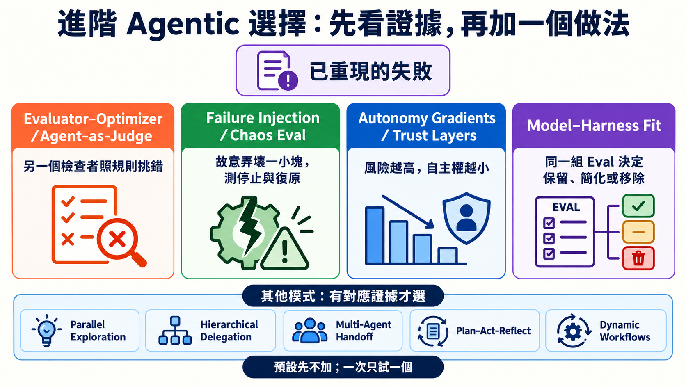
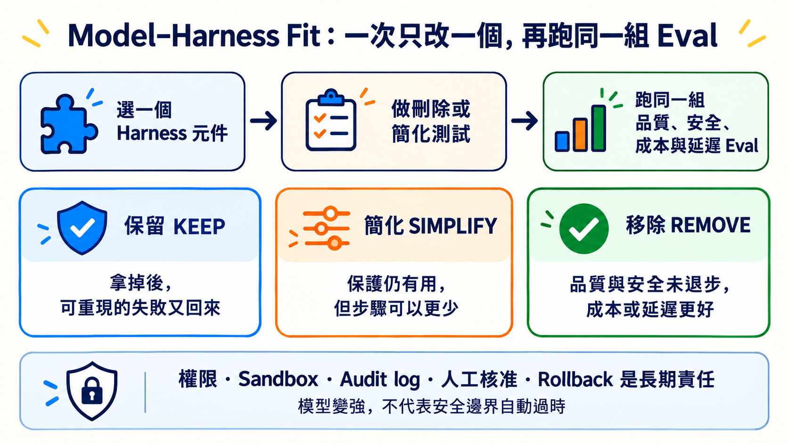

# Stage 7.5 — 進階 Agentic 選擇：有證據才增加複雜度

> **繁體中文** | [简体中文](./07.5-advanced-agentic-concepts.zh-Hans.md) | [English](./07.5-advanced-agentic-concepts.en.md)

<!-- freshness: canonical=stages/07.5-advanced-agentic-concepts.md; verified_on=2026-09-13; scope=agent-patterns,harnesses,evals,dynamic-workflows,framework-status,research; max_age_days=90 -->

← **先回到 [Stage 7 — Agent 上線工程](07-multi-agent-production.md)**：若你還不能用 Eval、Trace、Approval 與 Recovery 證明系統可測、可看、可停、可恢復，先不要增加本章的進階做法。

Stage 7.5 不是更多名詞的收藏櫃。它只回答一個問題：**哪個已重現的失敗，值得你多加一層檢查、故障測試、自主權分級或 Harness 元件？**

> 預設答案是「先不加」。先量單一 Agent 的 baseline；只有新做法在同一組 Eval 中帶來可重現改善，才保留它。

## 🎯 完成這一關後，你能做什麼

1. 用白話說清楚四個進階概念，以及它們各自處理哪種失敗。
2. 從短選擇表挑出一個候選做法，不把所有模式一次裝上。
3. 用 baseline、同一組 Eval、成本與安全結果決定是否保留複雜度。
4. 對 Harness 元件做 Keep／Simplify／Remove 判斷，並保留回復方法。

## 🚪 最短進入條件

完成 [Stage 7](07-multi-agent-production.md)，並已經有一組能重跑的 Eval cases、停止條件與單一 Agent baseline。這一關不要求寫程式，也不要求購買 API 或公開模型的私人 Chain-of-Thought。

<small>資料查核：2026-09-13 UTC。</small>

## 📚 必修閱讀

先讀三份；每份都對應本章的一個決定：

1. [Anthropic — Building Effective Agents](https://www.anthropic.com/engineering/building-effective-agents)：先用最簡單的 workflow；只有能證明分工有價值時才增加 Agent。
2. [Anthropic — Demystifying Evals for AI Agents](https://www.anthropic.com/engineering/demystifying-evals-for-ai-agents)：把失敗變成可重跑案例，再比較 Outcome、Trajectory、成本與穩定性。
3. [OpenAI — Harness Engineering](https://openai.com/index/harness-engineering/)：看真實 codebase 如何用清楚邊界、文件與機械 gate 幫 Agent 穩定工作；這是一個案例，不是所有系統的唯一架構。

<a id="-四個進階概念先懂白話再看正式名稱"></a>
## 🔑 先認識四個進階核心詞

先看白話總覽，知道哪種問題才需要哪個詞。表格下面的四段會再補上限制與來源，不把進階概念縮成一句口號。

<table>
<thead><tr><th scope="col">先處理什麼</th><th scope="col">核心詞</th><th scope="col">五歲也能懂的說法</th><th scope="col">何時使用／技術界線</th></tr></thead>
<tbody>
<tr><th scope="rowgroup" rowspan="2">先找出真正的問題</th><td><strong>Evaluator–Optimizer／Agent-as-Judge（評估者—優化者／由 Agent 評分）</strong></td><td>一個做，一個照清單檢查</td><td>內容需要判斷品質時才用；Judge 也會犯錯，不能單獨決定真相</td></tr>
<tr><td><strong>Failure Injection／Chaos Eval（故障注入／混沌評測）</strong></td><td>故意拔掉一塊小積木，看房子會不會安全停下</td><td>只在隔離環境製造可控制的小故障；不能拿真實資料隨意做實驗</td></tr>
</tbody>
<tbody>
<tr><th scope="rowgroup" rowspan="2">再控制新增的複雜度</th><td><strong>Autonomy Gradients／Trust Layers（自主權梯度／信任層級）</strong></td><td>事情越危險，AI 可以自己走的路越短</td><td>依風險縮小權限；付款、刪除、發布或外部訊息要先問人</td></tr>
<tr><td><strong>Model–Harness Fit（模型—Harness 適配）</strong></td><td>換了新引擎，就一次拿掉一個零件再重考</td><td>用同一組 Eval 決定元件要保留、簡化或移除；安全責任不能因模型變強就刪掉</td></tr>
</tbody>
</table>

下面不是另一份名詞清單；它只補充每個做法何時有用，以及最容易踩到的界線。

### 1. 先讓另一個檢查者照規則挑錯

**Evaluator–Optimizer／Agent-as-Judge（評估者—優化者／由 Agent 評分）**：一個角色產生成果，另一個角色按照明確 rubric 找出問題；產生者只在有新證據時做有界修正。

它適合「答案不只對或錯，還要判斷完整性、忠實度或寫作品質」的任務。Judge 也會犯錯，因此不能讓它單獨決定真相。至少搭配固定案例、可程式化檢查、人工抽樣與修正次數上限。

> **Constitutional AI** 是 principle-based training／critique 方法，不等於所有 runtime LLM judge。研究入口：[Constitutional AI paper](https://arxiv.org/abs/2212.08073)。

### 2. 故意弄壞一小塊，確認系統會安全停下

**Failure Injection／Chaos Eval（故障注入／混沌評測）**：主動製造可控制、可復原的小故障，例如 timeout、舊資料、壞格式或工具不可用，再檢查停止、降級與復原是否符合預期。

「Failure Injection／Chaos Eval」是本章採用的**編輯／社群統稱，不是跨供應商公認標準名稱**。先在隔離環境測最小故障，不能隨意在真實 production 資料上製造事故。設計方法可先看 [Anthropic — Demystifying Evals](https://www.anthropic.com/engineering/demystifying-evals-for-ai-agents)。

### 3. 風險越高，Agent 能自己決定的範圍越小

**Autonomy Gradients／Trust Layers（自主權梯度／信任層級）**：按任務風險分配不同程度的自主權。唯讀查詢可以自動執行；付款、刪除、發布或外部訊息則先提出方案，再由人核准。

「Autonomy Gradients／Trust Layers」也是本章採用的**編輯／社群統稱，不是單一正式標準**。常見階梯是 `suggest → propose → execute`，但實際層數由風險、權限與責任人決定，不由模型自評決定。

### 4. 模型變強後，重新證明每個外加步驟是否還值得

**Model–Harness Fit（模型—Harness 適配）**：換模型或版本後，一次拿一個 Harness 元件做刪除測試，用同一組品質、安全、成本與延遲 Eval 決定保留、簡化或移除。

「Model–Harness Fit」是本章的**編輯簡稱，不是公認標準術語**。它不代表用模型取代權限、sandbox、audit log、人工核准或 rollback；這些是長期責任，不能因模型升級就直接刪除。

## 🧭 其他模式：看到這種證據才選

| 候選模式 | 白話說法 | 先看到什麼證據 | 官方／原始入口 |
|---|---|---|---|
| **Parallel Exploration（平行探索）** | 同時試幾條互不依賴的路，再比較 | 問題真的能分開，且增加的成本與合併工作小於品質或時間收益 | [Anthropic parallelization workflow](https://www.anthropic.com/engineering/building-effective-agents) |
| **Hierarchical Delegation（階層式委派）** | 大工作逐層拆給較小角色 | 單一 context 放不下，或子任務有清楚輸入、輸出與驗收人 | [Anthropic orchestrator-workers](https://www.anthropic.com/engineering/building-effective-agents)；新 Microsoft 專案可從 [Microsoft Agent Framework](https://github.com/microsoft/agent-framework) 開始，AutoGen 已進入 maintenance mode |
| **Multi-Agent Handoff（多 Agent 交接）** | 把控制權、必要資料與完成證據一起交棒 | 不同角色必須直接接手，而且交接後的錯誤率低於單一 Agent baseline | [OpenAI Agents SDK orchestration](https://openai.github.io/openai-agents-python/multi_agent/) |
| **Plan–Act–Reflect（規劃—行動—回看）** | 先計畫、執行、讀證據，再有限次修正 | 測試或 grader 能指出可修正失敗；不是只把同一句話再試一次 | [Reflexion](https://arxiv.org/abs/2303.11366) |
| **Dynamic Workflows（動態工作流程）** | 讓 Agent 寫出可重跑的分工 script | 任務可平行、可重跑，而且固定 workflow 不足以表達當次分工 | [Claude Code Dynamic Workflows](https://code.claude.com/docs/en/workflows) |



## 🧪 最小決策紀錄：加之前先填完

```text
已重現的失敗：哪個 case 失敗？Outcome 或 Trajectory 哪裡不合格？
單一 Agent baseline：品質、成本、延遲、安全結果是多少？
只加的一個做法：它要防住哪個失敗？
接受門檻：同一組 Eval 至少改善什麼，而且不能犧牲什麼？
停止／回復：沒改善、變貴或變危險時，怎麼撤掉？
```

如果第一行沒有證據，先補 Eval case；如果第四、五行寫不出來，先不要增加複雜度。

## ⚖️ Model–Harness Fit：用 Eval 決定保留、簡化或移除

模型變強時，某個重複提醒 prompt、context reset 或額外 planner／reviewer 可能不再需要。一次只改一個元件，其他 task、資料、工具、環境、grader 與門檻保持相同，再比較多次 trials。



| 決定 | 你看到的證據 | 下一步 |
|---|---|---|
| **保留 Keep** | 拿掉後，同一個可重現失敗又回來，或安全門檻退步 | 放回去，記下它防住的 case 與版本 |
| **簡化 Simplify** | 保護仍有用，但較少步驟也能通過同一組 Eval | 一次再少一個步驟，重跑相同 trials |
| **移除 Remove** | 刪除測試通過，品質與安全未退步，成本或延遲相同或更好 | 移除後持續監測，保留可驗證的回復方法 |

| 先分哪一類 | 例子 | 判斷邊界 |
|---|---|---|
| **可能補某代模型弱點的元件** | context reset、重複提醒 prompt、額外 planner／reviewer | 模型變更時可以做刪除測試，但只能由同一組 Eval 決定 |
| **長期安全責任** | 最小權限、sandbox、audit log、人工核准、rollback | 實作可以更換；責任不能靠「模型變強」直接刪除 |

<details markdown="1">
<summary>⏳ 展開：Bitter Lesson、人機分工與刪除測試的限制</summary>

每加一層，記錄三件事：哪個可重現失敗需要它、哪個 Eval 證明它有效、哪個刪除測試能證明它已不再需要。

這和 Rich Sutton 的 [The Bitter Lesson](http://www.incompleteideas.net/IncIdeas/BitterLesson.html) 相呼應，但不是該文章直接提出的 Agent Harness 定律。

Anthropic 對 2025-10 到 2026-04 Claude Code 使用資料的分析，平均觀察到使用者做約 70% planning decisions，而 Claude 做約 80% execution decisions。這是特定產品與資料集的觀察，不是每個團隊都應硬套的比例。可帶走的是：**人負責目的、邊界與驗收；Agent 負責範圍內的執行。**來源：[How Claude Code is used in practice](https://www.anthropic.com/research/claude-code-expertise)。

</details>

<a id="-dynamic-workflowsopus-48-當-agent-自己寫出-workflow"></a>

### 🔀 Dynamic Workflows — 當 Agent 把分工寫成可重跑的 script

這是 Claude Code 的 Agent orchestration 功能，不是模型，也不是 OpenRouter、Airflow 或 n8n 的替代品。只有任務能安全 fan out、結果可比較，而且重跑有價值時才選它。

<details markdown="1">
<summary>展開：現行版本、機制、限制與安全邊界</summary>

- **目前條件**：現行官方文件列出所有付費方案、Anthropic API，以及 Amazon Bedrock、Google Cloud Agent Platform、Microsoft Foundry。Pro 可從 `/config` 啟用。
- **怎麼運作**：Claude 產生 JavaScript orchestration script，由背景 runtime 執行；中間結果留在 script 變數，最後結果才回到對話 context。
- **怎麼啟動**：明確要求 `use a workflow`／`run a workflow`，或使用 `ultracode`。`/effort ultracode` 需要 v2.1.203+ 且模型支援 `xhigh` effort。
- **現行上限**：最多 16 個 concurrent agents、每次 run 累計 1,000 個。這是防 runaway 的上限，不是建議你每次都用滿。
- **安全邊界**：subagent 的工具仍受 permission 與 sandbox 規則約束；workflow 本身沒有任意 shell／filesystem access。長 run 會用更多 token，啟動前仍要看 phase 與成本。
- **限制**：run 中不能插入一般使用者輸入；共享狀態很多或只需一個 Agent 的工作，不適合 fan out。

2026-05-28 的發布公告把它稱為 research preview，並和 Opus 4.8 同日公布；這只是一段歷史，不代表今天綁定 Opus 4.8。現行規則以 [Dynamic Workflows docs](https://code.claude.com/docs/en/workflows) 為準。

</details>

## 🔬 深讀時才需要的證據與失敗案例

<details markdown="1">
<summary>🧯 展開：三個案例教了什麼，以及如何避免讀錯</summary>

1. **分工後風格對不上**：Cognition 的 Flappy Bird 案例提醒，多個 subagent 若拿不到共同背景，最後很難拼在一起。來源：[Don’t Build Multi-Agents](https://cognition.ai/blog/dont-build-multi-agents)。
2. **研究 Agent 補進未驗證推測**：Anthropic 的 Research 系統用 source quality、引用與 evaluator 改善 speculative leap。來源：[How we built our multi-agent research system](https://www.anthropic.com/engineering/multi-agent-research-system)。
3. **文字規則沒有變成機械防線**：2025-07 的 Replit production database 事件是第三方記錄案例；它提醒 permission gate 的重要性，但不代表所有產品或版本都會發生相同行為。來源：[AI Incident Database #1152](https://incidentdatabase.ai/cite/1152/) 與 [The Register 報導](https://www.theregister.com/2025/07/21/replit_saastr_vibe_coding_incident/)。

事故不會自動變成最佳實踐。只有把教訓寫成權限、測試、review 與 recovery gate，系統才真的改變。

</details>

<details markdown="1">
<summary>⚖️ 展開：怎麼讀 Agent benchmark，才不會被單一分數騙</summary>

Agent benchmark 同時量到模型、prompt、tool、harness、硬體、timeout 與 grader。比較時至少固定 task、scaffold、工具、資料與環境；重跑多次；分開 infrastructure error 與解題失敗；使用 held-out cases；並讓 Judge 搭配 deterministic checks 與人工抽樣。

Anthropic 2026 的研究顯示，基礎設施差異可能大到超過排行榜模型間的差距；因此小幅領先不等於穩定較強。來源：[Quantifying infrastructure noise in agentic coding evals](https://www.anthropic.com/engineering/infrastructure-noise) 與 [Demystifying Evals](https://www.anthropic.com/engineering/demystifying-evals-for-ai-agents)。

</details>

## 🎯 精選閱讀：先挑一條

1. [Anthropic — Building Effective Agents](https://www.anthropic.com/engineering/building-effective-agents) ⭐⭐⭐⭐⭐：第一次讀進階 Agent pattern，先從這篇開始。
2. [OpenAI — Harness Engineering](https://openai.com/index/harness-engineering/) ⭐⭐⭐⭐⭐：看邊界、文件與機械 gate 怎麼放進真實 codebase。
3. [Anthropic — Demystifying Evals for AI Agents](https://www.anthropic.com/engineering/demystifying-evals-for-ai-agents) ⭐⭐⭐⭐⭐：想知道怎麼驗收 Agent，先讀這篇。
4. [Microsoft Agent Framework](https://github.com/microsoft/agent-framework) ⭐⭐⭐⭐⭐：要看現行 Microsoft multi-agent／workflow 實作；不要從 maintenance-mode AutoGen 開新專案。
5. [datawhalechina/hello-agents](https://github.com/datawhalechina/hello-agents) ⭐⭐⭐⭐⭐：想用中文把概念接到完整實作。

## 📚 完整學習資源與限制

<table>
  <thead>
    <tr><th scope="col">分類</th><th scope="col">資源</th><th scope="col">適合讀什麼</th><th scope="col">編輯評分</th><th scope="col">限制／狀態</th></tr>
  </thead>
  <tbody>
    <tr><th scope="rowgroup" rowspan="5">基本設計與 Context</th><td><a href="https://www.anthropic.com/engineering/building-effective-agents">Anthropic — Building Effective Agents</a></td><td>Workflow、Agent 與常用 pattern</td><td>⭐⭐⭐⭐⭐</td><td>2024 foundation；不是最新產品清單</td></tr>
    <tr><td><a href="https://www.anthropic.com/engineering/effective-context-engineering-for-ai-agents">Effective Context Engineering</a></td><td>怎麼挑 context，不把視窗塞滿</td><td>⭐⭐⭐⭐⭐</td><td>供應商文章；原則可跨模型使用</td></tr>
    <tr><td><a href="https://openai.com/index/harness-engineering/">OpenAI Harness Engineering</a></td><td>可讀 codebase、SoR、invariant</td><td>⭐⭐⭐⭐⭐</td><td>單一 OpenAI codebase case study</td></tr>
    <tr><td><a href="https://www.anthropic.com/engineering/effective-harnesses-for-long-running-agents">Effective Harnesses for Long-running Agents</a></td><td>跨 session artifact 與增量進度</td><td>⭐⭐⭐⭐</td><td>特定 coding harness 實驗</td></tr>
    <tr><td><a href="https://www.anthropic.com/engineering/harness-design-long-running-apps">Harness Design for Long-running Apps</a></td><td>Planner／Generator／Evaluator</td><td>⭐⭐⭐⭐</td><td>2026 Labs case study，不是唯一架構</td></tr>
  </tbody>
  <tbody>
    <tr><th scope="rowgroup" rowspan="5">Orchestration／Contracts</th><td><a href="https://www.anthropic.com/engineering/multi-agent-research-system">Anthropic Multi-Agent Research System</a></td><td>Orchestrator-workers production lessons</td><td>⭐⭐⭐⭐⭐</td><td>最適合 breadth-first research；token 開銷高</td></tr>
    <tr><td><a href="https://github.com/langchain-ai/langgraph">LangGraph</a></td><td>Stateful graph、checkpoint、HITL</td><td>⭐⭐⭐⭐</td><td>低階框架；要自己設計 state 與 Eval</td></tr>
    <tr><td><a href="https://github.com/microsoft/agent-framework">Microsoft Agent Framework</a></td><td>Python／.NET Agent 與 workflow</td><td>⭐⭐⭐⭐⭐</td><td>AutoGen／Semantic Kernel 的現行後繼入口</td></tr>
    <tr><td><a href="https://openai.github.io/openai-agents-python/sandbox/guide/">OpenAI Agents SDK Sandbox Agents</a></td><td>Workspace、session、snapshot、sandbox</td><td>⭐⭐⭐⭐</td><td><strong>Beta</strong>；介面仍可能變</td></tr>
    <tr><td><a href="https://code.claude.com/docs/en/workflows">Claude Code Dynamic Workflows</a></td><td>Agent-authored、可重跑的 orchestration</td><td>⭐⭐⭐⭐</td><td>Claude Code 功能；高 token、非通用 workflow engine</td></tr>
  </tbody>
  <tbody>
    <tr><th scope="rowgroup" rowspan="5">Eval／Resilience</th><td><a href="https://www.anthropic.com/engineering/demystifying-evals-for-ai-agents">Demystifying Evals for AI Agents</a></td><td>Capability、regression 與 transcript Eval</td><td>⭐⭐⭐⭐⭐</td><td>先從小而能重現的 failure set 開始</td></tr>
    <tr><td><a href="https://www.anthropic.com/engineering/infrastructure-noise">Infrastructure Noise in Agentic Evals</a></td><td>硬體與環境如何扭曲分數</td><td>⭐⭐⭐⭐</td><td>特定 benchmark 實驗；不要外推精確幅度</td></tr>
    <tr><td><a href="https://arxiv.org/abs/2507.02825">Best Practices for Rigorous Agentic Benchmarks</a></td><td>Task、reward 與環境設計缺陷</td><td>⭐⭐⭐⭐</td><td>研究 paper；需搭配 benchmark 現行版本</td></tr>
    <tr><td><a href="https://github.com/sierra-research/tau2-bench">tau2-bench</a></td><td>Tool-Agent-User interaction 與 pass^k</td><td>⭐⭐⭐⭐</td><td>Benchmark 不是 production SLA</td></tr>
    <tr><td><a href="https://github.com/SWE-bench/SWE-bench">SWE-bench</a></td><td>真實 GitHub issue 的 coding Eval</td><td>⭐⭐⭐⭐⭐</td><td>分數受 harness、版本與環境影響</td></tr>
  </tbody>
  <tbody>
    <tr><th scope="rowgroup" rowspan="5">Research patterns</th><td><a href="https://arxiv.org/abs/2210.03629">ReAct</a></td><td>Reasoning／Action／Observation loop</td><td>⭐⭐⭐⭐⭐</td><td>教可觀察行動，不要求公開私人 CoT</td></tr>
    <tr><td><a href="https://arxiv.org/abs/2303.11366">Reflexion</a></td><td>Feedback 後修正策略</td><td>⭐⭐⭐⭐</td><td>研究設定不等於每個 production loop</td></tr>
    <tr><td><a href="https://arxiv.org/abs/2212.08073">Constitutional AI</a></td><td>Principle-based critique 與 revision</td><td>⭐⭐⭐⭐</td><td>訓練方法；不能直接等同 LLM-as-judge</td></tr>
    <tr><td><a href="https://arxiv.org/abs/2303.17760">CAMEL</a></td><td>Role-playing multi-agent research</td><td>⭐⭐⭐</td><td>研究原型；高風險責任仍需固定 owner</td></tr>
    <tr><td><a href="https://github.com/stanfordnlp/dspy">DSPy</a></td><td>Typed signatures、program optimization</td><td>⭐⭐⭐⭐</td><td>框架持續更新；先鎖版本與 Eval</td></tr>
  </tbody>
  <tbody>
    <tr><th scope="rowgroup" rowspan="4">中文／動手入口</th><td><a href="https://github.com/datawhalechina/hello-agents">datawhalechina/hello-agents</a></td><td>中文完整 Agent 教材</td><td>⭐⭐⭐⭐⭐</td><td>篇幅長；按本章概念挑章節</td></tr>
    <tr><td><a href="https://github.com/microsoft/ai-agents-for-beginners">Microsoft AI Agents for Beginners</a></td><td>18 課 Agent 入門與多語教材</td><td>⭐⭐⭐⭐</td><td>供應商範例較多；先看概念再選 SDK</td></tr>
    <tr><td><a href="https://github.com/langchain-ai/deepagents">LangChain Deep Agents</a></td><td>Planning、subagent、filesystem harness</td><td>⭐⭐⭐⭐</td><td>較高階抽象；不是所有任務都需要</td></tr>
    <tr><td><a href="https://speech.ee.ntu.edu.tw/~hylee/">李宏毅生成式 AI 課程</a></td><td>中文課程與研究背景</td><td>⭐⭐⭐⭐⭐</td><td>依年份挑主題；產品介面仍查官方 docs</td></tr>
  </tbody>
</table>

## ✅ 完成檢查

- [ ] 我能用白話解釋四個進階概念，並說出三個編輯／社群命名的邊界。
- [ ] 我先有單一 Agent baseline 與可重跑失敗，才從選擇表增加一個模式。
- [ ] 我會用同一組 Eval 比較品質、安全、成本與延遲，不只看一次漂亮回答。
- [ ] 我能對一個 Harness 元件做 Keep／Simplify／Remove 決定，並指出證據與回復方法。
- [ ] 我知道 Judge 也要被檢查，故障注入先在隔離環境做，高風險動作不由模型自行升級權限。

五項都能做到，就進入 [Stage 8 — Agent 操作介面](08-agent-interfaces.md)。如果還沒有 baseline 或失敗證據，先回到 [Stage 7](07-multi-agent-production.md) 補齊，而不是再加一個 Agent。
