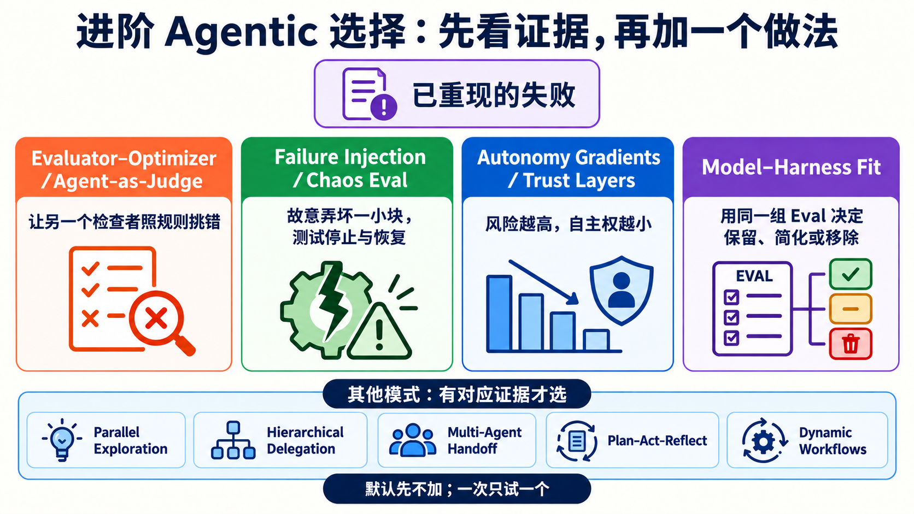
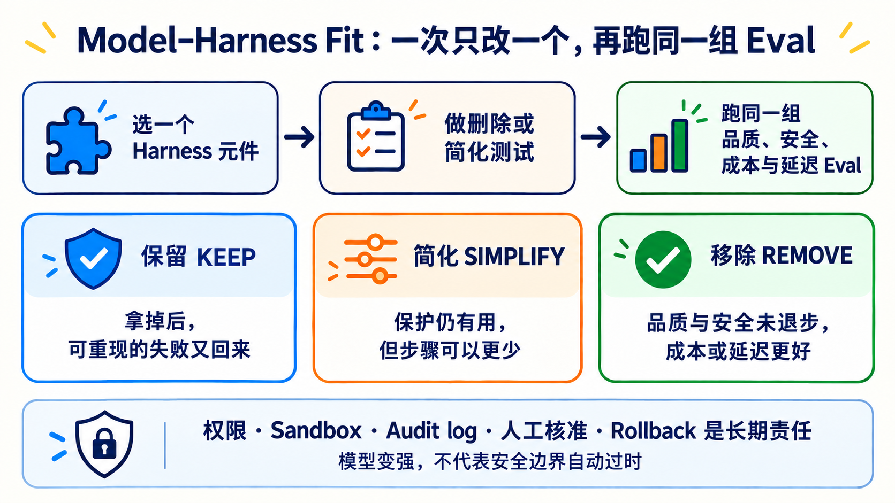

# Stage 7.5 — 进阶 Agentic 选择：有证据才增加复杂度

> [繁體中文](./07.5-advanced-agentic-concepts.md) | **简体中文** | [English](./07.5-advanced-agentic-concepts.en.md)

<!-- freshness: canonical=stages/07.5-advanced-agentic-concepts.md; verified_on=2026-09-13; scope=agent-patterns,harnesses,evals,dynamic-workflows,framework-status,research; max_age_days=90 -->

← **先回到 [Stage 7 — Agent 上线工程](07-multi-agent-production.zh-Hans.md)**：若你还不能用 Eval、Trace、Approval 与 Recovery 证明系统可测、可看、可停、可恢复，先不要增加本章的进阶做法。

Stage 7.5 不是更多名词的收藏柜。它只回答一个问题：**哪个已重现的失败，值得你多加一层检查、故障测试、自主权分级或 Harness 元件？**

> 预设答案是“先不加”。先量单一 Agent 的 baseline；只有新做法在同一组 Eval 中带来可重现改善，才保留它。

## 🎯 完成这一关后，你能做什么

1. 用白话说清楚四个进阶概念，以及它们各自处理哪种失败。
2. 从短选择表挑出一个候选做法，不把所有模式一次装上。
3. 用 baseline、同一组 Eval、成本与安全结果决定是否保留复杂度。
4. 对 Harness 元件做 Keep／Simplify／Remove 判断，并保留回复方法。

## 🚪 最短进入条件

完成 [Stage 7](07-multi-agent-production.zh-Hans.md)，并已经有一组能重跑的 Eval cases、停止条件与单一 Agent baseline。这一关不要求写程序，也不要求购买 API 或公开模型的私人 Chain-of-Thought。

<small>资料查核：2026-09-13 UTC。</small>

## 📚 必修阅读

先读三份；每份都对应本章的一个决定：

1. [Anthropic — Building Effective Agents](https://www.anthropic.com/engineering/building-effective-agents)：先用最简单的 workflow；只有能证明分工有价值时才增加 Agent。
2. [Anthropic — Demystifying Evals for AI Agents](https://www.anthropic.com/engineering/demystifying-evals-for-ai-agents)：把失败变成可重跑案例，再比较 Outcome、Trajectory、成本与稳定性。
3. [OpenAI — Harness Engineering](https://openai.com/index/harness-engineering/)：看真实 codebase 如何用清楚边界、文件与机械 gate 帮 Agent 稳定工作；这是一个案例，不是所有系统的唯一架构。

<a id="-四个进阶概念先懂白话再看正式名称"></a>
## 🔑 先认识四个进阶核心词

先看白话总览，知道哪种问题才需要哪个词。表格下面的四段会再补上限制与来源，不把进阶概念缩成一句口号。

<table>
<thead><tr><th scope="col">先处理什么</th><th scope="col">核心词</th><th scope="col">五岁也能懂的说法</th><th scope="col">何时使用／技术边界</th></tr></thead>
<tbody>
<tr><th scope="rowgroup" rowspan="2">先找出真正的问题</th><td><strong>Evaluator–Optimizer／Agent-as-Judge（评估者—优化者／由 Agent 评分）</strong></td><td>一个做，一个照清单检查</td><td>内容需要判断质量时才用；Judge 也会犯错，不能单独决定真相</td></tr>
<tr><td><strong>Failure Injection／Chaos Eval（故障注入／混沌评测）</strong></td><td>故意拔掉一块小积木，看房子会不会安全停下</td><td>只在隔离环境制造可控制的小故障；不能拿真实数据随意做实验</td></tr>
</tbody>
<tbody>
<tr><th scope="rowgroup" rowspan="2">再控制新增的复杂度</th><td><strong>Autonomy Gradients／Trust Layers（自主权梯度／信任层级）</strong></td><td>事情越危险，AI 可以自己走的路越短</td><td>依风险缩小权限；付款、删除、发布或外部信息要先问人</td></tr>
<tr><td><strong>Model–Harness Fit（模型—Harness 适配）</strong></td><td>换了新引擎，就一次拿掉一个零件再重考</td><td>用同一组 Eval 决定元件要保留、简化或移除；安全责任不能因模型变强就删除</td></tr>
</tbody>
</table>

下面不是另一份名词清单；它只补充每个做法何时有用，以及最容易踩到的边界。

### 1. 先让另一个检查者照规则挑错

**Evaluator–Optimizer／Agent-as-Judge（评估者—优化者／由 Agent 评分）**：一个角色产生成果，另一个角色按照明确 rubric 找出问题；产生者只在有新证据时做有界修正。

它适合“答案不只对或错，还要判断完整性、忠实度或写作质量”的任务。Judge 也会犯错，因此不能让它单独决定真相。至少搭配固定案例、可程序化检查、人工抽样与修正次数上限。

> **Constitutional AI** 是 principle-based training／critique 方法，不等于所有 runtime LLM judge。研究入口：[Constitutional AI paper](https://arxiv.org/abs/2212.08073)。

### 2. 故意弄坏一小块，确认系统会安全停下

**Failure Injection／Chaos Eval（故障注入／混沌评测）**：主动制造可控制、可复原的小故障，例如 timeout、旧资料、坏格式或工具不可用，再检查停止、降级与复原是否符合预期。

“Failure Injection／Chaos Eval”是本章采用的**编辑／社群统称，不是跨供应商公认标准名称**。先在隔离环境测最小故障，不能随意在真实 production 资料上制造事故。设计方法可先看 [Anthropic — Demystifying Evals](https://www.anthropic.com/engineering/demystifying-evals-for-ai-agents)。

### 3. 风险越高，Agent 能自己决定的范围越小

**Autonomy Gradients／Trust Layers（自主权梯度／信任层级）**：按任务风险分配不同程度的自主权。唯读查询可以自动执行；付款、删除、发布或外部讯息则先提出方案，再由人核准。

“Autonomy Gradients／Trust Layers”也是本章采用的**编辑／社群统称，不是单一正式标准**。常见阶梯是 `suggest → propose → execute`，但实际层数由风险、权限与责任人决定，不由模型自评决定。

### 4. 模型变强后，重新证明每个外加步骤是否还值得

**Model–Harness Fit（模型—Harness 适配）**：换模型或版本后，一次拿一个 Harness 元件做删除测试，用同一组质量、安全、成本与延迟 Eval 决定保留、简化或移除。

“Model–Harness Fit”是本章的**编辑简称，不是公认标准术语**。它不代表用模型取代权限、sandbox、audit log、人工核准或 rollback；这些是长期责任，不能因模型升级就直接删除。

## 🧭 其他模式：看到这种证据才选

| 候选模式 | 白话说法 | 先看到什么证据 | 官方／原始入口 |
|---|---|---|---|
| **Parallel Exploration（平行探索）** | 同时试几条互不依赖的路，再比较 | 问题真的能分开，且增加的成本与合并工作小于质量或时间收益 | [Anthropic parallelization workflow](https://www.anthropic.com/engineering/building-effective-agents) |
| **Hierarchical Delegation（阶层式委派）** | 大工作逐层拆给较小角色 | 单一 context 放不下，或子任务有清楚输入、输出与验收人 | [Anthropic orchestrator-workers](https://www.anthropic.com/engineering/building-effective-agents)；新 Microsoft 专案可从 [Microsoft Agent Framework](https://github.com/microsoft/agent-framework) 开始，AutoGen 已进入 maintenance mode |
| **Multi-Agent Handoff（多 Agent 交接）** | 把控制权、必要资料与完成证据一起交棒 | 不同角色必须直接接手，而且交接后的错误率低于单一 Agent baseline | [OpenAI Agents SDK orchestration](https://openai.github.io/openai-agents-python/multi_agent/) |
| **Plan–Act–Reflect（规划—行动—回看）** | 先计划、执行、读证据，再有限次修正 | 测试或 grader 能指出可修正失败；不是只把同一句话再试一次 | [Reflexion](https://arxiv.org/abs/2303.11366) |
| **Dynamic Workflows（动态工作流程）** | 让 Agent 写出可重跑的分工 script | 任务可平行、可重跑，而且固定 workflow 不足以表达当次分工 | [Claude Code Dynamic Workflows](https://code.claude.com/docs/en/workflows) |



## 🧪 最小决策纪录：加之前先填完

```text
已重现的失败：哪个 case 失败？Outcome 或 Trajectory 哪里不合格？
单一 Agent baseline：品质、成本、延迟、安全结果是多少？
只加的一个做法：它要防住哪个失败？
接受门槛：同一组 Eval 至少改善什么，而且不能牺牲什么？
停止／回复：没改善、变贵或变危险时，怎么撤掉？
```

如果第一行没有证据，先补 Eval case；如果第四、五行写不出来，先不要增加复杂度。

## ⚖️ Model–Harness Fit：用 Eval 决定保留、简化或移除

模型变强时，某个重复提醒 prompt、context reset 或额外 planner／reviewer 可能不再需要。一次只改一个元件，其他 task、资料、工具、环境、grader 与门槛保持相同，再比较多次 trials。



| 决定 | 你看到的证据 | 下一步 |
|---|---|---|
| **保留 Keep** | 拿掉后，同一个可重现失败又回来，或安全门槛退步 | 放回去，记下它防住的 case 与版本 |
| **简化 Simplify** | 保护仍有用，但较少步骤也能通过同一组 Eval | 一次再少一个步骤，重跑相同 trials |
| **移除 Remove** | 删除测试通过，质量与安全未退步，成本或延迟相同或更好 | 移除后持续监测，保留可验证的回复方法 |

| 先分哪一类 | 例子 | 判断边界 |
|---|---|---|
| **可能补某代模型弱点的元件** | context reset、重复提醒 prompt、额外 planner／reviewer | 模型变更时可以做删除测试，但只能由同一组 Eval 决定 |
| **长期安全责任** | 最小权限、sandbox、audit log、人工核准、rollback | 实作可以更换；责任不能靠“模型变强”直接删除 |

<details markdown="1">
<summary>⏳ 展开：Bitter Lesson、人机分工与删除测试的限制</summary>

每加一层，记录三件事：哪个可重现失败需要它、哪个 Eval 证明它有效、哪个删除测试能证明它已不再需要。

这和 Rich Sutton 的 [The Bitter Lesson](http://www.incompleteideas.net/IncIdeas/BitterLesson.html) 相呼应，但不是该文章直接提出的 Agent Harness 定律。

Anthropic 对 2025-10 到 2026-04 Claude Code 使用资料的分析，平均观察到用户做约 70% planning decisions，而 Claude 做约 80% execution decisions。这是特定产品与资料集的观察，不是每个团队都应硬套的比例。可带走的是：**人负责目的、边界与验收；Agent 负责范围内的执行。**来源：[How Claude Code is used in practice](https://www.anthropic.com/research/claude-code-expertise)。

</details>

<a id="-dynamic-workflowsopus-48-当-agent-自己写出-workflow"></a>

### 🔀 Dynamic Workflows — 当 Agent 把分工写成可重跑的 script

这是 Claude Code 的 Agent orchestration 功能，不是模型，也不是 OpenRouter、Airflow 或 n8n 的替代品。只有任务能安全 fan out、结果可比较，而且重跑有价值时才选它。

<details markdown="1">
<summary>展开：现行版本、机制、限制与安全边界</summary>

- **目前条件**：现行官方文件列出所有付费方案、Anthropic API，以及 Amazon Bedrock、Google Cloud Agent Platform、Microsoft Foundry。Pro 可从 `/config` 启用。
- **怎么运作**：Claude 产生 JavaScript orchestration script，由背景 runtime 执行；中间结果留在 script 变数，最后结果才回到对话 context。
- **怎么启动**：明确要求 `use a workflow`／`run a workflow`，或使用 `ultracode`。`/effort ultracode` 需要 v2.1.203+ 且模型支援 `xhigh` effort。
- **现行上限**：最多 16 个 concurrent agents、每次 run 累计 1,000 个。这是防 runaway 的上限，不是建议你每次都用满。
- **安全边界**：subagent 的工具仍受 permission 与 sandbox 规则约束；workflow 本身没有任意 shell／filesystem access。长 run 会用更多 token，启动前仍要看 phase 与成本。
- **限制**：run 中不能插入一般用户输入；共享状态很多或只需一个 Agent 的工作，不适合 fan out。

2026-05-28 的发布公告把它称为 research preview，并和 Opus 4.8 同日公布；这只是一段历史，不代表今天绑定 Opus 4.8。现行规则以 [Dynamic Workflows docs](https://code.claude.com/docs/en/workflows) 为准。

</details>

## 🔬 深读时才需要的证据与失败案例

<details markdown="1">
<summary>🧯 展开：三个案例教了什么，以及如何避免读错</summary>

1. **分工后风格对不上**：Cognition 的 Flappy Bird 案例提醒，多个 subagent 若拿不到共同背景，最后很难拼在一起。来源：[Don’t Build Multi-Agents](https://cognition.ai/blog/dont-build-multi-agents)。
2. **研究 Agent 补进未验证推测**：Anthropic 的 Research 系统用 source quality、引用与 evaluator 改善 speculative leap。来源：[How we built our multi-agent research system](https://www.anthropic.com/engineering/multi-agent-research-system)。
3. **文字规则没有变成机械防线**：2025-07 的 Replit production database 事件是第三方记录案例；它提醒 permission gate 的重要性，但不代表所有产品或版本都会发生相同行为。来源：[AI Incident Database #1152](https://incidentdatabase.ai/cite/1152/) 与 [The Register 报导](https://www.theregister.com/2025/07/21/replit_saastr_vibe_coding_incident/)。

事故不会自动变成最佳实践。只有把教训写成权限、测试、review 与 recovery gate，系统才真的改变。

</details>

<details markdown="1">
<summary>⚖️ 展开：怎么读 Agent benchmark，才不会被单一分数骗</summary>

Agent benchmark 同时量到模型、prompt、tool、harness、硬体、timeout 与 grader。比较时至少固定 task、scaffold、工具、资料与环境；重跑多次；分开 infrastructure error 与解题失败；使用 held-out cases；并让 Judge 搭配 deterministic checks 与人工抽样。

Anthropic 2026 的研究显示，基础设施差异可能大到超过排行榜模型间的差距；因此小幅领先不等于稳定较强。来源：[Quantifying infrastructure noise in agentic coding evals](https://www.anthropic.com/engineering/infrastructure-noise) 与 [Demystifying Evals](https://www.anthropic.com/engineering/demystifying-evals-for-ai-agents)。

</details>

## 🎯 精选阅读：先挑一条

1. [Anthropic — Building Effective Agents](https://www.anthropic.com/engineering/building-effective-agents) ⭐⭐⭐⭐⭐：第一次读进阶 Agent pattern，先从这篇开始。
2. [OpenAI — Harness Engineering](https://openai.com/index/harness-engineering/) ⭐⭐⭐⭐⭐：看边界、文件与机械 gate 怎么放进真实 codebase。
3. [Anthropic — Demystifying Evals for AI Agents](https://www.anthropic.com/engineering/demystifying-evals-for-ai-agents) ⭐⭐⭐⭐⭐：想知道怎么验收 Agent，先读这篇。
4. [Microsoft Agent Framework](https://github.com/microsoft/agent-framework) ⭐⭐⭐⭐⭐：要看现行 Microsoft multi-agent／workflow 实作；不要从 maintenance-mode AutoGen 开新专案。
5. [datawhalechina/hello-agents](https://github.com/datawhalechina/hello-agents) ⭐⭐⭐⭐⭐：想用中文把概念接到完整实作。

## 📚 完整学习资源与限制

<table>
  <thead>
    <tr><th scope="col">分类</th><th scope="col">资源</th><th scope="col">适合读什么</th><th scope="col">编辑评分</th><th scope="col">限制／状态</th></tr>
  </thead>
  <tbody>
    <tr><th scope="rowgroup" rowspan="5">基本设计与 Context</th><td><a href="https://www.anthropic.com/engineering/building-effective-agents">Anthropic — Building Effective Agents</a></td><td>Workflow、Agent 与常用 pattern</td><td>⭐⭐⭐⭐⭐</td><td>2024 foundation；不是最新产品清单</td></tr>
    <tr><td><a href="https://www.anthropic.com/engineering/effective-context-engineering-for-ai-agents">Effective Context Engineering</a></td><td>怎么挑 context，不把视窗塞满</td><td>⭐⭐⭐⭐⭐</td><td>供应商文章；原则可跨模型使用</td></tr>
    <tr><td><a href="https://openai.com/index/harness-engineering/">OpenAI Harness Engineering</a></td><td>可读 codebase、SoR、invariant</td><td>⭐⭐⭐⭐⭐</td><td>单一 OpenAI codebase case study</td></tr>
    <tr><td><a href="https://www.anthropic.com/engineering/effective-harnesses-for-long-running-agents">Effective Harnesses for Long-running Agents</a></td><td>跨 session artifact 与增量进度</td><td>⭐⭐⭐⭐</td><td>特定 coding harness 实验</td></tr>
    <tr><td><a href="https://www.anthropic.com/engineering/harness-design-long-running-apps">Harness Design for Long-running Apps</a></td><td>Planner／Generator／Evaluator</td><td>⭐⭐⭐⭐</td><td>2026 Labs case study，不是唯一架构</td></tr>
  </tbody>
  <tbody>
    <tr><th scope="rowgroup" rowspan="5">Orchestration／Contracts</th><td><a href="https://www.anthropic.com/engineering/multi-agent-research-system">Anthropic Multi-Agent Research System</a></td><td>Orchestrator-workers production lessons</td><td>⭐⭐⭐⭐⭐</td><td>最适合 breadth-first research；token 开销高</td></tr>
    <tr><td><a href="https://github.com/langchain-ai/langgraph">LangGraph</a></td><td>Stateful graph、checkpoint、HITL</td><td>⭐⭐⭐⭐</td><td>低阶框架；要自己设计 state 与 Eval</td></tr>
    <tr><td><a href="https://github.com/microsoft/agent-framework">Microsoft Agent Framework</a></td><td>Python／.NET Agent 与 workflow</td><td>⭐⭐⭐⭐⭐</td><td>AutoGen／Semantic Kernel 的现行后继入口</td></tr>
    <tr><td><a href="https://openai.github.io/openai-agents-python/sandbox/guide/">OpenAI Agents SDK Sandbox Agents</a></td><td>Workspace、session、snapshot、sandbox</td><td>⭐⭐⭐⭐</td><td><strong>Beta</strong>；介面仍可能变</td></tr>
    <tr><td><a href="https://code.claude.com/docs/en/workflows">Claude Code Dynamic Workflows</a></td><td>Agent-authored、可重跑的 orchestration</td><td>⭐⭐⭐⭐</td><td>Claude Code 功能；高 token、非通用 workflow engine</td></tr>
  </tbody>
  <tbody>
    <tr><th scope="rowgroup" rowspan="5">Eval／Resilience</th><td><a href="https://www.anthropic.com/engineering/demystifying-evals-for-ai-agents">Demystifying Evals for AI Agents</a></td><td>Capability、regression 与 transcript Eval</td><td>⭐⭐⭐⭐⭐</td><td>先从小而能重现的 failure set 开始</td></tr>
    <tr><td><a href="https://www.anthropic.com/engineering/infrastructure-noise">Infrastructure Noise in Agentic Evals</a></td><td>硬体与环境如何扭曲分数</td><td>⭐⭐⭐⭐</td><td>特定 benchmark 实验；不要外推精确幅度</td></tr>
    <tr><td><a href="https://arxiv.org/abs/2507.02825">Best Practices for Rigorous Agentic Benchmarks</a></td><td>Task、reward 与环境设计缺陷</td><td>⭐⭐⭐⭐</td><td>研究 paper；需搭配 benchmark 现行版本</td></tr>
    <tr><td><a href="https://github.com/sierra-research/tau2-bench">tau2-bench</a></td><td>Tool-Agent-User interaction 与 pass^k</td><td>⭐⭐⭐⭐</td><td>Benchmark 不是 production SLA</td></tr>
    <tr><td><a href="https://github.com/SWE-bench/SWE-bench">SWE-bench</a></td><td>真实 GitHub issue 的 coding Eval</td><td>⭐⭐⭐⭐⭐</td><td>分数受 harness、版本与环境影响</td></tr>
  </tbody>
  <tbody>
    <tr><th scope="rowgroup" rowspan="5">Research patterns</th><td><a href="https://arxiv.org/abs/2210.03629">ReAct</a></td><td>Reasoning／Action／Observation loop</td><td>⭐⭐⭐⭐⭐</td><td>教可观察行动，不要求公开私人 CoT</td></tr>
    <tr><td><a href="https://arxiv.org/abs/2303.11366">Reflexion</a></td><td>Feedback 后修正策略</td><td>⭐⭐⭐⭐</td><td>研究设定不等于每个 production loop</td></tr>
    <tr><td><a href="https://arxiv.org/abs/2212.08073">Constitutional AI</a></td><td>Principle-based critique 与 revision</td><td>⭐⭐⭐⭐</td><td>训练方法；不能直接等同 LLM-as-judge</td></tr>
    <tr><td><a href="https://arxiv.org/abs/2303.17760">CAMEL</a></td><td>Role-playing multi-agent research</td><td>⭐⭐⭐</td><td>研究原型；高风险责任仍需固定 owner</td></tr>
    <tr><td><a href="https://github.com/stanfordnlp/dspy">DSPy</a></td><td>Typed signatures、program optimization</td><td>⭐⭐⭐⭐</td><td>框架持续更新；先锁版本与 Eval</td></tr>
  </tbody>
  <tbody>
    <tr><th scope="rowgroup" rowspan="4">中文／动手入口</th><td><a href="https://github.com/datawhalechina/hello-agents">datawhalechina/hello-agents</a></td><td>中文完整 Agent 教材</td><td>⭐⭐⭐⭐⭐</td><td>篇幅长；按本章概念挑章节</td></tr>
    <tr><td><a href="https://github.com/microsoft/ai-agents-for-beginners">Microsoft AI Agents for Beginners</a></td><td>18 课 Agent 入门与多语教材</td><td>⭐⭐⭐⭐</td><td>供应商范例较多；先看概念再选 SDK</td></tr>
    <tr><td><a href="https://github.com/langchain-ai/deepagents">LangChain Deep Agents</a></td><td>Planning、subagent、filesystem harness</td><td>⭐⭐⭐⭐</td><td>较高阶抽象；不是所有任务都需要</td></tr>
    <tr><td><a href="https://speech.ee.ntu.edu.tw/~hylee/">李宏毅生成式 AI 课程</a></td><td>中文课程与研究背景</td><td>⭐⭐⭐⭐⭐</td><td>依年份挑主题；产品介面仍查官方 docs</td></tr>
  </tbody>
</table>

## ✅ 完成检查

- [ ] 我能用白话解释四个进阶概念，并说出三个编辑／社群命名的边界。
- [ ] 我先有单一 Agent baseline 与可重跑失败，才从选择表增加一个模式。
- [ ] 我会用同一组 Eval 比较质量、安全、成本与延迟，不只看一次漂亮回答。
- [ ] 我能对一个 Harness 元件做 Keep／Simplify／Remove 决定，并指出证据与回复方法。
- [ ] 我知道 Judge 也要被检查，故障注入先在隔离环境做，高风险动作不由模型自行升级权限。

五项都能做到，就进入 [Stage 8 — Agent 操作介面](08-agent-interfaces.zh-Hans.md)。如果还没有 baseline 或失败证据，先回到 [Stage 7](07-multi-agent-production.zh-Hans.md) 补齐，而不是再加一个 Agent。
